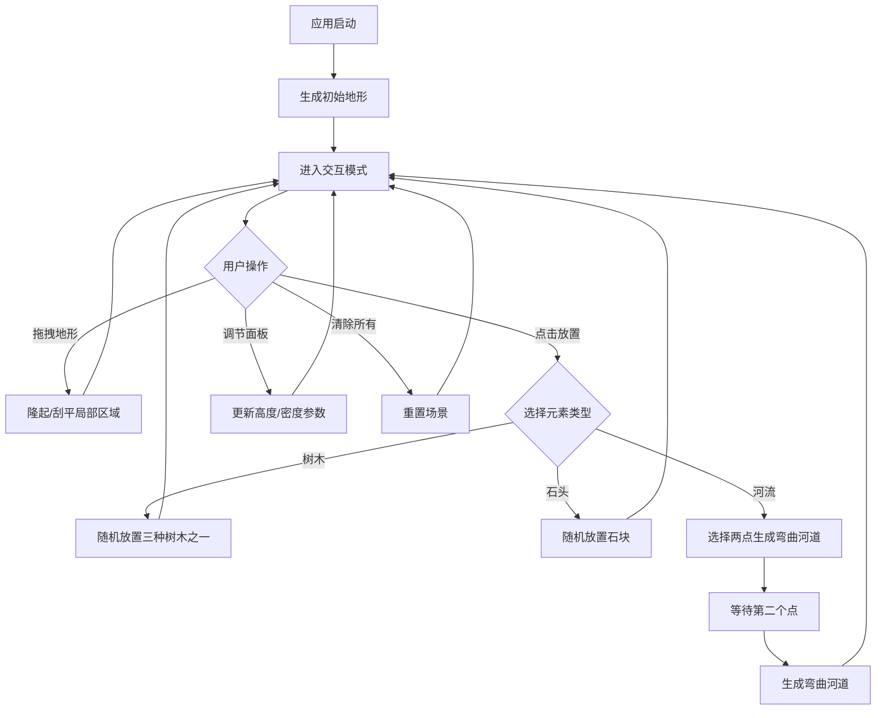

## 1. 产品概述

「息壤世界」是一款交互式3D地形生成与探索Web应用，用户可以通过拖拽和点击实时塑造程序化生成的低多边形地形，并在其上放置树木、石头、河流等自然元素，创作属于自己的小型自然景观。

- 目标用户：创意爱好者、游戏开发者、数字艺术创作者
- 核心价值：提供直觉式的地形编辑体验，让用户无需专业3D建模知识即可创造精美的低多边形自然景观

## 2. 核心功能

### 2.1 功能模块

1. **主场景页面**：3D地形视口、交互编辑、元素放置、控制面板

### 2.2 页面详情

| 页面名称 | 模块名称 | 功能描述 |
|----------|----------|----------|
| 主场景 | 地形生成 | 基于Perlin噪声生成初始起伏地形，支持拖拽刮平或隆起局部区域 |
| 主场景 | 元素放置 | 点击地形放置树木（三种随机模型）、石块（随机形状）、河流（两点生成弯曲河道） |
| 主场景 | 交互反馈 | 拖拽时圆形光标和深度指示，放置时粒子爆散与Web Audio音效 |
| 主场景 | 控制面板 | 毛玻璃面板：高度缩放滑块、元素密度滑块、清除所有按钮 |
| 主场景 | 性能监控 | 右下角实时帧率显示 |
| 主场景 | 天空环境 | 渐变色球体天空 |

## 3. 核心流程

用户打开应用后，看到Perlin噪声生成的初始地形。通过鼠标拖拽可隆起或刮平地形，通过点击可放置自然元素，通过控制面板可调节参数。

## 4. 用户界面设计

### 4.1 设计风格

- **整体风格**：低多边形（Low-Poly）自然风格
- **主色调**：草绿 (#4CAF50) 到雪白 (#F5F5F5) 的地形渐变，天空渐变蓝 (#87CEEB → #1E3A5F)
- **辅色调**：半透明河流蓝 (#4FC3F7)，树干棕色 (#8D6E63)，石块灰色 (#9E9E9E)
- **面板风格**：毛玻璃（backdrop-filter: blur），圆角卡片，白色半透明背景
- **字体**：中文使用系统默认，英文使用等宽风格
- **布局**：3D视口全屏，控制面板浮动在左上角，帧率右下角

### 4.2 页面设计概览

| 页面名称 | 模块名称 | UI元素 |
|----------|----------|--------|
| 主场景 | 3D视口 | 全屏Canvas，低多边形地形，渐变天空球体 |
| 主场景 | 控制面板 | 毛玻璃面板，滑块控件，按钮，窄屏折叠为图标菜单 |
| 主场景 | 交互光标 | 圆形高亮光标，深度指示器 |
| 主场景 | 元素选择栏 | 底部居中图标按钮（树木/石头/河流） |
| 主场景 | 帧率显示 | 右下角半透明FPS计数器 |

### 4.3 响应式设计

- 桌面优先设计，3D视口全屏自适应
- 控制面板在窄屏（<768px）时折叠为图标菜单，点击展开
- 元素选择栏在窄屏时缩小图标尺寸
- 触屏设备支持触摸拖拽和点击

### 4.4 3D场景指引

- **环境与氛围**：低多边形自然风格，温暖柔和的光照，渐变天空营造开阔感
- **光照设置**：方向光模拟日光（暖白色），环境光提供柔和补光
- **相机设置**：透视相机，45°俯视角度，OrbitControls支持旋转/缩放
- **交互与动画**：河流流动动画，树木轻微摇摆，放置元素时粒子爆散效果
- **性能预算**：地形网格顶点数≤10000，帧率稳定60fps，远处物体LOD简化

## 5. 交互细节

### 5.1 地形编辑

- **隆起模式**：鼠标拖拽时，地形沿Y轴隆起，圆形区域内顶点高度平滑过渡
- **刮平模式**：鼠标拖拽时，地形向平均高度收敛，实现刮平效果
- **圆形光标**：跟随鼠标在地形表面移动，显示编辑范围和当前深度
- **实时更新**：拖拽过程中逐帧更新地形网格顶点位置和法线

### 5.2 元素放置

- **树木**：三种随机模型（圆锥松树、圆形灌木、多层圆锥高树），点击地形表面放置
- **石头**：随机不规则多面体形状，点击地形表面放置
- **河流**：第一次点击设置起点，第二次点击设置终点，自动生成沿地形起伏的弯曲河道

### 5.3 反馈系统

- **粒子爆散**：放置元素时从放置点向外扩散的粒子效果
- **音效**：放置时播放Web Audio合成的短促音效（不同元素不同音色）
- **视觉提示**：河流放置时显示起点标记和虚线引导
