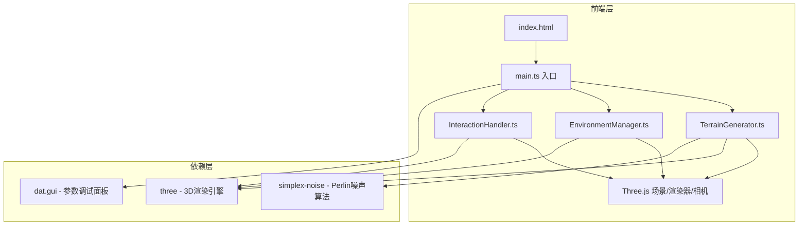

## 1. 架构设计



## 2. 技术说明

- **前端**：TypeScript + Three.js + Vite（纯前端项目，无后端）
- **构建工具**：Vite
- **3D引擎**：Three.js（含 OrbitControls）
- **噪声算法**：simplex-noise（用于Perlin/Simplex噪声地形生成）
- **参数面板**：dat.gui（开发调试用，同时集成自定义毛玻璃UI面板）
- **音效**：Web Audio API（浏览器原生，合成简单音效）

## 3. 文件结构

```
project/
├── index.html              # 入口HTML
├── package.json            # 依赖与脚本
├── tsconfig.json           # TypeScript配置
├── vite.config.js          # Vite配置
└── src/
    ├── main.ts             # 场景初始化、相机、渲染器、动画循环、UI面板
    ├── TerrainGenerator.ts # 噪声地形生成、网格动态修改
    ├── EnvironmentManager.ts # 树木/石头/河流元素的生成与布局
    └── InteractionHandler.ts # 鼠标事件、地形编辑、元素放置反馈
```

## 4. 模块职责

### 4.1 main.ts

- 初始化Three.js场景、PerspectiveCamera、WebGLRenderer
- 创建OrbitControls实现相机旋转/缩放
- 实例化TerrainGenerator、EnvironmentManager、InteractionHandler
- 创建自定义毛玻璃UI控制面板（高度缩放滑块、密度滑块、清除按钮、元素选择）
- 创建FPS计数器
- 动画循环（requestAnimationFrame）
- 窗口resize自适应

### 4.2 TerrainGenerator

- 使用simplex-noise生成高度图
- 创建PlaneGeometry并根据高度图修改顶点Y值
- 顶点颜色：根据高度从草绿渐变到雪白
- 计算顶点法线实现正确光照
- `deform(position, radius, strength)` 方法：隆起/刮平地形
- `getHeightAt(x, z)` 方法：获取指定位置地形高度
- 性能控制：地形网格顶点数≤10000

### 4.3 EnvironmentManager

- `placeTree(position, type?)` ：放置树木（3种随机模型）
  - 松树：圆锥体 + 圆柱体树干
  - 灌木：球体 + 圆柱体树干
  - 高树：多层圆锥体 + 圆柱体树干
- `placeRock(position)` ：放置石块（随机IcosahedronGeometry变形）
- `placeRiver(start, end)` ：在两点间生成弯曲河道
  - 使用CatmullRomCurve3生成曲线路径
  - 沿路径创建TubeGeometry
  - 半透明蓝色材质 + 流动动画（UV偏移）
- `clearAll()` ：清除所有已放置元素
- 元素密度参数控制

### 4.4 InteractionHandler

- Raycaster射线拾取：检测鼠标与地形/元素的交互
- 地形编辑模式：拖拽隆起/刮平
  - 圆形光标（CircleGeometry + MeshBasicMaterial）
  - 深度指示器（环形或颜色变化）
- 元素放置模式：点击放置
  - 当前选中元素类型（树木/石头/河流）
  - 河流两点放置逻辑
- 粒子爆散效果：放置元素时触发
  - 使用Points + BufferGeometry
  - 粒子从中心向外扩散并淡出
- Web Audio音效反馈
  - AudioContext生成合成音
  - 不同元素不同音调

## 5. 性能策略

| 策略 | 实现方式 |
|------|----------|
| 地形顶点控制 | PlaneGeometry分段数控制在100×100以内（≈10000顶点） |
| LOD简化 | 根据与相机距离，远处元素降低细节或隐藏 |
| 帧率监控 | requestAnimationFrame时间差计算FPS |
| 按需更新 | 地形修改时仅更新受影响区域的顶点和法线 |
| 对象池 | 粒子系统复用BufferGeometry，避免频繁创建销毁 |

## 6. 色彩方案

| 元素 | 颜色 | 说明 |
|------|------|------|
| 低海拔地形 | #4CAF50 | 草绿色 |
| 中海拔地形 | #8BC34A | 浅绿色 |
| 高海拔地形 | #F5F5F5 | 雪白色 |
| 树叶 | #2E7D32 / #558B2F / #33691E | 三种深浅绿色 |
| 树干 | #8D6E63 | 棕色 |
| 石头 | #9E9E9E | 灰色（随机偏移） |
| 河流 | #4FC3F7 (alpha 0.6) | 半透明蓝色 |
| 天空顶部 | #1E3A5F | 深蓝 |
| 天空底部 | #87CEEB | 浅蓝 |
| 控制面板 | rgba(255,255,255,0.15) | 毛玻璃白 |
