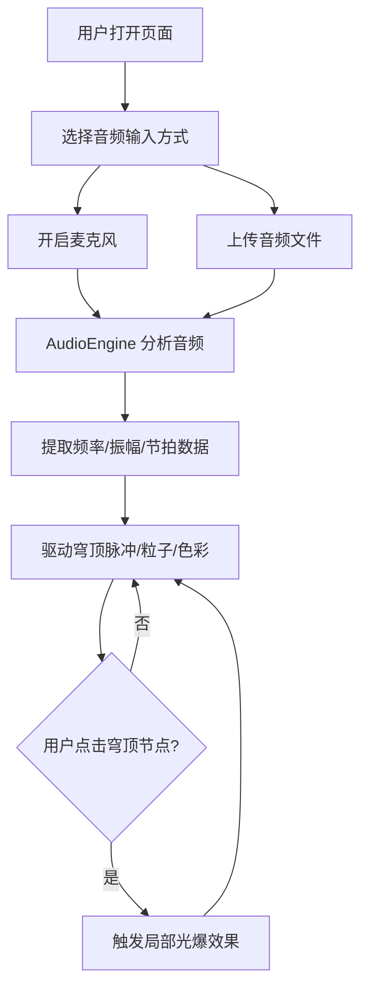

## 1. 产品概述

「穹顶回声」是一款浏览器端交互式音乐可视化应用，用户通过麦克风实时录音或上传音频文件（WAV/MP3），页面实时生成动态3D穹顶结构——音乐节奏驱动穹顶起伏、粒子环绕和色彩渐变，营造赛博朋克霓虹风格的沉浸式视听体验。

- 目标用户：音乐爱好者、视觉艺术创作者、VJ演出人员
- 核心价值：将听觉体验转化为可交互的3D视觉奇观，让用户"看见"音乐

## 2. 核心功能

### 2.1 用户角色

| 角色 | 注册方式 | 核心权限 |
|------|----------|----------|
| 访客 | 无需注册 | 使用全部可视化与交互功能 |

### 2.2 功能模块

1. **主页面**：3D穹顶可视化场景、音频输入控制、交互操作

### 2.3 页面详情

| 页面名称 | 模块名称 | 功能描述 |
|----------|----------|----------|
| 主页面 | 3D穹顶场景 | 球状骨架穹顶，表面节点随音频节拍脉冲放大，颜色从蓝到粉渐变；数千发光粒子沿穹顶表面螺旋运动，节奏快时粒子速度加快、颜色变亮 |
| 主页面 | 音频输入模块 | 支持麦克风实时录音和上传WAV/MP3文件，提取频率、振幅和节拍数据驱动可视化 |
| 主页面 | 交互效果模块 | 点击穹顶任意节点触发局部光爆效果——该节点膨胀并放射冲击波，周围粒子被推开 |
| 主页面 | 控制栏 | 深色半透明毛玻璃控制栏位于底部，包含音频开关、音量指示器和频谱预览（小波形图），按钮有悬停发光动画 |
| 主页面 | 响应式适配 | 桌面和平板完整显示控制栏，移动端隐藏控制栏细节 |

## 3. 核心流程

1. 用户打开页面，看到深空蓝紫渐变背景下的静态穹顶结构
2. 用户选择音频输入方式：开启麦克风或上传音频文件
3. 音频数据经AudioEngine分析后，实时驱动穹顶节点的脉冲、粒子运动和色彩变化
4. 用户可点击穹顶节点触发光爆交互效果
5. 用户通过控制栏调节音频开关、查看音量和频谱

## 4. 用户界面设计

### 4.1 设计风格

- 主色调：深空蓝（#0a0e27）→ 星际紫（#1a0533）渐变背景
- 强调色：霓虹蓝（#00f0ff）、霓虹粉（#ff00aa）、霓虹紫（#8b5cf6）
- 按钮风格：圆角半透明按钮，悬停时边框发光（box-shadow霓虹色扩散）
- 字体：显示字体 Orbitron（科技感），UI字体 Rajdhani（简洁可读）
- 布局：全屏3D场景 + 底部悬浮控制栏
- 图标：线性霓虹风格图标

### 4.2 页面设计概览

| 页面名称 | 模块名称 | UI元素 |
|----------|----------|--------|
| 主页面 | 3D穹顶场景 | 全屏Canvas，深空蓝紫渐变背景，发光网格穹顶居中，螺旋粒子流环绕穹顶表面 |
| 主页面 | 控制栏 | 底部居中毛玻璃条，左侧麦克风按钮+上传按钮，中间音量条+频谱小波形图，右侧音频开关；按钮悬停霓虹发光 |
| 主页面 | 光爆效果 | 点击节点处径向发光扩散，冲击波环向外扩展，附近粒子被推散 |

### 4.3 响应式设计

- 桌面（≥1024px）：完整控制栏，穹顶占满视口
- 平板（768px-1023px）：控制栏简化但保留核心按钮，穹顶自适应
- 移动端（<768px）：隐藏频谱预览和音量指示器细节，仅保留麦克风/上传/开关三个图标按钮

### 4.4 3D场景指导

- 环境/HDRI：深空黑色背景，无环境贴图，通过自发光材质营造氛围
- 灯光设置：微弱环境光（AmbientLight #0a0e27 强度0.3），穹顶表面自发光为主光源
- 相机设置：PerspectiveCamera，FOV 60°，位于穹顶前方偏上方，微微俯视；支持OrbitControls旋转浏览
- 构图与焦点：穹顶居中，占视口60-70%高度，粒子流环绕增添动感
- 交互与动画：穹顶节点随节拍脉冲（scale振荡），粒子沿球面螺旋运动，点击节点光爆冲击波
- 后处理效果：Bloom发光效果增强霓虹感（UnrealBloomPass）
- 资源来源与性能预算：纯程序化生成，粒子数上限8000，目标帧率60fps
