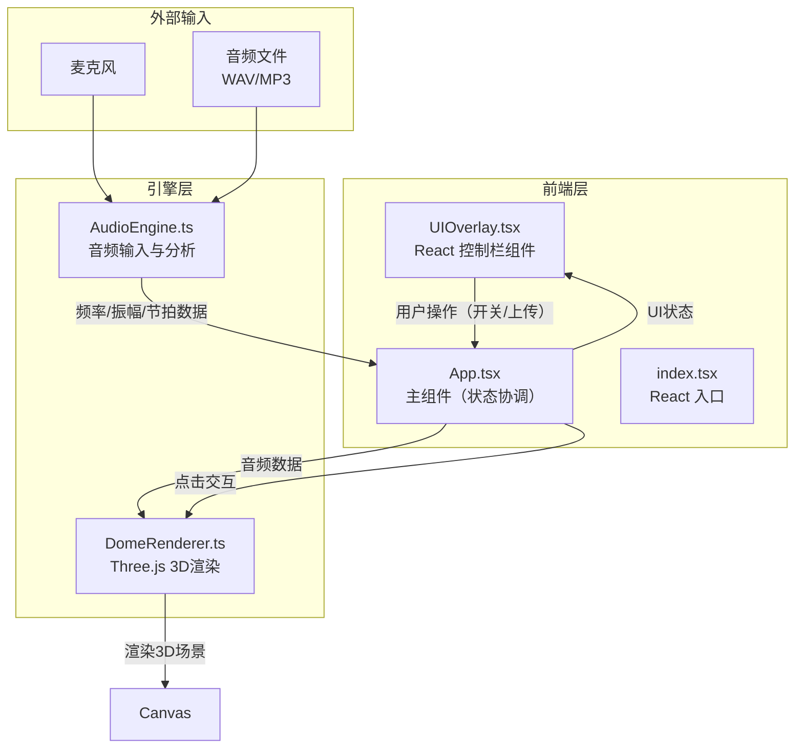

## 1. 架构设计



## 2. 技术说明

- 前端：React 18 + TypeScript + Vite
- 3D渲染：Three.js（直接使用，非React Three Fiber，以确保精细控制性能）
- 状态管理：Zustand（轻量级，管理音频状态和UI状态）
- 样式：Tailwind CSS + CSS Modules（控制栏毛玻璃效果）
- 构建工具：Vite
- 后端：无

## 3. 路由定义

| 路由 | 用途 |
|------|------|
| / | 主页面，包含3D穹顶可视化场景和音频控制 |

## 4. API定义

无需后端API。音频分析在浏览器端通过Web Audio API完成。

### 4.1 核心数据接口

```typescript
interface AudioData {
  frequencies: Uint8Array;
  amplitudes: Uint8Array;
  beat: {
    detected: boolean;
    intensity: number;
    bpm: number;
  };
  volume: number;
}

interface DomeNodeInteraction {
  nodeId: number;
  position: [number, number, number];
  timestamp: number;
}

interface AppState {
  isPlaying: boolean;
  audioSource: 'mic' | 'file' | null;
  audioData: AudioData | null;
  togglePlay: () => void;
  setAudioSource: (source: 'mic' | 'file' | null) => void;
  setAudioData: (data: AudioData) => void;
}
```

## 5. 服务器架构图

无后端服务。

## 6. 数据模型

无数据库。音频数据为实时流数据，不持久化。

## 7. 文件结构

```
project-root/
├── index.html                  # 入口HTML
├── package.json                # 依赖和脚本
├── tsconfig.json               # TypeScript配置
├── vite.config.ts              # Vite构建配置
├── tailwind.config.js          # Tailwind CSS配置
├── postcss.config.js           # PostCSS配置
├── src/
│   ├── index.tsx               # React入口，挂载根组件
│   ├── App.tsx                 # 主组件，协调AudioEngine和DomeRenderer
│   ├── AudioEngine.ts          # 音频输入、Web Audio API分析、节拍检测
│   ├── DomeRenderer.ts         # Three.js场景初始化、穹顶网格、粒子系统、交互
│   ├── UIOverlay.tsx           # React控制栏组件（毛玻璃、频谱预览、按钮）
│   ├── store.ts                # Zustand状态管理
│   ├── index.css               # 全局样式和Tailwind导入
│   └── vite-env.d.ts           # Vite类型声明
```

## 8. 关键技术实现方案

### 8.1 音频引擎（AudioEngine.ts）

- 使用 Web Audio API 的 `AudioContext`、`AnalyserNode`、`MediaStreamSource`/`MediaElementSource`
- 麦克风：`navigator.mediaDevices.getUserMedia()` → `MediaStreamSource` → `AnalyserNode`
- 文件上传：`AudioContext.decodeAudioData()` → `AudioBufferSourceNode` → `AnalyserNode`
- 频率数据：`AnalyserNode.getByteFrequencyData()` 获取256频段
- 振幅数据：`AnalyserNode.getByteTimeDomainData()` 获取波形
- 节拍检测：基于低频能量突增的简单算法（对比当前低频能量与历史均值，超过阈值即判定为节拍）

### 8.2 穹顶渲染器（DomeRenderer.ts）

- 场景初始化：`THREE.Scene` + `PerspectiveCamera` + `WebGLRenderer`（antialias, alpha）
- 穹顶网格：基于 `THREE.SphereGeometry` 的线框骨架，使用 `THREE.LineSegments` + 自定义ShaderMaterial实现发光效果
- 节点脉冲：存储穹顶顶点原始位置，每帧根据音频节拍数据修改顶点位置（径向偏移），颜色在shader中从蓝到粉渐变
- 粒子系统：`THREE.Points` + `THREE.BufferGeometry` + 自定义ShaderMaterial（点精灵发光），最多8000粒子
- 粒子运动：每粒子存储球面坐标(θ, φ)，每帧递增θ实现螺旋运动，速度由节拍强度驱动
- 光爆效果：点击时通过Raycaster检测交点，在交点处创建临时发光球体（scale动画）+ 冲击波环（TorusGeometry scale动画），并修改附近粒子的速度向量使其向外推散
- 后处理：`EffectComposer` + `RenderPass` + `UnrealBloomPass` 实现霓虹发光

### 8.3 UI层（UIOverlay.tsx）

- 毛玻璃效果：`backdrop-filter: blur(16px)` + 半透明深色背景
- 频谱预览：小型Canvas元素，绘制实时频率波形
- 音量指示器：CSS动画条，宽度随音量变化
- 按钮发光：CSS `box-shadow` + `transition` 实现悬停霓虹发光

### 8.4 性能优化

- 粒子数硬限制8000，通过BufferAttribute预分配
- 穹顶网格细分度适中（~40×40段），保证视觉又不过度消耗
- 使用requestAnimationFrame驱动渲染循环
- ShaderMaterial避免CPU端每帧计算颜色，由GPU完成
- UnrealBloomPass分辨率降采样（0.5x）减少GPU负担
- 使用`THREE.InstancedBufferGeometry`或`THREE.Points`而非独立Mesh
