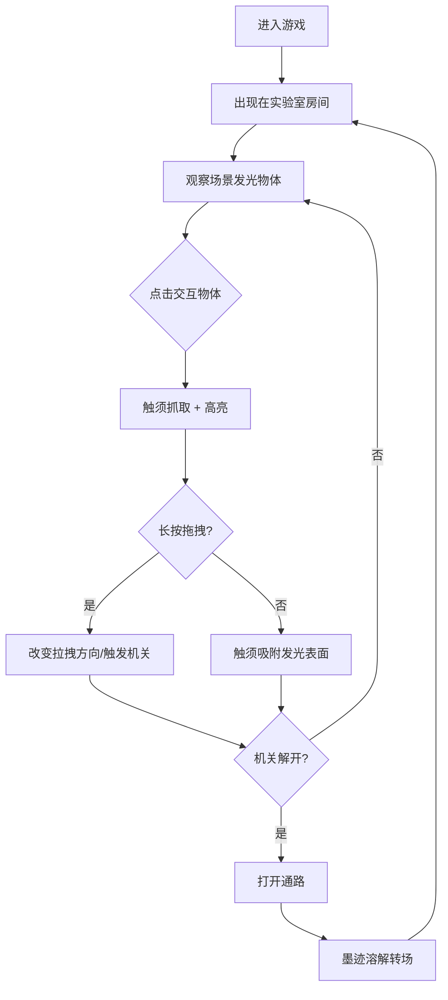

## 1. 产品概述

「暗潮囚笼」是一款2D即时动作解谜游戏，玩家操控能释放暗影触须的角色，在废弃地下实验室中通过抓取和拉拽场景中的光线、碎片或敌人来解开机关、打开通路。
- 核心体验：触须物理交互 + 光线解谜 + 暗黑手绘漫画视觉
- 目标用户：喜爱独立游戏、解谜类游戏、暗黑美学风格的玩家

## 2. 核心功能

### 2.1 用户角色

| 角色 | 说明 |
|------|------|
| 玩家角色 | 操控暗影触须的实验体，拥有生命值和能量值 |

### 2.2 功能模块

1. **游戏主界面**：游戏画布渲染区 + HUD叠加层（生命/能量/地图/线索）
2. **实验室房间**：多个可切换的房间场景，每间包含可交互物体和机关

### 2.3 页面详情

| 页面名称 | 模块名称 | 功能描述 |
|----------|----------|----------|
| 游戏主界面 | Canvas渲染区 | 绘制实验室场景、光线、暗雾、触须及所有动态效果，60fps |
| 游戏主界面 | 角色控制 | WASD移动角色，左键点击交互物体自动触须抓取，长按拖拽改变拉拽方向 |
| 游戏主界面 | 触须系统 | 触须生成、吸附发光表面、拖拽物理、粒子拖尾效果 |
| 游戏主界面 | 生命/能量面板 | 左上角显示角色生命值和能量条，能量用于释放触须，随时间缓慢恢复 |
| 游戏主界面 | 地图/线索面板 | 右下角毛玻璃效果地图和线索面板 |
| 游戏主界面 | 房间转场 | 切换房间时黑色墨迹溶解转场动画 |
| 游戏主界面 | 交互高亮 | 鼠标悬停/点击可交互物体时高亮显示 |

## 3. 核心流程

玩家进入游戏 → 出现在废弃实验室房间 → 观察场景中发光物体和机关 → 点击发光物体释放触须抓取 → 长按拖拽改变光线方向或触发陷阱 → 解开机关打开通路 → 墨迹转场进入下一房间 → 继续探索解谜

## 4. 用户界面设计

### 4.1 设计风格

- 主色调：黑灰(#1a1a2e) 到深红(#8b0000) 渐变背景
- 辅助色：深紫色(#4a0e4e) 用于触须，暖黄色(#ffd700) 用于光线
- 按钮风格：无传统按钮，交互通过Canvas内点击和拖拽完成
- 字体：手绘风格像素字体，标题18px，线索文本14px
- 布局风格：全屏Canvas游戏画面，HUD元素叠加在Canvas之上
- 暗雾效果：半透明深灰色烟雾在场景中飘动
- 触须视觉：深紫色半透明线条，带细碎光点拖尾
- 吸附点光晕：脉动式发光效果
- 光线视觉：暖黄色半透明光束，被抓取时有扭曲变形动画

### 4.2 页面设计概览

| 页面名称 | 模块名称 | UI元素 |
|----------|----------|--------|
| 游戏主界面 | 生命/能量面板 | 左上角竖排，深色半透明背景，红色生命条，紫色能量条，带脉动动画 |
| 游戏主界面 | 地图/线索面板 | 右下角，毛玻璃(backdrop-filter:blur)效果，深色半透明，地图缩略图 + 线索文字列表 |
| 游戏主界面 | 交互高亮 | 可交互物体边缘发出暖黄色脉动光晕 |
| 游戏主界面 | 转场动画 | 全屏黑色墨迹从中心向四周扩散溶解，持续1秒 |

### 4.3 响应式设计

- 桌面优先，Canvas自适应窗口大小
- HUD元素使用绝对定位 + 百分比布局，适配不同分辨率
- 触须交互区域随Canvas尺寸缩放

### 4.4 2D场景指引

- 环境/氛围：废弃地下实验室，昏暗潮湿，管道纵横
- 光照设置：场景中散布少量暖黄色光源（灯管、裂缝漏光），其余区域黑暗
- 相机设置：固定视角俯视，跟随角色平移
- 构图焦点：可交互的发光物体是视觉焦点
- 交互动画：触须伸展/收缩、光线扭曲变形、暗雾飘动、粒子拖尾
- 后处理效果：暗角(vignette)、色彩偏移、噪点纹理叠加
- 性能预算：60fps稳定运行，粒子数量控制在200以内
