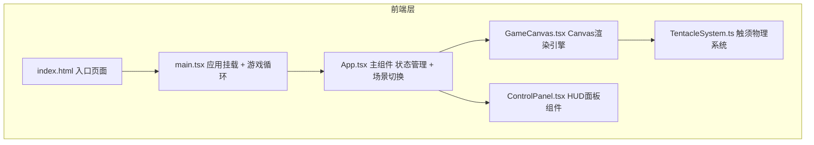
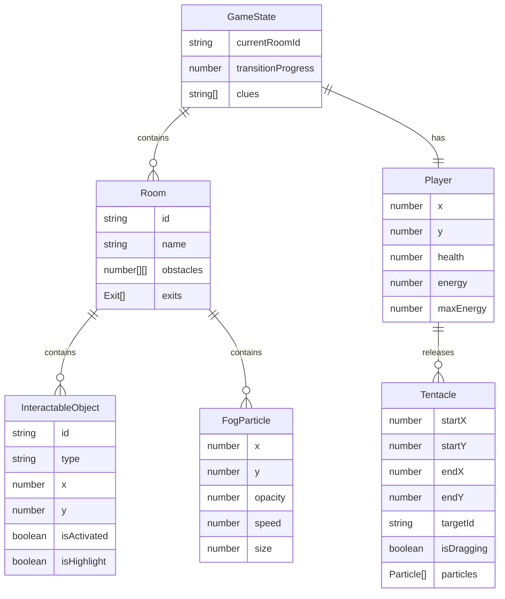

## 1. 架构设计



## 2. 技术说明

- 前端：React@18 + TypeScript + Vite
- 状态管理：Zustand（管理游戏状态、房间数据、角色属性）
- 初始化工具：vite-init (react-ts模板)
- 后端：无
- 数据库：无（游戏数据在前端内存中管理）

## 3. 路由定义

| 路由 | 用途 |
|------|------|
| / | 游戏主页面，包含Canvas和HUD |

## 4. 文件结构

```
├── index.html                  # 入口页面
├── package.json                # 依赖和脚本
├── vite.config.ts              # Vite配置
├── tsconfig.json               # TypeScript配置
└── src/
    ├── main.tsx                # 入口挂载React应用并初始化游戏循环
    ├── App.tsx                 # 主组件管理游戏状态、场景切换和UI布局
    ├── GameCanvas.tsx          # Canvas渲染引擎，绘制场景、光线、暗雾、动态效果
    ├── TentacleSystem.ts       # 触须生成、抓取逻辑、拖拽物理和粒子拖尾
    ├── ControlPanel.tsx        # UI面板：生命值、能量条、地图和线索
    └── store.ts                # Zustand全局状态管理
```

## 5. 核心模块说明

### 5.1 GameCanvas.tsx - 渲染引擎

- 使用HTML5 Canvas 2D上下文
- 渲染层次（从后到前）：背景渐变 → 暗雾 → 场景物体 → 光线 → 触须 → 粒子效果 → 暗角叠加
- requestAnimationFrame驱动60fps游戏循环
- 场景数据结构定义可交互物体的位置、类型、状态

### 5.2 TentacleSystem.ts - 触须系统

- 触须用贝塞尔曲线绘制，控制点受物理模拟影响
- 抓取逻辑：点击可交互物体 → 触须从角色位置伸展到目标 → 吸附光晕动画
- 拖拽物理：长按时触须末端跟随鼠标，物体受弹性力影响
- 粒子拖尾：触须路径上生成细碎光点粒子，带有渐隐效果
- 能量消耗：每次释放触须消耗能量，能量不足时无法释放

### 5.3 ControlPanel.tsx - HUD面板

- 生命值条：红色渐变条，受伤时有闪烁动画
- 能量条：紫色渐变条，随能量恢复缓慢填充
- 地图面板：毛玻璃效果(backdrop-filter: blur)，显示已探索房间
- 线索面板：毛玻璃效果，显示已收集的线索文字

### 5.4 场景转场

- 墨迹溶解效果：使用Canvas绘制扩展的黑色圆形遮罩
- 转场期间切换场景数据
- 转场完成后淡出遮罩

## 6. 数据模型

### 6.1 游戏状态数据模型



### 6.2 Zustand Store 定义

```typescript
interface GameStore {
  player: {
    x: number;
    y: number;
    health: number;
    energy: number;
    maxEnergy: number;
  };
  currentRoomId: string;
  rooms: Record<string, Room>;
  clues: string[];
  isTransitioning: boolean;
  transitionProgress: number;
  updatePlayer: (partial: Partial<GameStore['player']>) => void;
  setCurrentRoom: (roomId: string) => void;
  addClue: (clue: string) => void;
  setTransition: (isTransitioning: boolean, progress: number) => void;
}
```
