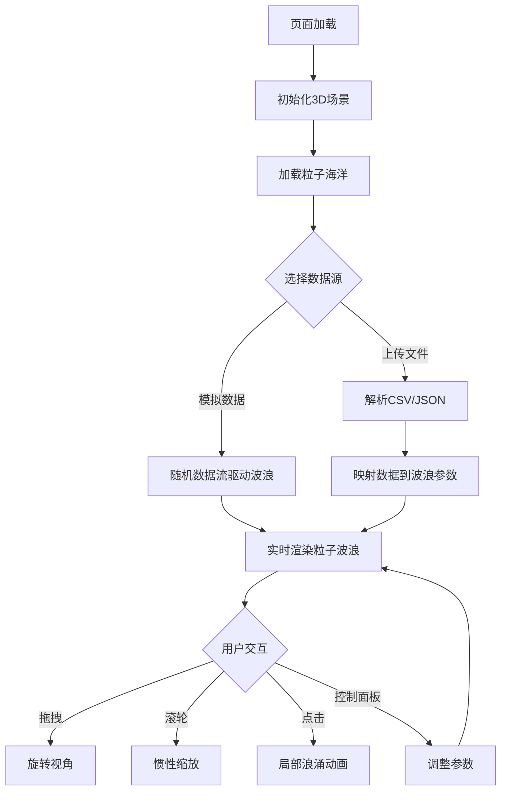

## 1. 产品概述

「数据潮汐」是一个3D交互式数据可视化项目，在深蓝色数字海洋中用数千个发光粒子模拟由实时数据流驱动的动态波浪。用户可通过鼠标交互控制波浪形态，查看不同数据维度的视觉映射，实现数据与视觉艺术的融合体验。

- 目标用户：数据分析师、可视化爱好者、创意开发者
- 核心价值：将抽象数据转化为沉浸式3D视觉体验，让数据"可触摸"

## 2. 核心功能

### 2.1 功能模块

1. **3D粒子海洋场景**：数千个发光粒子组成的动态波浪，粒子大小和颜色随波浪高度变化，底部有半透明光晕
2. **数据驱动波浪**：支持模拟随机数据和用户上传CSV/JSON文件两种数据源，数据自动映射到波浪参数（高度、颜色、速度）
3. **交互控制**：鼠标拖拽旋转视角、滚轮惯性缩放、点击波浪触发局部浪涌动画
4. **控制面板**：毛玻璃风格面板，包含数据源选择、振幅滑块、颜色主题切换、粒子密度调节和重置视角按钮

### 2.2 页面详情

| 页面名称 | 模块名称 | 功能描述 |
|---------|---------|---------|
| 主场景 | 粒子海洋 | 数千个发光粒子组成的波浪网格，自动旋转，粒子拖尾效果 |
| 主场景 | 数据映射层 | 根据数据源实时调整波浪高度、颜色和速度 |
| 主场景 | 交互反馈层 | 鼠标拖拽旋转、滚轮缩放、点击浪涌动画 |
| 控制面板 | 数据源选择器 | 切换模拟数据/上传文件两种模式 |
| 控制面板 | 参数调节器 | 波浪振幅滑块、粒子密度滑块（1000-5000） |
| 控制面板 | 主题切换器 | 海洋/火焰/极光三种颜色主题，平滑过渡 |
| 控制面板 | 重置按钮 | 一键重置相机视角到默认位置 |

## 3. 核心流程

1. 用户进入页面 → 加载3D场景 → 粒子海洋默认以模拟数据缓慢旋转
2. 用户可通过控制面板切换数据源 → 波浪形态响应式变化
3. 用户上传CSV/JSON文件 → 数据自动映射到波浪参数 → 视觉效果实时更新
4. 用户鼠标交互 → 拖拽旋转/滚轮缩放/点击浪涌
5. 用户切换颜色主题 → 粒子颜色平滑过渡

## 4. 用户界面设计

### 4.1 设计风格

- **主色调**：深蓝色（#0a0e27）到纯黑（#000000）渐变背景，搭配青蓝色（#00d4ff）发光粒子
- **辅助色**：火焰主题（橙红渐变 #ff4500 → #ff8c00）、极光主题（绿紫渐变 #00ff88 → #8b5cf6）
- **按钮风格**：圆角半透明，hover时边框发光，点击有涟漪效果
- **字体**：标题使用 Orbitron（科技感显示字体），UI文字使用 Rajdhani（未来感正文）
- **布局风格**：全屏3D场景 + 悬浮毛玻璃控制面板
- **图标风格**：线性描边图标，发光效果

### 4.2 页面设计概览

| 页面名称 | 模块名称 | UI元素 |
|---------|---------|--------|
| 主场景 | 全屏3D画布 | 深蓝到黑渐变背景，居中标题"数据潮汐"，Orbitron字体，入场淡入动画 |
| 主场景 | 粒子波浪 | 数千发光粒子，AdditiveBlending混合，粒子大小随高度变化，底部光晕 |
| 控制面板 | 毛玻璃容器 | backdrop-blur，半透明白色边框发光，圆角16px |
| 控制面板 | 数据源选择器 | 下拉菜单，模拟/上传两种选项，上传区域支持拖拽 |
| 控制面板 | 振幅滑块 | 自定义样式range input，实时数值显示 |
| 控制面板 | 主题切换 | 三个圆形色块按钮，选中时边框发光，切换动画0.5s |
| 控制面板 | 粒子密度 | 带数值标签的滑块，1000-5000范围 |
| 控制面板 | 重置按钮 | 居中按钮，点击后相机平滑归位 |

### 4.3 响应式适配

- **桌面端**：控制面板位于右下角，固定宽度280px，距右下各24px
- **移动端**（< 768px）：控制面板底部全宽，可折叠展开，圆角仅在顶部
- **触摸优化**：移动端触摸拖拽旋转，双指缩放替代滚轮

### 4.4 3D场景指引

- **环境**：深蓝色数字海洋氛围，无HDRI，用雾效果（Fog）营造深度
- **光照**：环境光（低强度蓝色调）+ 点光源（随数据脉冲闪烁）
- **相机**：PerspectiveCamera，FOV 60°，初始位置(0, 15, 30)，默认自动旋转速度0.1
- **构图**：粒子波浪居中，相机略高俯视，营造俯瞰数字海洋感
- **交互**：拖拽旋转（惯性衰减）、滚轮缩放（带惯性）、点击浪涌（raycasting检测）
- **后处理**：UnrealBloomPass泛光效果，增强粒子发光感
- **性能预算**：粒子数1000-5000，目标60fps，使用BufferGeometry + Points

## 5. 非功能性需求

| 需求类别 | 描述 |
|---------|------|
| 性能 | 帧率稳定60fps，粒子数动态调节时平滑过渡（逐帧增减） |
| 兼容性 | 支持Chrome 90+、Firefox 90+、Safari 15+、Edge 90+ |
| 响应式 | 桌面右下角面板 → 移动端底部全宽面板 |
| 动画 | 所有状态切换均有平滑过渡，浪涌动画持续2秒后恢复 |
