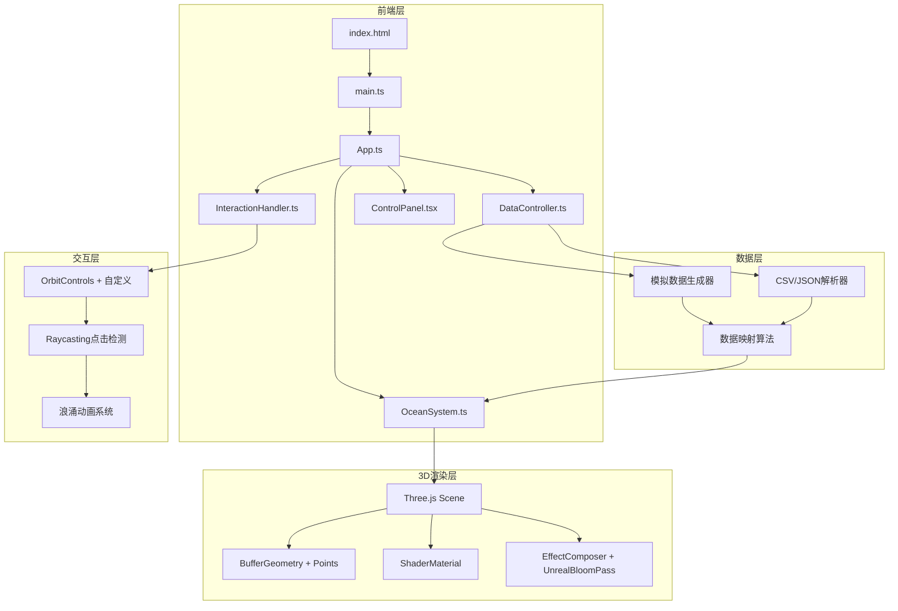

## 1. 架构设计



## 2. 技术说明

- **前端框架**：React 18 + TypeScript（严格模式）
- **3D引擎**：Three.js（直接使用，非React Three Fiber，以获得更精细的粒子系统控制）
- **UI组件**：React（仅用于控制面板），毛玻璃效果通过CSS backdrop-filter实现
- **构建工具**：Vite + TypeScript插件
- **状态管理**：模块间通过App.ts中央协调，事件驱动架构
- **初始化工具**：vite-init（react-ts模板）

## 3. 路由定义

| 路由 | 用途 |
|------|------|
| / | 单页面应用，3D场景 + 控制面板 |

## 4. 文件结构与模块职责

| 文件路径 | 职责 |
|---------|------|
| `src/main.ts` | 入口文件，初始化Three.js场景、相机、渲染器、EffectComposer，挂载React控制面板 |
| `src/App.ts` | 主组件，管理场景状态（数据源、振幅、主题、密度），协调各子系统通信 |
| `src/OceanSystem.ts` | 粒子波浪核心：BufferGeometry生成、波浪算法（多层正弦叠加）、粒子属性管理、拖尾效果、浪涌动画 |
| `src/DataController.ts` | 数据流管理：模拟随机数据生成、CSV/JSON解析、数据到波浪参数的映射算法 |
| `src/InteractionHandler.ts` | 交互处理：OrbitControls自定义扩展、惯性缩放、Raycasting点击检测、浪涌触发 |
| `src/ui/ControlPanel.tsx` | React毛玻璃控制面板：数据源选择、振幅滑块、主题切换、密度调节、重置按钮 |
| `index.html` | 入口页面，深蓝到黑渐变背景 |
| `package.json` | 项目依赖与脚本 |
| `tsconfig.json` | TypeScript严格模式配置，路径别名 |
| `vite.config.ts` | Vite配置，React插件 |

## 5. 核心算法设计

### 5.1 波浪算法

采用多层正弦波叠加法：
```
height(x, z, t) = Σ(Ai * sin(kxi * x + kzi * z + ωi * t + φi))
```
其中每层波浪有不同的振幅Ai、波数(kxi, kzi)、频率ωi和相位φi，共叠加4-6层。

### 5.2 数据映射

数据值归一化到[0, 1]区间后映射到波浪参数：
- 高度映射：`amplitude = baseAmplitude * (0.5 + normalizedValue * 1.5)`
- 颜色映射：通过主题调色板插值，低值→冷色，高值→暖色
- 速度映射：`speed = baseSpeed * (0.5 + normalizedValue)`

### 5.3 浪涌动画

点击位置为中心，半径R内的粒子施加高斯衰减的向上冲量：
```
surgeHeight(r, t) = A * exp(-r²/2σ²) * sin(πt/T) * (1 - t/T)
```
持续T=2秒后恢复原始波浪。

### 5.4 拖尾效果

使用自定义ShaderMaterial，在顶点着色器中记录粒子历史位置，片段着色器中根据速度方向绘制拖尾，通过alpha渐变实现。

### 5.5 粒子密度过渡

动态增减粒子时，每帧最多增减50个粒子，避免突变导致的性能抖动。

## 6. 主题色彩映射

| 主题名 | 低值色 | 中值色 | 高值色 | 光晕色 |
|-------|--------|--------|--------|--------|
| 海洋 | #003366 | #0088cc | #00d4ff | rgba(0,100,200,0.3) |
| 火焰 | #661100 | #cc4400 | #ff8c00 | rgba(200,80,0,0.3) |
| 极光 | #1a0033 | #5533cc | #00ff88 | rgba(80,50,200,0.3) |
