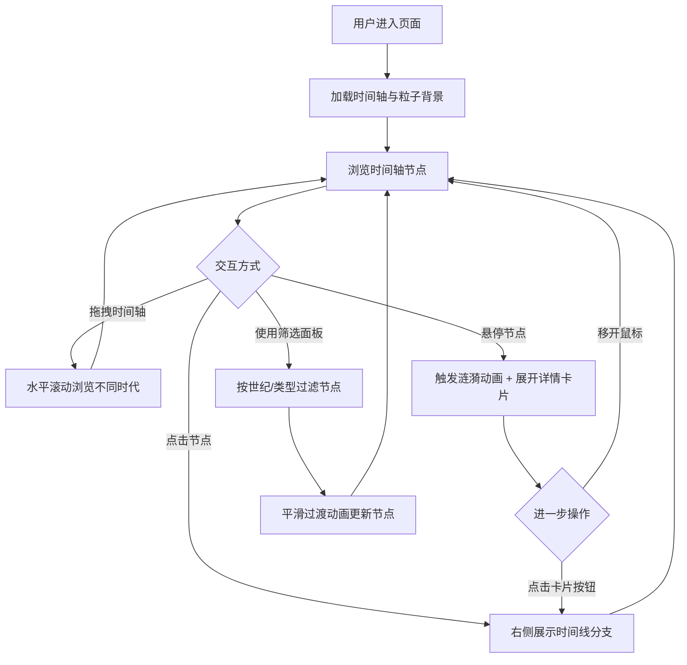

## 1. 产品概述

「时光旅者」是一款交互式时间轴可视化工具，让用户以沉浸式的方式探索人类历史重大事件。采用复古科幻视觉风格，通过动态粒子、发光节点和毛玻璃界面，营造出穿越时空的体验感。

- 目标用户：历史爱好者、教育工作者、对交互可视化感兴趣的开发者
- 核心价值：将枯燥的历史事件时间线转化为可交互、可探索的沉浸式视觉体验

## 2. 核心功能

### 2.1 用户角色
| 角色 | 注册方式 | 核心权限 |
|------|----------|----------|
| 访客 | 无需注册 | 浏览和交互所有时间轴内容 |

### 2.2 功能模块
1. **主时间轴页面**：动态时间轴、历史事件节点、粒子背景、事件详情卡片
2. **筛选面板**：按世纪/事件类型过滤，实时平滑过渡
3. **事件分支面板**：选中事件的详细时间线分支展示

### 2.3 页面详情
| 页面名称 | 模块名称 | 功能描述 |
|----------|----------|----------|
| 主时间轴页面 | 动态时间轴 | 水平可拖拽时间轴，半透明金色光线，流动粒子效果 |
| 主时间轴页面 | 事件节点 | 暖黄到冷蓝渐变发光圆环节点，悬停展开详情卡片 |
| 主时间轴页面 | 涟漪动画 | 悬停/点击节点时触发涟漪扩散动画 |
| 主时间轴页面 | 事件详情卡片 | 毛玻璃质感卡片，等宽字体文字，复古圆形仪表盘按钮 |
| 筛选面板 | 世纪筛选 | 按世纪范围过滤事件节点，平滑过渡动画 |
| 筛选面板 | 类型筛选 | 按科技/战争/文化等类型过滤，平滑过渡动画 |
| 事件分支面板 | 时间线分支 | 展示选中事件的详细子事件时间线 |

## 3. 核心流程

用户打开页面后，看到深蓝到紫色渐变背景搭配星云纹理的沉浸式界面，中央横贯一条半透明金色时间轴，轴上分布着发光的事件节点。用户可以：

1. **拖拽浏览**：沿时间轴左右拖拽，探索不同时代的事件
2. **悬停探索**：鼠标悬停到节点上，触发涟漪动画并展开毛玻璃详情卡片
3. **筛选过滤**：通过左侧毛玻璃面板按世纪或事件类型筛选节点
4. **深入探索**：点击节点后右侧展示该事件的详细时间线分支

## 4. 用户界面设计

### 4.1 设计风格
- **主色调**：深蓝(#0a0e27)到紫色(#2d1b69)渐变背景，星云纹理叠加
- **强调色**：半透明金色(#ffd700/80%)时间轴线，暖黄(#ffb347)到冷蓝(#4fc3f7)渐变节点
- **按钮风格**：复古圆形仪表盘样式，金属质感边框
- **字体**：等宽字体(IBM Plex Mono / Fira Code)，标题使用 Space Mono
- **布局风格**：全屏沉浸式，左侧筛选面板 + 中央时间轴 + 右侧分支面板
- **质感**：毛玻璃(backdrop-blur)面板和卡片，发光效果(glow/shadow)

### 4.2 页面设计概览
| 页面名称 | 模块名称 | UI元素 |
|----------|----------|--------|
| 主时间轴页面 | 背景 | 深蓝→紫色渐变，CSS星云纹理（径向渐变+噪声），浮动粒子 |
| 主时间轴页面 | 时间轴线 | 半透明金色水平线，沿线的流动光点粒子 |
| 主时间轴页面 | 事件节点 | 渐变发光圆环(暖黄→冷蓝)，外发光，悬停放大+脉冲 |
| 主时间轴页面 | 详情卡片 | 毛玻璃背景，等宽字体文字，圆角，发光边框，仪表盘按钮 |
| 筛选面板 | 面板容器 | 左侧固定，毛玻璃背景，可折叠，世纪滑块+类型标签 |
| 筛选面板 | 筛选控件 | 世纪范围滑块，类型复选标签(科技/战争/文化) |
| 事件分支面板 | 分支时间线 | 右侧面板，垂直子时间线，连接线+小节点 |

### 4.3 响应式设计
- 桌面端优先（1920×1080基准）
- 大屏(>1440px)：三栏全展开
- 中屏(1024-1440px)：筛选面板折叠为图标，右侧面板浮层
- 小屏(<1024px)：筛选面板底部抽屉，右侧面板全屏浮层

### 4.4 动效规范
- 粒子系统：Canvas绘制，60fps，约100个流动粒子
- 节点涟漪：CSS动画，300ms扩散
- 筛选过渡：节点透明度+位移，500ms ease-in-out
- 卡片展开：缩放+淡入，250ms
- 拖拽：requestAnimationFrame驱动，无延迟
