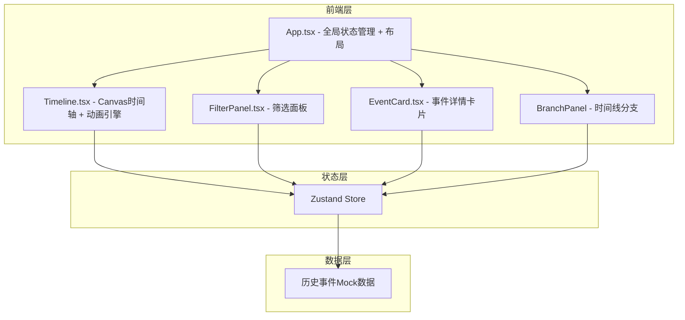

## 1. 架构设计



## 2. 技术说明
- 前端：React@18 + TypeScript + Tailwind CSS@3 + Vite
- 初始化工具：vite-init (react-ts 模板)
- 状态管理：Zustand
- 后端：无（纯前端，使用Mock数据）
- 数据库：无（内嵌Mock数据集）

## 3. 路由定义
| 路由 | 用途 |
|------|------|
| / | 主时间轴页面，包含所有交互功能 |

## 4. 数据模型

### 4.1 核心数据结构

```typescript
interface HistoricalEvent {
  id: string;
  title: string;
  year: number;
  century: number;
  category: 'technology' | 'war' | 'culture' | 'politics' | 'exploration';
  description: string;
  detail: string;
  branches?: EventBranch[];
}

interface EventBranch {
  id: string;
  title: string;
  year: number;
  description: string;
}

interface FilterState {
  centuries: number[];
  categories: string[];
}
```

### 4.2 状态管理（Zustand Store）

```typescript
interface TimelineStore {
  events: HistoricalEvent[];
  filteredEvents: HistoricalEvent[];
  selectedEvent: HistoricalEvent | null;
  hoveredEvent: HistoricalEvent | null;
  filters: FilterState;
  setFilters: (filters: Partial<FilterState>) => void;
  selectEvent: (event: HistoricalEvent | null) => void;
  hoverEvent: (event: HistoricalEvent | null) => void;
}
```

## 5. 组件架构

| 组件 | 职责 | 关键技术 |
|------|------|----------|
| App.tsx | 全局布局、状态管理、三栏布局 | Zustand, 响应式布局 |
| Timeline.tsx | Canvas时间轴渲染、粒子系统、节点绘制、拖拽交互 | Canvas API, requestAnimationFrame |
| FilterPanel.tsx | 世纪筛选、类型筛选、毛玻璃面板 | Tailwind, CSS过渡 |
| EventCard.tsx | 事件详情卡片、涟漪动画、仪表盘按钮 | CSS动画, 毛玻璃效果 |
| BranchPanel | 选中事件的子时间线分支 | CSS动画, 列表渲染 |

## 6. 性能策略
- Canvas粒子系统：离屏渲染，requestAnimationFrame驱动
- 节点渲染：Canvas批量绘制，避免逐个DOM操作
- 筛选过渡：CSS transform + opacity，GPU加速
- 拖拽：passive事件监听，防止滚动阻塞
- 卡片：React.memo防止不必要重渲染
