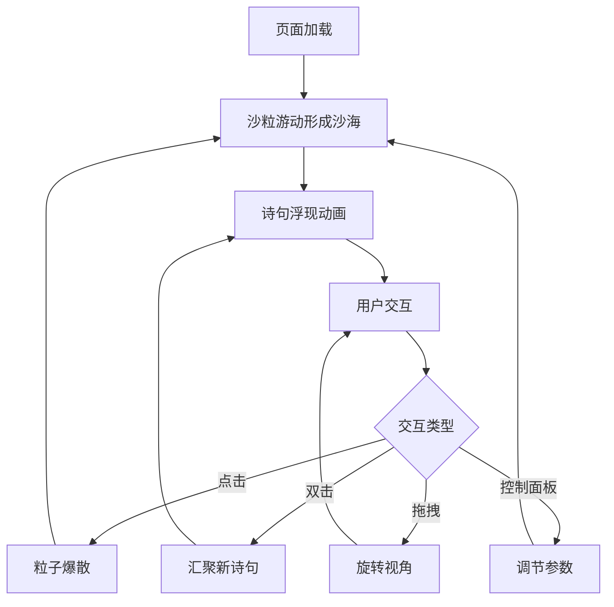

# 流沙诗集 — 产品需求文档

## 1. 产品概述
「流沙诗集」是一个3D交互可视化项目，在浩瀚沙漠夜空下，由无数发光沙粒构成动态沙海，沙粒随时间流动形成文字诗句，并随用户交互产生漩涡、目标用户为追求沉浸式视觉体验的创意设计师和交互爱好者，核心价值在于将诗歌与粒子动效结合，打造令人难忘的沉浸式数字体验。

## 2. 核心功能

### 2.1 功能模块
1. **沙粒粒子系统**：粒子在3D空间中随机游动，形成沙海流动效果，带缓慢波浪起伏
2. **文字浮现动画**：沙粒根据诗句位置逐渐汇聚成文字，文字边缘有流动轨迹，浮现后维持一段时间再消散
3. **交互反馈**：点击沙粒触发粒子汇聚并爆散成金色粒子流，双击使所有粒子快速汇聚成新诗句，拖拽旋转视角平滑无卡顿
4. **控制面板**：右下角毛玻璃面板，包含沙粒数量滑块（2000-8000）、诗句切换速度滑块、当前诗句显示、随机生成按钮

### 2.2 页面详情
| 页面 | 模块 | 功能描述 |
|------|------|----------|
| 主场景 | 沙海粒子 | 粒子在3D空间游动，波浪起伏，构成流动沙海 |
| 主场景 | 文字浮现 | 沙粒汇聚成诗句文字，浮现后消散 |
| 主场景 | 交互反馈 | 点击爆散、双击汇聚、拖拽旋转 |
| 控制面板 | 参数调节 | 沙粒数量滑块、诗句速度滑块、诗句显示、随机按钮 |

## 3. 核心流程
用户打开页面 → 沙粒在3D空间中游动形成沙海 → 诗句文字由沙粒汇聚浮现 → 用户欣赏或交互 → 点击触发爆散 → 双击汇聚新诗句 → 拖拽旋转视角 → 控制面板调节参数 → 循环

## 4. 界面设计

### 4.1 设计风格
- **主色调**：深蓝 (#0a0e27) 到墨黑 (#000000) 渐变背景
- **辅助色**：暖金色沙粒 (#ffd700 / #e8a317)，微弱光晕 (#fff8dc)
- **按钮样式**：圆形沙漏样式，金色细边框，微光悬停
- **字体**：优雅衬线字体（Noto Serif SC），诗词显示用
- **布局**：全屏3D场景 + 右下角悬浮控制面板
- **面板风格**：毛玻璃半透明磨砂质感，金色细边框

### 4.2 页面设计概览
| 页面 | 模块 | UI元素 |
|------|------|--------|
| 主场景 | 沙海背景 | 深蓝-墨黑渐变，粒子金色发光带光晕和拖尾 |
| 主场景 | 诗句显示 | 沙粒构成文字，边缘流动轨迹，缓缓浮现又消散 |
| 控制面板 | 参数调节 | 毛玻璃面板，金色边框，圆形沙漏按钮，微光悬停反馈 |

### 4.3 响应式
- 桌面优先设计
- 全屏3D Canvas自适应

### 4.4 3D场景指引
- **环境**：深邃夜空沙漠，无HDRI，使用渐变背景
- **氛围**：神秘、宁静、壮阔
- **相机**：透视相机，位于沙海上方略微俯瞰
- **构图**：沙海为主体，诗句居中浮现
- **交互**：点击爆散、双击汇聚、拖拽旋转
- **动画**：粒子游动、文字浮现消散、爆散汇聚
- **后处理**：粒子光晕效果（PointLight Shader），无需额外后处理
- **资源来源**：纯程序生成，无外部模型
- **性能预算**：8000粒子，60fps，BufferAttribute更新
