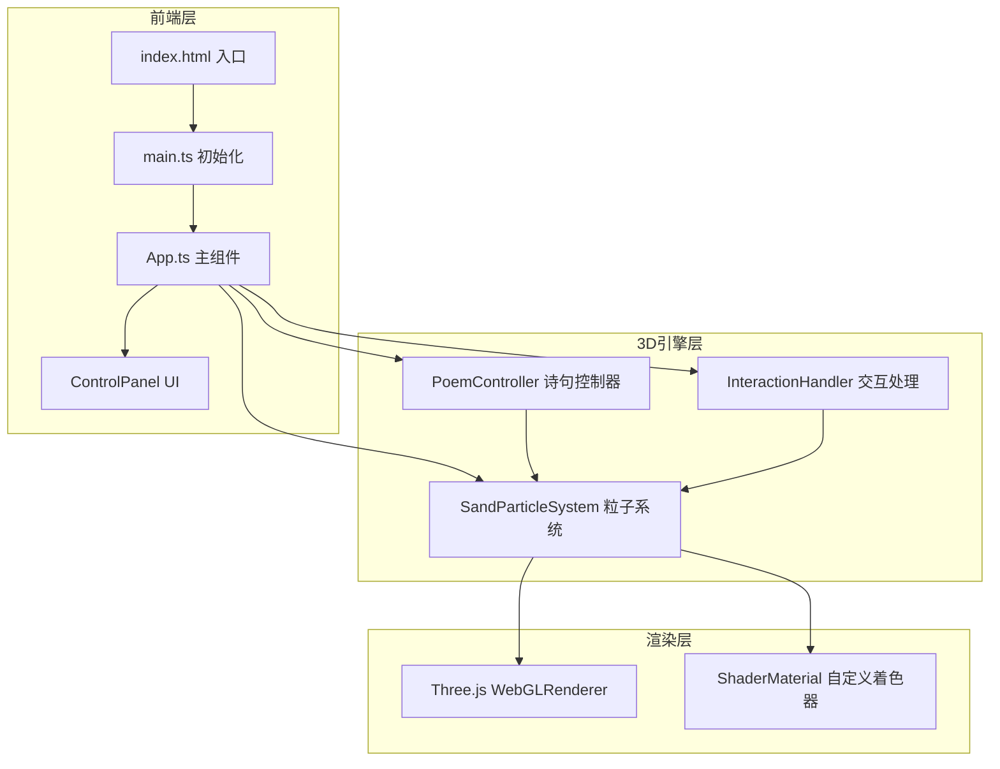

# 流沙诗集 — 技术架构文档

## 1. 架构设计



## 2. 技术说明
- **前端**：TypeScript + Three.js + Vite（纯TS类组件，无React）
- **构建**：Vite
- **包管理**：npm
- **无后端**：纯前端项目

## 3. 文件结构
```
├── index.html
├── package.json
├── tsconfig.json
├── vite.config.js
└── src/
    ├── main.ts
    ├── App.ts
    ├── SandParticleSystem.ts
    ├── PoemController.ts
    └── InteractionHandler.ts
```

## 4. 模块职责

### 4.1 main.ts
- 创建Scene、PerspectiveCamera、WebGLRenderer
- 启动App

### 4.2 App.ts
- 管理整体场景状态
- 创建并协调SandParticleSystem、PoemController、InteractionHandler
- 渲染循环animate()
- ControlPanel DOM创建和事件绑定

### 4.3 SandParticleSystem.ts
- 类SandParticleSystem
- 属性：geometry、material、points、positions、velocities、targetPositions
- 方法：init(count)、update(dt,elapsed)、setTargets(positions)、burstAt(point)、gatherTo(positions)、resize()
- ShaderMaterial：顶点着色器点大小+颜色，片元着色器圆形粒子+光晕

### 4.4 PoemController.ts
- 类PoemController
- 属性：poems数组、currentIndex、switchSpeed
- 方法：getTextPositions(text)、next()、random()、update()
- 文字映射：Canvas绘制文字 → 像素采样 → 3D坐标

### 4.5 InteractionHandler.ts
- 类InteractionHandler
- 方法：onMouseDown/Move/Up拖拽旋转、onWheel缩放、onClick射线爆散、onDblClick汇聚新诗句

## 5. 数据模型

```typescript
interface Poem {
  text: string;
  author: string;
}
```

## 6. 性能策略
- 粒子上限8000，BufferAttribute + needsUpdate
- ShaderMaterial避免每帧创建对象
- requestAnimationFrame
- Raycaster仅点击时调用
- 控制面板DOM一次创建
