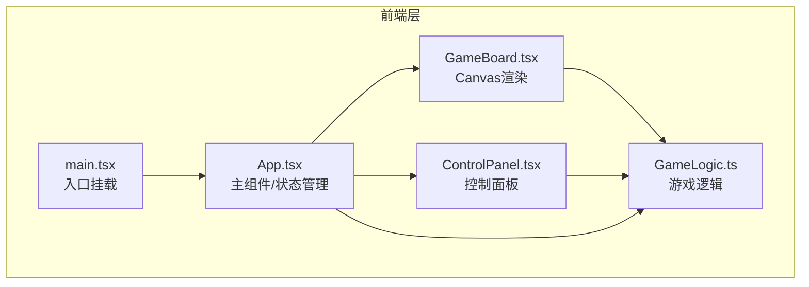
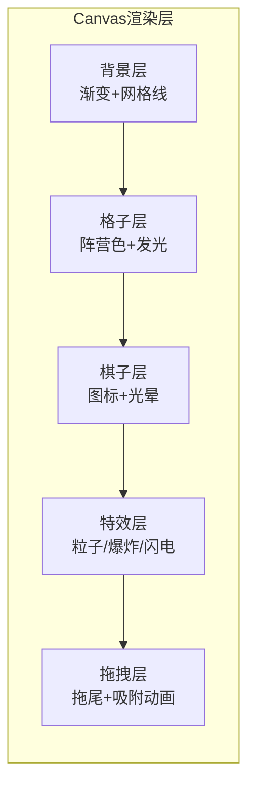

## 1. 架构设计



## 2. 技术说明
- 前端框架：React 18 + TypeScript
- 构建工具：Vite
- 状态管理：Zustand
- 渲染方案：Canvas 2D（棋盘、棋子、粒子特效）
- 样式方案：Tailwind CSS + CSS变量（霓虹主题）
- 无后端，纯前端对战（本地双人）

## 3. 路由定义
| 路由 | 用途 |
|------|------|
| / | 游戏主界面（单页应用） |

## 4. 数据模型

### 4.1 核心类型定义

```typescript
type Faction = "blue" | "red"

interface Spirit {
  id: string
  name: string
  faction: Faction
  hp: number
  maxHp: number
  attack: number
  skill: Skill
  position: { row: number; col: number }
  isFrozen: boolean
  frozenTurns: number
}

interface Skill {
  name: string
  energyCost: number
  range: number
  damage: number
  type: "lightning" | "explosion" | "freeze" | "single"
  description: string
}

interface Cell {
  row: number
  col: number
  owner: Faction | null
  glowIntensity: number
}

interface GameState {
  board: Cell[][]
  spirits: Spirit[]
  currentTurn: Faction
  turnTimer: number
  energy: { blue: number; red: number }
  logs: LogEntry[]
  selectedSpirit: string | null
  selectedSkill: string | null
  phase: "placement" | "playing" | "ended"
  winner: Faction | null
}
```

### 4.2 文件职责
| 文件 | 职责 |
|------|------|
| src/main.tsx | React应用入口，挂载App到DOM |
| src/App.tsx | 主组件，管理游戏状态（Zustand store），三栏布局 |
| src/GameBoard.tsx | Canvas渲染8×8棋盘、棋子、粒子特效、拖拽交互 |
| src/GameLogic.ts | 幻灵数据定义、战斗计算、回合管理、合法移动判定 |
| src/ControlPanel.tsx | 玩家信息、能量条、技能按钮、日志面板、结束回合按钮 |
| index.html | HTML入口 |

## 5. 渲染架构



### 5.1 Canvas渲染策略
- 使用requestAnimationFrame驱动60fps渲染循环
- 分层绘制：背景 → 格子 → 棋子 → 特效 → 拖拽
- 粒子系统：对象池复用，最大粒子数500
- 拖拽吸附：使用easing函数实现平滑过渡动画

### 5.2 交互流程
1. mousedown/touchstart → 检测点击的棋子 → 进入拖拽模式
2. mousemove/touchmove → 更新棋子位置，绘制粒子拖尾
3. mouseup/touchend → 计算最近合法格子，吸附动画，执行移动
4. 技能选择 → 点击技能按钮 → 点击目标 → 播放特效 → 计算伤害
