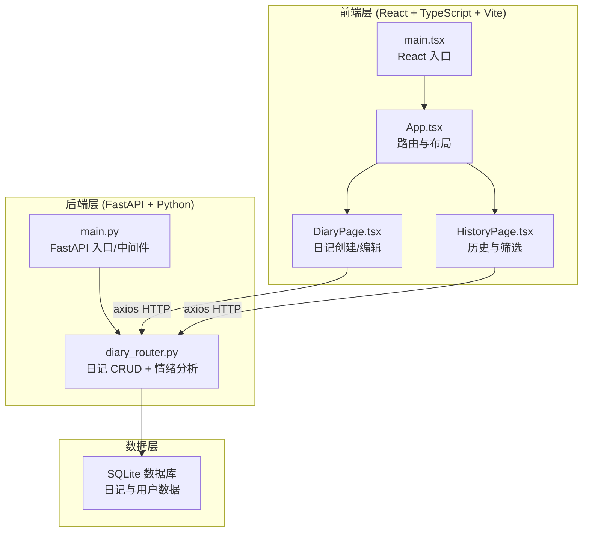
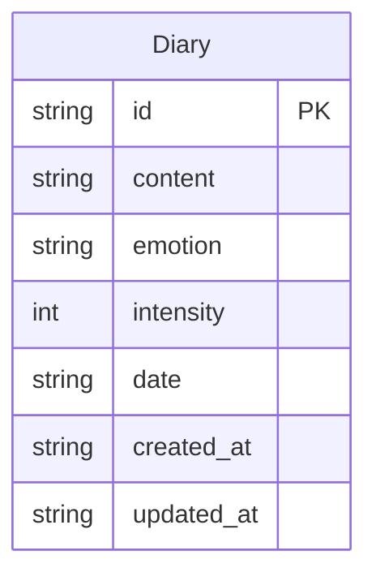

## 1. 架构设计



## 2. 技术说明
- **前端**：React@18 + TypeScript + Tailwind CSS@3 + Vite
- **初始化工具**：vite-init（react-ts 模板）
- **后端**：FastAPI@0.104+ (Python 3.10+)
- **数据库**：SQLite（轻量单文件，无需额外部署）
- **HTTP 客户端**：axios
- **状态管理**：zustand
- **路由**：react-router-dom@6
- **图表**：轻量 SVG 手绘实现（无需第三方图表库，保持包体积精简）

## 3. 路由定义
| 路由 | 用途 |
|------|------|
| `/` | 日记创建/编辑页面（默认首页） |
| `/history` | 历史日记展示和筛选页面 |

## 4. API 定义

### 4.1 数据类型
```typescript
interface Diary {
  id: string;
  content: string;
  emotion: EmotionType;
  intensity: number;
  date: string;
  created_at: string;
  updated_at: string;
}

type EmotionType = "happy" | "sad" | "calm" | "anxious" | "angry" | "grateful";

interface EmotionConfig {
  type: EmotionType;
  label: string;
  colors: string[];
  gradient: string;
}

interface MoodDataPoint {
  date: string;
  emotion: EmotionType;
  intensity: number;
}
```

### 4.2 接口定义
| 方法 | 路径 | 请求体 | 响应 | 说明 |
|------|------|--------|------|------|
| POST | `/api/diaries` | `{ content, emotion, intensity, date }` | `Diary` | 创建日记 |
| GET | `/api/diaries` | Query: `?emotion=&start_date=&end_date=` | `Diary[]` | 获取日记列表（支持筛选） |
| GET | `/api/diaries/{id}` | - | `Diary` | 获取单条日记 |
| PUT | `/api/diaries/{id}` | `{ content, emotion, intensity }` | `Diary` | 更新日记 |
| DELETE | `/api/diaries/{id}` | - | `{ success: bool }` | 删除日记 |
| GET | `/api/mood-curve` | Query: `?days=30` | `MoodDataPoint[]` | 获取心情曲线数据 |

### 4.3 情绪分析逻辑
后端根据 `emotion` 字段和 `intensity`（1-10）计算色块参数：
- 情绪类型映射到固定色谱（如 happy → #FFB347 → #FF6B6B）
- 强度影响渐变角度、色块尺寸和动画速度
- 返回色块配置供前端渲染

## 5. 服务端架构图


## 6. 数据模型

### 6.1 数据模型定义



### 6.2 数据定义语言
```sql
CREATE TABLE IF NOT EXISTS diaries (
    id TEXT PRIMARY KEY,
    content TEXT NOT NULL,
    emotion TEXT NOT NULL CHECK(emotion IN ('happy','sad','calm','anxious','angry','grateful')),
    intensity INTEGER NOT NULL CHECK(intensity >= 1 AND intensity <= 10),
    date TEXT NOT NULL,
    created_at TEXT NOT NULL DEFAULT (datetime('now')),
    updated_at TEXT NOT NULL DEFAULT (datetime('now'))
);

CREATE INDEX idx_diaries_date ON diaries(date);
CREATE INDEX idx_diaries_emotion ON diaries(emotion);
```

## 7. 项目文件结构

```
project-root/
├── index.html                    # Vite 入口 HTML
├── package.json                  # 依赖与脚本
├── vite.config.js                # Vite 配置（含 API 代理）
├── tsconfig.json                 # TypeScript 配置
├── client/
│   └── src/
│       ├── main.tsx              # React 入口
│       ├── App.tsx               # 主组件（路由 + 布局 + 导航栏）
│       ├── DiaryPage.tsx         # 日记创建/编辑页面
│       └── HistoryPage.tsx       # 历史日记展示和筛选页面
└── server/
    ├── main.py                   # FastAPI 入口，初始化路由和中间件
    └── diary_router.py           # 日记增删改查和情绪分析逻辑
```
