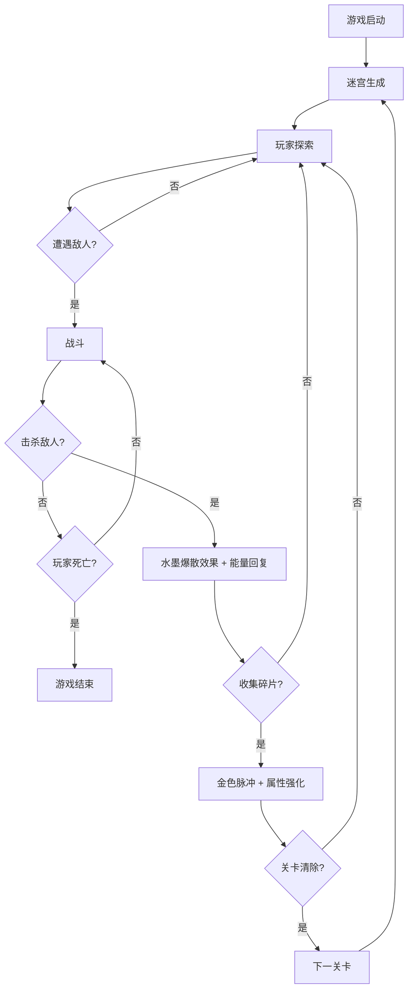

## 1. 产品概述

「影流之境」是一款2D俯视角动作游戏，玩家控制暗影能量构成的角色在发光几何迷宫中穿梭，通过挥动暗影利刃斩杀敌人并收集能量碎片来强化自身。目标用户为喜爱动作类独立游戏的玩家，核心价值在于独特的暗黑水墨视觉风格与流畅的战斗反馈体验。

## 2. 核心功能

### 2.1 功能模块

1. **战斗场景页面**：迷宫地图、玩家角色、敌人、能量碎片、碰撞检测、攻击系统
2. **HUD界面层**：生命值显示、能量条、小地图、技能快捷键

### 2.2 页面详情

| 页面名称 | 模块名称 | 功能描述 |
|----------|----------|----------|
| 战斗场景 | 迷宫生成 | 程序化生成发光几何迷宫，半透明白色墙壁，支持关卡切换 |
| 战斗场景 | 玩家控制 | 虚拟摇杆平滑移动，暗影利刃攻击动画，水墨拖尾效果 |
| 战斗场景 | 敌人系统 | 红色发光球体带眼睛，AI巡逻/追踪行为，碰撞伤害，死亡水墨爆散粒子 |
| 战斗场景 | 能量碎片 | 金色菱形闪烁，收集时光晕脉冲动画，强化玩家属性 |
| 战斗场景 | 碰撞检测 | 玩家与墙壁碰撞、玩家攻击与敌人碰撞、敌人与玩家碰撞、碎片拾取 |
| HUD界面 | 生命值 | 左上角三颗水墨风格心形，受伤时心形破碎动画 |
| HUD界面 | 能量条 | 左上角生命值下方，用于释放技能，随攻击回复 |
| HUD界面 | 小地图 | 右下角毛玻璃风格，显示玩家位置和迷宫概览 |
| HUD界面 | 技能快捷键 | 右下角区域，显示可用技能及冷却状态 |

## 3. 核心流程

玩家进入游戏 → 迷宫生成 → 操控角色移动探索 → 遭遇敌人 → 攻击/闪避 → 击杀敌人（水墨爆散效果+能量回复）→ 收集能量碎片（金色脉冲+属性强化）→ 清除当前关卡敌人 → 进入下一关卡（迷宫变化+敌人增强）→ 循环

## 4. 用户界面设计

### 4.1 设计风格

- **主色调**：深灰(#1a1a2e)到纯黑(#000000)渐变背景
- **辅色调**：深紫色(#4a1a6b)用于玩家轮廓，白色(#ffffff, 50%透明)用于迷宫墙壁
- **强调色**：金色(#ffd700)用于能量碎片，红色(#ff3333)用于敌人
- **视觉风格**：暗黑手绘水墨，所有元素带半透明和发光效果
- **字体**：思源宋体/楷体风格，用于HUD文字
- **布局**：全屏Canvas游戏画面，HUD绝对定位叠加

### 4.2 页面设计概览

| 页面名称 | 模块名称 | UI元素 |
|----------|----------|--------|
| 战斗场景 | 背景 | 深灰到纯黑径向渐变，微弱粒子漂浮 |
| 战斗场景 | 迷宫墙壁 | 半透明白色发光线条，带微弱呼吸脉动 |
| 战斗场景 | 玩家角色 | 深紫色半透明轮廓，水墨拖尾，暗影利刃挥斩弧线 |
| 战斗场景 | 敌人 | 红色半透明发光球体，带白色眼睛，受击闪烁 |
| 战斗场景 | 能量碎片 | 金色菱形，旋转+闪烁，拾取时金色光晕脉冲 |
| HUD | 生命值 | 三颗水墨晕染心形，受伤时墨迹消散 |
| HUD | 能量条 | 紫色渐变条，随能量增减流动 |
| HUD | 小地图 | 毛玻璃半透明底板，缩略迷宫+玩家亮点 |
| HUD | 技能快捷键 | 毛玻璃圆形按钮，图标+冷却遮罩 |

### 4.3 交互反馈

- **攻击**：暗影利刃弧线动画 + 屏幕轻微震动(2-3px偏移, 100ms)
- **击杀敌人**：红色水墨爆散粒子(8-12个粒子向外扩散消散)
- **收集碎片**：金色光晕从碎片位置向外脉冲扩散
- **移动**：平滑摇杆控制，水墨拖尾随移动方向延伸
- **受伤**：屏幕边缘红色闪烁 + 心形破碎动画
- **帧率**：稳定60fps，使用requestAnimationFrame驱动
