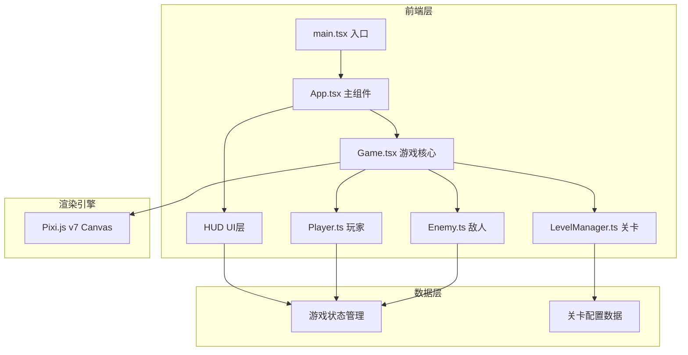

## 1. 架构设计



## 2. 技术说明

- **前端框架**：React 18 + TypeScript
- **渲染引擎**：Pixi.js v7（通过@pixi/react或直接集成）
- **构建工具**：Vite 5
- **状态管理**：React useState/useRef 管理HUD状态，游戏逻辑状态在Game.tsx内部管理
- **样式方案**：CSS-in-JS（内联样式），HUD层使用绝对定位叠加在Canvas之上
- **无后端**：纯前端单机游戏

## 3. 路由定义

| 路由 | 用途 |
|------|------|
| / | 游戏主页面（唯一页面，包含Canvas和HUD） |

## 4. 文件结构

```
src/
├── main.tsx          # 入口，挂载React应用和初始化Pixi.js画布
├── App.tsx           # 主组件，管理游戏状态和UI布局
├── Game.tsx          # 核心游戏逻辑，管理玩家/敌人/迷宫/碰撞/帧循环
├── Player.ts         # 玩家类，移动/攻击/技能/能量
├── Enemy.ts          # 敌人类，生成/AI/碰撞/死亡效果
└── LevelManager.ts   # 关卡管理器，迷宫生成/关卡切换/碎片逻辑
```

## 5. 核心类设计

### 5.1 Player.ts

```typescript
class Player {
  x, y: number              // 位置
  speed: number             // 移动速度
  health: number            // 生命值（最大3）
  energy: number            // 能量值（0-100）
  attackCooldown: number    // 攻击冷却
  trail: Array              // 水墨拖尾点集
  move(dx, dy): void        // 移动
  attack(): AttackResult    // 攻击，返回攻击范围和伤害
  useSkill(skillId): void   // 释放技能
  takeDamage(amount): void  // 受伤
  update(dt): void          // 帧更新
}
```

### 5.2 Enemy.ts

```typescript
class Enemy {
  x, y: number
  health: number
  speed: number
  state: 'patrol' | 'chase' | 'attack'
  detectionRange: number
  update(dt, playerPos): void  // AI行为更新
  takeDamage(amount): void     // 受伤
  isDead(): boolean            // 死亡判定
}
```

### 5.3 LevelManager.ts

```typescript
class LevelManager {
  level: number
  maze: boolean[][]            // 迷宫网格
  fragments: Fragment[]        // 能量碎片
  enemies: Enemy[]             // 当前关卡敌人
  generateMaze(width, height): void  // 程序化迷宫生成
  spawnEnemies(count): void          // 生成敌人
  spawnFragments(count): void        // 放置碎片
  checkFragmentCollect(playerPos): Fragment | null
  isLevelClear(): boolean            // 关卡清除判定
  nextLevel(): void                  // 切换下一关
}
```

## 6. 渲染架构

- **Canvas层**：Pixi.js负责游戏场景渲染（迷宫、角色、敌人、碎片、粒子效果）
- **HUD层**：React组件绝对定位叠加在Canvas之上，使用CSS实现毛玻璃效果
- **帧循环**：Pixi.js的Ticker驱动60fps游戏循环，每帧更新游戏逻辑和渲染

## 7. 性能策略

- 迷宫墙壁使用Pixi.js Graphics批量绘制，避免逐帧重绘
- 粒子效果使用对象池复用，避免GC压力
- 敌人AI每3帧更新一次检测逻辑
- 拖尾效果限制最大点数，超出则移除最旧点
- 使用WebGL渲染器，确保硬件加速
