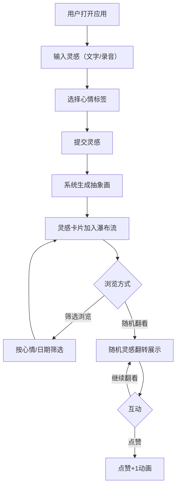

## 1. 产品概述

「灵感回声」是一款轻量级灵感记录与分享应用，让用户捕捉一闪而过的灵感（文字或录音），系统自动生成抽象画作为灵感的视觉印记，并支持匿名浏览和点赞他人的灵感。
- 目标用户：创意工作者、写作者、设计师等需要随时捕捉灵感的人群
- 核心价值：将转瞬即逝的灵感以「文字+AI抽象画」的形式具象化，并通过匿名分享机制激发创意碰撞

## 2. 核心功能

### 2.1 用户角色
| 角色 | 注册方式 | 核心权限 |
|------|----------|----------|
| 匿名用户 | 无需注册 | 记录灵感、浏览、点赞 |

### 2.2 功能模块
1. **首页**：灵感输入区（文字/录音）、心情选择、瀑布流灵感卡片列表、筛选栏
2. **随机灵感页**：随机灵感卡片翻转展示、匿名点赞、继续翻看

### 2.3 页面详情
| 页面名称 | 模块名称 | 功能描述 |
|----------|----------|----------|
| 首页 | 灵感输入区 | 文字输入框（最多200字）、录音按钮（最多30秒）、心情标签选择（快乐/悲伤/平静/兴奋/焦虑）、提交按钮 |
| 首页 | 筛选栏 | 心情下拉筛选、日期范围选择器、筛选结果即时刷新 |
| 首页 | 瀑布流列表 | 所有灵感卡片以瀑布流展示，卡片含抽象画背景、文字/录音图标、心情标签、点赞数，滚动懒加载 |
| 随机灵感页 | 卡片翻转展示 | 随机展示一张灵感，卡片翻转动画入场，展示完整文字/录音+抽象画 |
| 随机灵感页 | 互动区 | 匿名点赞按钮（微光脉冲+1数字弹出）、"继续翻看"按钮 |

## 3. 核心流程

用户打开应用 → 在首页输入灵感文字或录音 → 选择心情标签 → 提交 → 系统自动生成抽象画 → 灵感卡片出现在瀑布流中 → 用户可筛选浏览 → 点击"随机看看" → 随机灵感翻转展示 → 点赞或继续翻看

## 4. 用户界面设计

### 4.1 设计风格
- 主色调：柔和渐变（浅灰 #f0f0f5 → 白 #ffffff），搭配淡彩点缀
- 辅助色：心情标签色系（快乐-暖黄 #FFD93D、悲伤-淡蓝 #6EC1E4、平静-薄荷 #A8E6CF、兴奋-珊瑚 #FF8B94、焦虑-淡紫 #C3AED6）
- 卡片风格：圆角毛玻璃面板（backdrop-filter: blur），微阴影（box-shadow）
- 字体：无衬线体，标题用 Noto Sans SC Medium，正文用 Noto Sans SC Regular
- 布局：响应式瀑布流，桌面端3列，平板2列，手机1列
- 图标：线性风格，录音用波形图标

### 4.2 页面设计概览
| 页面名称 | 模块名称 | UI元素 |
|----------|----------|--------|
| 首页 | 灵感输入区 | 毛玻璃输入框，圆角按钮，心情标签胶囊按钮组，录音按钮带波形动画 |
| 首页 | 筛选栏 | 半透明下拉选择器，日期选择器，磨砂质感导航栏 |
| 首页 | 瀑布流列表 | 毛玻璃卡片，抽象画渐变背景+几何形状，悬停上浮阴影加深，懒加载 |
| 随机灵感页 | 卡片翻转 | 翻转动画入场，大尺寸毛玻璃卡片，抽象画全屏背景 |
| 随机灵感页 | 互动区 | 点赞按钮微光脉冲+1弹出，"继续翻看"按钮淡入过渡 |

### 4.3 响应式适配
- 桌面端（≥1024px）：3列瀑布流，侧边筛选栏
- 平板端（768-1023px）：2列瀑布流，顶部筛选栏
- 手机端（<768px）：1列卡片流，顶部折叠筛选
- 触控优化：按钮最小44px触控区域，录音按钮加大

### 4.4 动效规范
- 卡片悬停：translateY(-4px) + shadow加深，200ms ease
- 卡片淡入排序：opacity 0→1 + translateY(8px→0)，300ms ease-out，交错50ms
- 随机卡片翻转：3D rotateY(180deg→0)，600ms ease-in-out
- 点赞脉冲：box-shadow闪烁 + "+1"数字上浮消失，800ms
- 抽象画背景：缓慢缩放 scale(1→1.05) 循环 8s，或轻微旋转 2deg 周期10s
- 帧率目标：60fps，使用 will-change 和 transform 优化
