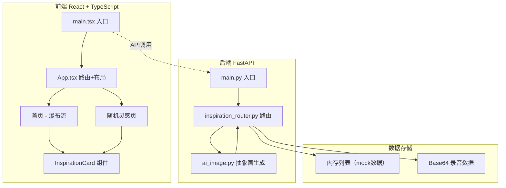
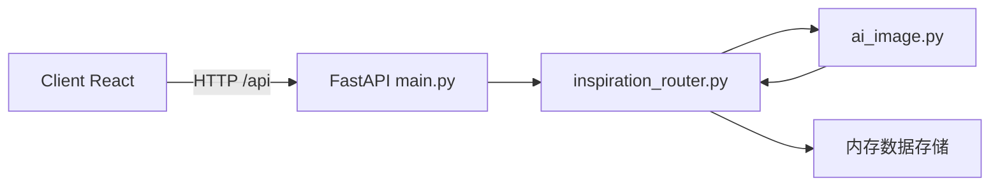
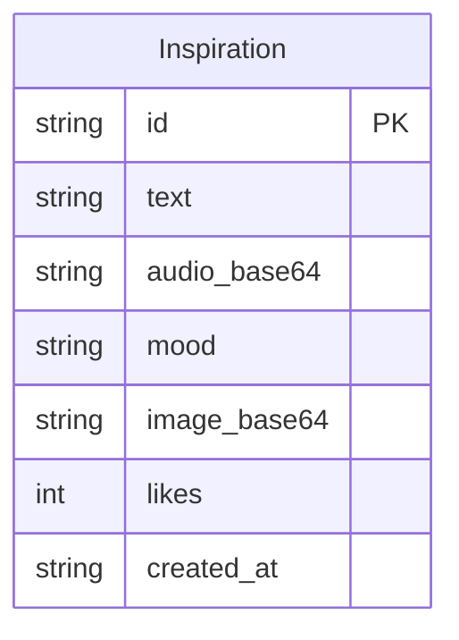

## 1. 架构设计



## 2. 技术说明
- 前端：React@18 + TypeScript + Vite，CSS Modules / 内联样式实现毛玻璃效果
- 初始化工具：Vite (react-ts template)
- 后端：FastAPI (Python 3.10+)，uvicorn 作为 ASGI 服务器
- 数据库：内存列表存储（mock数据），无需外部数据库
- HTTP代理：Vite dev server 配置 proxy 将 /api 请求转发到 FastAPI

## 3. 路由定义
| 路由 | 用途 |
|------|------|
| / | 首页 - 灵感输入+瀑布流+筛选 |
| /random | 随机灵感页 - 翻转卡片+点赞 |

## 4. API 定义

### 4.1 数据类型
```typescript
interface Inspiration {
  id: string;
  text: string | null;
  audio_base64: string | null;
  mood: "happy" | "sad" | "calm" | "excited" | "anxious";
  image_base64: string;
  likes: number;
  created_at: string;
}

interface CreateInspirationRequest {
  text?: string;
  audio_base64?: string;
  mood: "happy" | "sad" | "calm" | "excited" | "anxious";
}
```

### 4.2 API 端点
| 方法 | 路径 | 请求体 | 响应 | 用途 |
|------|------|--------|------|------|
| GET | /api/inspirations | - | Inspiration[] | 获取所有灵感列表 |
| POST | /api/inspirations | CreateInspirationRequest | Inspiration | 创建新灵感（自动生成抽象画） |
| GET | /api/inspirations/random | - | Inspiration | 获取随机灵感 |
| POST | /api/inspirations/{id}/like | - | { likes: number } | 匿名点赞 |
| GET | /api/inspirations/image | - | { image_base64: string } | 单独获取抽象画（调试用） |

## 5. 服务器架构图



## 6. 数据模型

### 6.1 数据模型定义


### 6.2 抽象画生成逻辑
- 画布尺寸：400x300px
- 背景：随机双色渐变（根据心情选择色系）
- 装饰元素：3-6个随机色块（圆形/三角形），半透明叠加
- 输出格式：PNG Base64
- 心情色系映射：
  - 快乐：暖黄→橙色系
  - 悲伤：淡蓝→深蓝系
  - 平静：薄荷→淡绿系
  - 兴奋：珊瑚→粉色系
  - 焦虑：淡紫→灰色系
