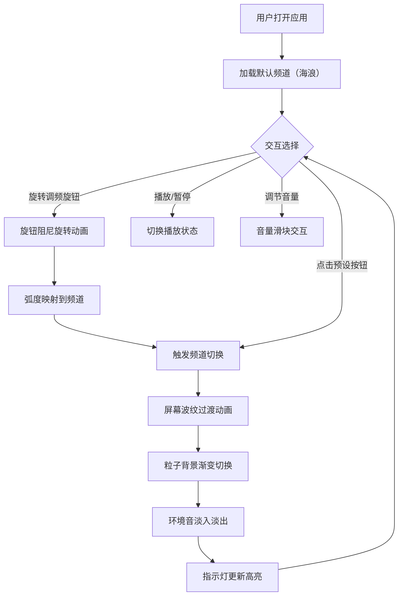

## 1. 产品概述

「浮光电台」是一款复古风格交互式环境音播放器，模拟经典收音机的调频体验，让用户通过旋转调频旋钮在不同虚拟频道间切换，聆听不同主题的环境音（海浪、雨夜、篝火、森林），同时享受与音效主题匹配的粒子背景动画。

- 目标用户：追求沉浸式放松体验的用户、白噪音爱好者、复古设计爱好者
- 核心价值：将环境音播放与复古收音机交互美学融合，打造兼具功能性与艺术性的沉浸式音频体验

## 2. 核心功能

### 2.2 功能模块

1. **主界面**：收音机外壳、调频旋钮、频率显示屏幕、频道指示灯、粒子背景、控制面板

### 2.3 页面详情

| 页面名称 | 模块名称 | 功能描述 |
|----------|----------|----------|
| 主界面 | 收音机外壳 | 深棕色木纹纹理背景 + 圆角金属质感（铜色边框 + 拉丝铝面板）的收音机主体 |
| 主界面 | 调频旋钮 | 齿轮阻尼感旋转动画，弧度映射到频道频率，拖拽/触摸旋转交互 |
| 主界面 | 频率显示屏 | 半透明毛玻璃带微弱扫描线效果，显示当前频道名称和频率值 |
| 主界面 | 频道指示灯 | 4个指示灯（暖黄到冷蓝渐变），当前频道高亮 |
| 主界面 | 粒子背景 | Canvas 全屏粒子动画，根据频道主题切换粒子样式（雨夜=斜向银白粒子、篝火=上升橙色火星、海浪=水平蓝色波纹粒子、森林=飘落绿色叶片粒子） |
| 主界面 | 控制面板 | 毛玻璃按钮行：播放/暂停、音量滑块、4个频道预设快捷按钮，悬停微光脉冲反馈 |
| 主界面 | 频道切换过渡 | 屏幕淡入淡出波纹过渡动画 |

## 3. 核心流程

用户打开应用 → 看到复古收音机界面和默认频道粒子背景 → 旋转调频旋钮切换频道 → 频道切换时屏幕显示波纹过渡动画 + 粒子背景渐变切换 → 环境音淡入淡出切换 → 使用控制面板调节播放/音量/快速切换预设频道

## 4. 用户界面设计

### 4.1 设计风格

- **主色调**：深棕色木纹（#3E2723）为背景基调，铜色（#B87333）为边框和旋钮强调色，拉丝铝（#C0C0C0）为面板色
- **辅助色**：暖黄（#FFD54F）到冷蓝（#42A5F5）渐变用于频道指示灯
- **按钮风格**：毛玻璃半透明圆角按钮，悬停时微光脉冲
- **字体**：显示字体使用 Playfair Display（复古衬线），UI字体使用 DM Sans（清晰无衬线）
- **布局**：居中单栏布局，收音机主体居中，控制面板底部水平排列
- **图标风格**：线性图标，线条粗细2px，圆角端点
- **动画**：CSS关键帧 + Canvas粒子，频道切换波纹过渡使用径向渐变扩散

### 4.2 页面设计概览

| 页面名称 | 模块名称 | UI元素 |
|----------|----------|--------|
| 主界面 | 收音机外壳 | 深棕木纹背景、铜色圆角边框、拉丝铝面板、内阴影增加深度 |
| 主界面 | 调频旋钮 | 圆形旋钮、铜色外圈、刻度标记、旋转时齿轮阻尼动画、中间点指示器 |
| 主界面 | 频率显示屏 | 毛玻璃背景、扫描线叠加、频道名+频率值文字、波纹过渡遮罩 |
| 主界面 | 频道指示灯 | 4个圆形灯泡、从左到右暖黄→冷蓝渐变色、当前频道发光高亮 |
| 主界面 | 粒子背景 | Canvas全屏背景、粒子密度约200个、不同频道不同颜色/方向/形态 |
| 主界面 | 控制面板 | 毛玻璃条形容器、播放/暂停圆形按钮、音量滑块、4个预设频道小按钮、悬停发光效果 |

### 4.3 响应式设计

- **桌面端**（≥768px）：收音机宽度480px居中，控制面板水平排列，旋钮直径120px
- **移动端**（<768px）：收音机宽度95vw居中，控制面板可换行，旋钮直径90px，触摸优化（更大的按钮点击区域）

### 4.4 频道粒子主题定义

| 频道 | 名称 | 频率 | 粒子颜色 | 粒子运动 | 粒子形态 |
|------|------|------|----------|----------|----------|
| 1 | 海浪 | 88.5 | 浅蓝 #90CAF9 | 水平左右波动 | 小圆点，大小不一 |
| 2 | 雨夜 | 92.7 | 银白 #E0E0E0 | 斜向45°下落 | 细长线条 |
| 3 | 篝火 | 96.3 | 橙红 #FF6D00 | 向上飘散，尾部渐隐 | 小圆点+尾迹 |
| 4 | 森林 | 101.1 | 翠绿 #66BB6A | 缓慢飘落，轻微左右摇摆 | 椭圆叶片形 |
