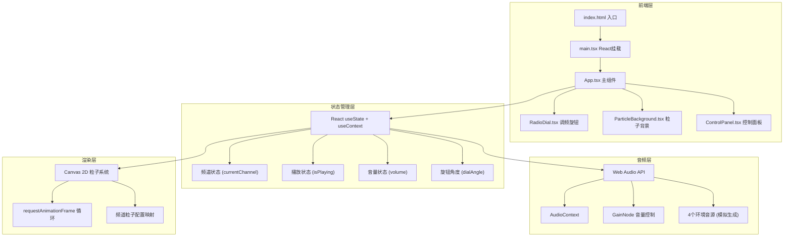
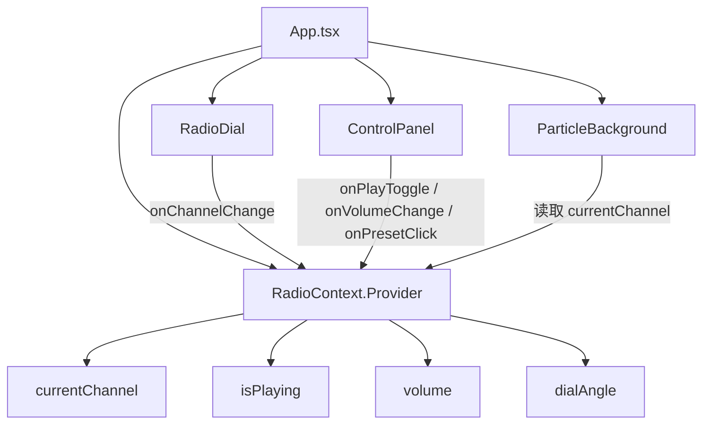

## 1. 架构设计



## 2. 技术说明

- **前端框架**：React 18 + TypeScript + Vite
- **样式方案**：CSS Modules + CSS Variables（全局主题变量）
- **动画方案**：Canvas 2D API（粒子背景）+ CSS Keyframes（UI过渡动画）
- **音频方案**：Web Audio API（OscillatorNode + 白噪音生成模拟环境音，无需外部音频文件）
- **状态管理**：React useState + useContext，轻量级无外部依赖
- **构建工具**：Vite 5 + @vitejs/plugin-react
- **后端**：无（纯前端应用）

## 3. 路由定义

| 路由 | 用途 |
|------|------|
| / | 主界面（单页应用，无路由切换） |

## 4. 组件架构



## 5. 核心数据模型

### 5.1 频道数据模型

```typescript
interface Channel {
  id: number;
  name: string;
  frequency: string;
  indicatorColor: string;
  particleConfig: {
    color: string;
    direction: 'horizontal' | 'diagonal-down' | 'up' | 'fall-down';
    shape: 'circle' | 'line' | 'circle-trail' | 'leaf';
    speed: number;
    size: number;
    count: number;
    angle?: number;
  };
  audioConfig: {
    type: 'ocean' | 'rain' | 'fire' | 'forest';
    baseFrequency: number;
    noiseType: 'white' | 'pink' | 'brown';
    filterFreq: number;
    filterQ: number;
  };
}
```

### 5.2 应用状态模型

```typescript
interface RadioState {
  currentChannel: number;
  isPlaying: boolean;
  volume: number;
  dialAngle: number;
}
```

## 6. 文件结构

```
├── index.html
├── package.json
├── vite.config.ts
├── tsconfig.json
├── src/
│   ├── main.tsx              # 入口挂载
│   ├── App.tsx               # 主组件 + RadioContext
│   ├── App.css               # 全局样式 + 收音机外壳样式
│   ├── components/
│   │   ├── RadioDial.tsx     # 调频旋钮组件
│   │   ├── RadioDial.css     # 旋钮样式
│   │   ├── ParticleBackground.tsx  # 粒子背景组件
│   │   ├── ParticleBackground.css  # 粒子背景样式
│   │   ├── ControlPanel.tsx  # 控制面板组件
│   │   └── ControlPanel.css  # 控制面板样式
│   └── channels.ts           # 频道配置数据
```

## 7. 性能目标

- 粒子渲染：60fps 稳定帧率（Canvas 2D，约200个粒子）
- 频道切换过渡：≤300ms 完成粒子+音频过渡
- 旋钮交互：16ms 内响应拖拽事件
- 音频淡入淡出：200ms crossfade
- 首屏加载：< 2s（无外部音频文件依赖）

## 8. 音频生成策略

使用 Web Audio API 纯代码生成环境音，无需加载外部音频文件：

- **海浪**：低频振荡器 + 带通滤波白噪音，周期性调制音量模拟浪潮
- **雨夜**：粉噪音 + 高通滤波，叠加随机滴答声模拟雨滴
- **篝火**：棕噪音 + 带通滤波，随机噼啪声（短促高频脉冲）
- **森林**：粉噪音 + 多层带通滤波，叠加鸟鸣模拟（正弦波频率扫描）
