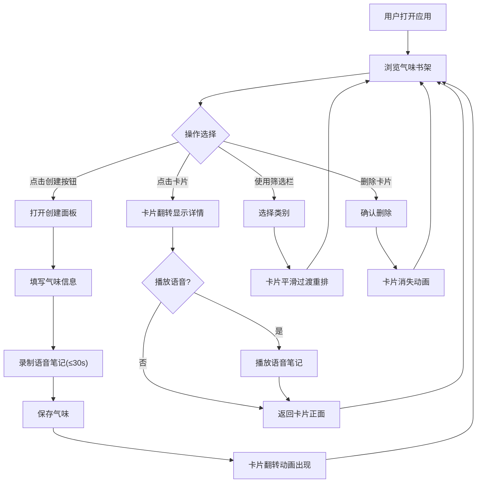

## 1. 产品概述

「气味图书馆」是一个个人气味收藏管理应用，用户可以为生活中的气味建立数字化收藏档案，通过名称、描述、代表色、语音笔记和分类来记录和回忆气味记忆。以复古书香的视觉语言，让气味收藏如翻阅一本珍贵的藏书。

- 核心价值：将转瞬即逝的气味体验转化为可收藏、可回味的数字记忆
- 目标用户：香氛爱好者、调香师、生活美学追求者

## 2. 核心功能

### 2.1 用户角色

| 角色 | 注册方式 | 核心权限 |
|------|----------|----------|
| 个人用户 | 无需注册 | 创建、浏览、筛选、删除自己的气味收藏 |

### 2.2 功能模块

1. **气味书架页**：虚拟书架展示所有收藏的气味卡片，支持按类别筛选
2. **气味创建**：通过表单添加新的气味收藏，包括名称、描述、代表色、语音笔记和分类
3. **气味详情**：点击卡片翻转查看详情，支持播放语音笔记
4. **语音录制**：30秒内的语音笔记录制功能

### 2.3 页面详情

| 页面名称 | 模块名称 | 功能描述 |
|----------|----------|----------|
| 气味书架页 | 书架布局 | 以3D立体卡片网格展示所有气味收藏，深木纹质感书架背景 |
| 气味书架页 | 筛选栏 | 按"花香"、"木质"、"果香"、"清新"、"香料"、"海洋"类别筛选，带平滑过渡动画 |
| 气味书架页 | 创建按钮 | 复古黄铜色圆形按钮，点击打开创建面板 |
| 气味创建面板 | 表单 | 输入名称、描述、选择代表色、选择分类、录制语音笔记 |
| 气味卡片 | 正面 | 显示名称、分类标签、代表色渐变色块 |
| 气味卡片 | 背面 | 显示描述文字、播放语音笔记按钮 |
| 气味卡片 | 翻转动画 | 创建时和点击时触发3D翻转动画 |

## 3. 核心流程

用户打开应用后，在书架页浏览所有气味卡片。点击黄铜色创建按钮打开创建面板，填写气味信息并录制语音后保存，新卡片以翻转动画出现在书架上。通过筛选栏按类别过滤卡片，卡片以平滑过渡动画重排。点击某张卡片可翻转查看详情和播放语音。

## 4. 用户界面设计

### 4.1 设计风格

- **整体风格**：书香复古，如翻阅一本古老藏书
- **主色**：暖米色(#F5F0E8)到浅褐色(#D4C5A9)渐变背景
- **强调色**：复古黄铜色(#B8860B)，用于按钮和交互元素
- **书架色**：深木纹(#5C3A1E)质感
- **卡片样式**：毛玻璃(glassmorphism)圆角面板，带阴影，代表色作为顶部色块渐变
- **字体**：衬线字体（Playfair Display 用于标题，Noto Serif SC 用于中文正文）
- **按钮**：复古黄铜色圆形，悬停时微光效果
- **动画**：卡片创建时3D翻转，筛选时平滑过渡，悬停时微微浮起

### 4.2 页面设计概览

| 页面名称 | 模块名称 | UI元素 |
|----------|----------|--------|
| 气味书架页 | 书架背景 | 深木纹纹理，多层木板水平排列，暖色光影 |
| 气味书架页 | 筛选栏 | 横向排列的类别标签按钮，选中态为黄铜色底，未选中为透明底带边框 |
| 气味书架页 | 卡片网格 | 响应式网格，桌面3列，平板2列，手机1列 |
| 气味卡片 | 正面 | 顶部代表色渐变色块(40%高度)，下方名称(衬线粗体)、分类标签(小圆角标签)、微妙纸纹理 |
| 气味卡片 | 背面 | 描述文字、语音播放按钮(黄铜色圆形)、删除按钮 |
| 创建面板 | 表单 | 模态弹窗，毛玻璃背景，表单字段垂直排列，颜色选择器、分类下拉、语音录制条 |

### 4.3 响应式适配

- 桌面端（≥1024px）：3列网格，卡片较大，侧边筛选栏
- 平板端（768px-1023px）：2列网格，顶部筛选栏
- 手机端（<768px）：1列网格，顶部筛选栏，创建面板全屏
- 触控优化：卡片点击区域≥44px，按钮间距充足

### 4.4 3D场景指引

不适用3D场景，但卡片翻转使用CSS 3D变换（perspective + rotateY），书架使用CSS阴影和渐变营造深度感。
