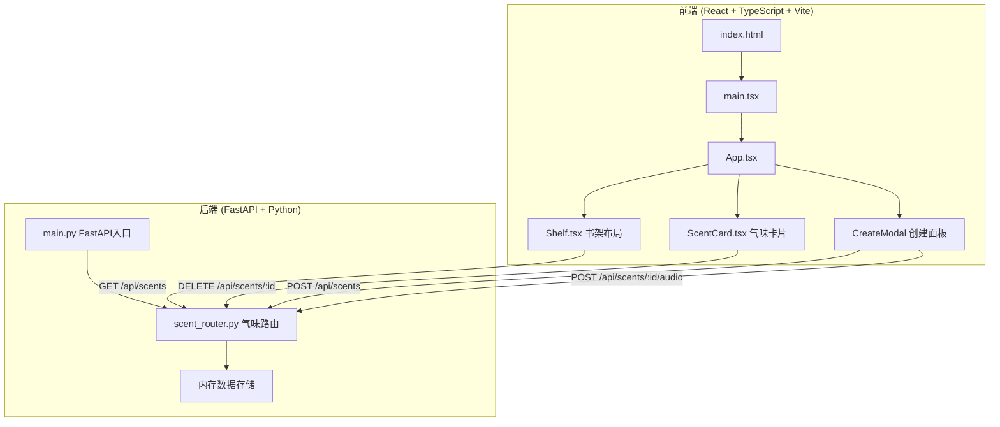
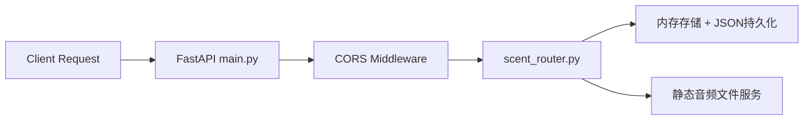
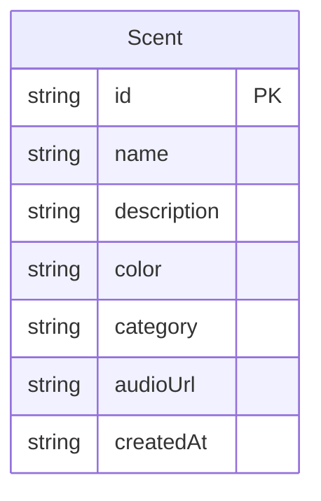

## 1. 架构设计



## 2. 技术说明

- **前端**：React 18 + TypeScript + Vite + Tailwind CSS
- **构建工具**：Vite
- **后端**：FastAPI (Python 3.10+) + Uvicorn
- **数据库**：内存存储（JSON文件持久化），无需外部数据库
- **语音处理**：浏览器 MediaRecorder API 录制，FormData 上传
- **状态管理**：Zustand

## 3. 路由定义

| 路由 | 用途 |
|------|------|
| `/` | 气味书架主页面，展示所有收藏卡片 |

## 4. API 定义

### 4.1 TypeScript 类型定义

```typescript
type ScentCategory = "花香" | "木质" | "果香" | "清新" | "香料" | "海洋"

interface Scent {
  id: string
  name: string
  description: string
  color: string
  category: ScentCategory
  audioUrl?: string
  createdAt: string
}

interface CreateScentRequest {
  name: string
  description: string
  color: string
  category: ScentCategory
}

interface ScentResponse {
  id: string
  name: string
  description: string
  color: string
  category: ScentCategory
  audioUrl: string | null
  createdAt: string
}
```

### 4.2 API 端点

| 方法 | 路径 | 请求体 | 响应 | 用途 |
|------|------|--------|------|------|
| GET | `/api/scents` | - | `ScentResponse[]` | 获取所有气味收藏，可选 `?category=花香` 筛选 |
| POST | `/api/scents` | `CreateScentRequest` (JSON) | `ScentResponse` | 创建新气味收藏 |
| POST | `/api/scents/{id}/audio` | FormData (audio blob) | `{"audioUrl": string}` | 上传语音笔记 |
| DELETE | `/api/scents/{id}` | - | `{"message": "deleted"}` | 删除气味收藏 |
| GET | `/api/scents/{id}/audio` | - | audio file stream | 获取语音笔记音频 |

## 5. 服务器架构图



## 6. 数据模型

### 6.1 数据模型定义



### 6.2 数据存储

- 使用 Python 字典作为内存存储
- 启动时从 `server/data/scents.json` 加载
- 每次增删改后自动写回 `server/data/scents.json`
- 音频文件存储在 `server/audio/` 目录下
- 每条气味的 `id` 使用 UUID4 生成

## 7. 项目文件结构

```
项目根目录/
├── package.json              # 前端依赖和脚本
├── vite.config.js            # Vite 配置
├── tsconfig.json             # TypeScript 配置
├── index.html                # 入口 HTML
├── tailwind.config.js        # Tailwind CSS 配置
├── postcss.config.js         # PostCSS 配置
├── server/
│   ├── main.py               # FastAPI 入口
│   ├── scent_router.py       # 气味收藏路由
│   ├── requirements.txt      # Python 依赖
│   ├── data/
│   │   └── scents.json       # 数据持久化文件
│   └── audio/                # 语音文件存储目录
├── client/
│   └── src/
│       ├── main.tsx          # React 入口
│       ├── App.tsx           # 主应用组件
│       ├── index.css         # 全局样式
│       ├── store.ts          # Zustand 状态管理
│       ├── types.ts          # TypeScript 类型定义
│       └── components/
│           ├── ScentCard.tsx # 气味卡片组件
│           ├── Shelf.tsx     # 书架布局组件
│           └── CreateModal.tsx # 创建面板组件
```
