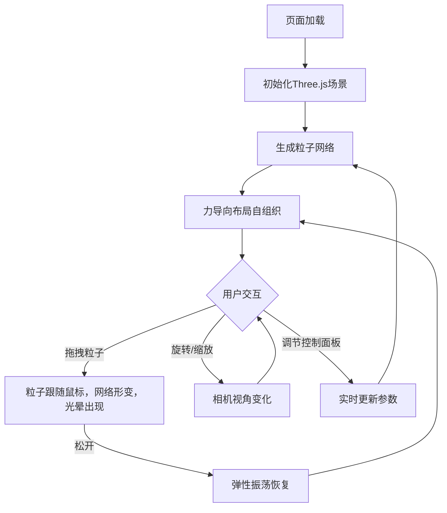

## 1. 产品概述

「光织梦境」是一款3D交互可视化项目，在纯黑空间中模拟由用户交互驱动的动态光网——无数发光粒子之间由细丝连接，形成类似蜘蛛网的网状结构。用户拖拽任意粒子会带动整个网络形变，松开后网络缓慢恢复原状并产生弹性振荡。
- 目标用户：视觉艺术爱好者、交互设计师、创意开发者
- 核心价值：提供沉浸式的赛博霓虹风格3D粒子网络交互体验，展示力导向布局与弹性物理模拟的视觉美感

## 2. 核心功能

### 2.1 功能模块

1. **3D粒子网络场景**：发光粒子与连接细丝构成的动态网状结构
2. **拖拽交互系统**：拖拽粒子带动网络形变，松开后弹性恢复
3. **控制面板**：毛玻璃风格参数调节面板

### 2.2 页面详情

| 页面名称 | 模块名称 | 功能描述 |
|----------|----------|----------|
| 主场景 | 粒子系统 | 渲染100-500个发光粒子，颜色从中心暖黄到边缘冷蓝渐变 |
| 主场景 | 连接线系统 | 粒子间距离小于阈值时绘制半透明发光细线 |
| 主场景 | 力导向布局 | 粒子间斥力+连接弹力驱动的自组织布局 |
| 主场景 | 拖拽交互 | 鼠标拖拽粒子带动网络形变，松开后弹性振荡恢复 |
| 主场景 | 光晕效果 | 拖拽时粒子周围出现光晕，释放后弹性波浪动画 |
| 控制面板 | 粒子数量滑块 | 调节粒子数量（100-500） |
| 控制面板 | 连接距离滑块 | 调节粒子间连接阈值（50-200） |
| 控制面板 | 恢复速度滑块 | 调节弹性恢复速度（0.1-1.0） |
| 控制面板 | 重置布局按钮 | 重置所有粒子到初始位置 |

## 3. 核心流程

用户打开页面后，看到黑暗空间中的动态光网。粒子在力导向布局下缓慢自组织，粒子间由发光细丝连接。用户可以旋转/缩放视角观察3D网络，也可以拖拽任意粒子——拖拽时该粒子周围出现光晕，周围粒子受到牵引产生形变；松开后网络以弹性振荡方式缓慢恢复原状。用户可通过左下角控制面板调节粒子数量、连接距离和恢复速度。

## 4. 用户界面设计

### 4.1 设计风格

- 主色调：纯黑（#000000）到深紫（#1a0033）渐变背景
- 粒子颜色：中心暖黄（#FFD700）到边缘冷蓝（#00BFFF）渐变
- 连接线：半透明发光细线，颜色随粒子渐变
- 光晕效果：拖拽时粒子周围出现径向发光
- 控制面板：毛玻璃效果（backdrop-filter: blur），深色半透明底
- 字体：Orbitron（标题/标签）+ Rajdhani（数值显示），赛博朋克风格
- 布局：3D场景全屏铺满，控制面板固定左下角

### 4.2 页面设计概览

| 页面名称 | 模块名称 | UI元素 |
|----------|----------|--------|
| 主场景 | 背景 | 纯黑到深紫径向渐变，深空氛围 |
| 主场景 | 粒子 | 细小发光点，PointLight风格，暖黄到冷蓝渐变 |
| 主场景 | 连接线 | 半透明发光细线，线宽1-2px |
| 主场景 | 光晕 | 拖拽时径向扩散光圈 |
| 控制面板 | 面板容器 | 毛玻璃效果，深色半透明，圆角8px |
| 控制面板 | 滑块 | 自定义赛博风滑块，荧光色轨道 |
| 控制面板 | 按钮 | 荧光边框按钮，hover发光效果 |

### 4.3 响应式设计

- 桌面端优先：Three.js场景占满视口
- 移动端适配：支持触摸拖拽，控制面板自适应宽度
- 触控优化：增大粒子点击热区

### 4.4 3D场景指引

- 环境：纯黑深空，深紫渐变远景
- 灯光：无环境光，粒子自发光（点精灵+AdditiveBlending）
- 相机：透视相机，初始位置z=500，支持OrbitControls旋转缩放
- 构图：粒子网络居中，周围留白营造漂浮感
- 交互：鼠标射线检测拾取粒子，拖拽移动粒子位置
- 后处理：可选Bloom效果增强发光感
- 性能预算：500粒子+连接线，目标60fps
