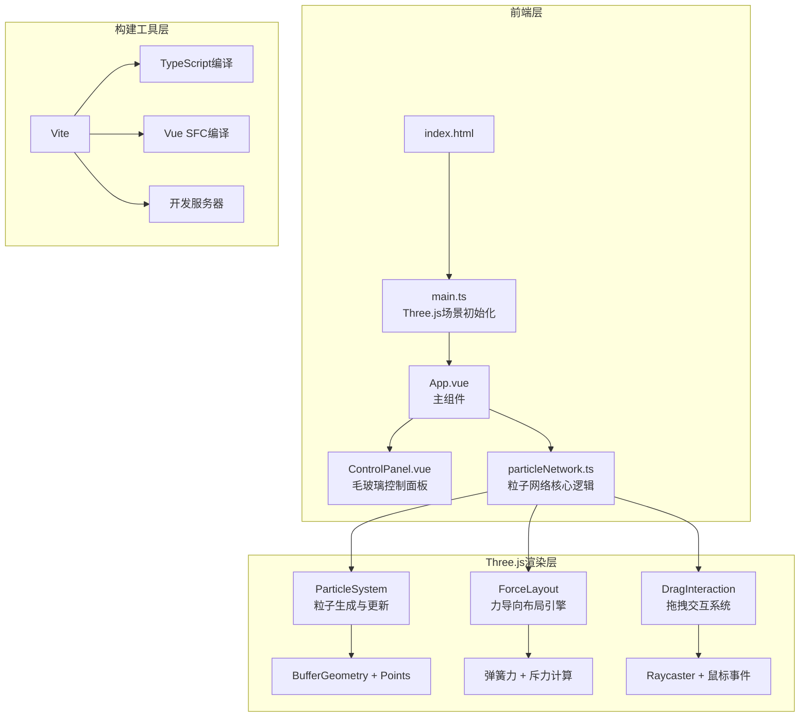

## 1. 架构设计



## 2. 技术说明

- 前端框架：Vue 3 + TypeScript
- 3D渲染：Three.js（粒子系统使用BufferGeometry + Points，连接线使用LineSegments）
- 构建工具：Vite
- 初始化工具：vite-init（vue-ts模板）
- 状态管理：Vue reactive（ref/reactive）组件内管理，无需额外状态库
- 后端：无
- 数据库：无

## 3. 路由定义

本项目为单页面应用，无路由：

| 路由 | 用途 |
|------|------|
| / | 主场景页面，3D粒子网络+控制面板 |

## 4. 文件结构

```
├── index.html                  # 入口HTML
├── package.json                # 依赖配置
├── vite.config.js              # Vite配置
├── tsconfig.json               # TypeScript配置
└── src/
    ├── main.ts                 # 程序入口，初始化Three场景
    ├── App.vue                 # 主组件，挂载场景和控制面板
    ├── utils/
    │   └── particleNetwork.ts  # 核心逻辑：粒子系统、力导向布局、拖拽交互
    └── components/
        └── ControlPanel.vue    # 毛玻璃控制面板组件
```

## 5. 核心模块设计

### 5.1 particleNetwork.ts — 粒子网络核心

```typescript
interface ParticleNetworkConfig {
  particleCount: number;       // 粒子数量 100-500
  connectionDistance: number;   // 连接距离 50-200
  recoverySpeed: number;       // 恢复速度 0.1-1.0
}

class ParticleNetwork {
  // 粒子数据
  positions: Float32Array;     // 当前位置
  restPositions: Float32Array; // 静止位置
  velocities: Float32Array;    // 速度向量
  
  // Three.js对象
  particleGeometry: BufferGeometry;
  particleMaterial: PointsMaterial;
  lineGeometry: BufferGeometry;
  lineMaterial: LineBasicMaterial;
  
  // 交互状态
  draggedParticle: number | null;
  
  update(deltaTime: number): void;  // 力导向更新+弹性恢复
  connectParticles(): void;          // 更新连接线
  dragParticle(index: number, pos: Vector3): void;
  releaseParticle(): void;
  resetLayout(): void;
  updateConfig(config: Partial<ParticleNetworkConfig>): void;
}
```

### 5.2 ControlPanel.vue — 控制面板

- 毛玻璃效果：`backdrop-filter: blur(20px); background: rgba(10, 0, 30, 0.6)`
- 自定义滑块样式：荧光色轨道+发光拇指
- emit事件：`update:particleCount`, `update:connectionDistance`, `update:recoverySpeed`, `reset`

### 5.3 性能优化策略

- 粒子使用BufferGeometry + Points渲染（单次draw call）
- 连接线使用LineSegments + BufferGeometry（单次draw call）
- 力计算使用空间分区优化（网格划分减少O(n²)计算）
- 位置/颜色使用attribute buffer直接更新，避免每帧创建新对象
- 使用requestAnimationFrame驱动渲染循环
- 拖拽粒子时暂停力导向计算，仅更新被拖拽粒子位置

## 6. 物理模拟参数

| 参数 | 值 | 说明 |
|------|------|------|
| 弹簧刚度 | 0.02 | 粒子回到静止位置的弹力系数 |
| 阻尼系数 | 0.95 | 速度衰减，控制振荡收敛速度 |
| 斥力系数 | 500 | 粒子间互斥力 |
| 连接弹力 | 0.01 | 连接粒子间的弹力 |
| 恢复速度 | 0.1-1.0 | 用户可调，影响弹簧刚度和阻尼 |
