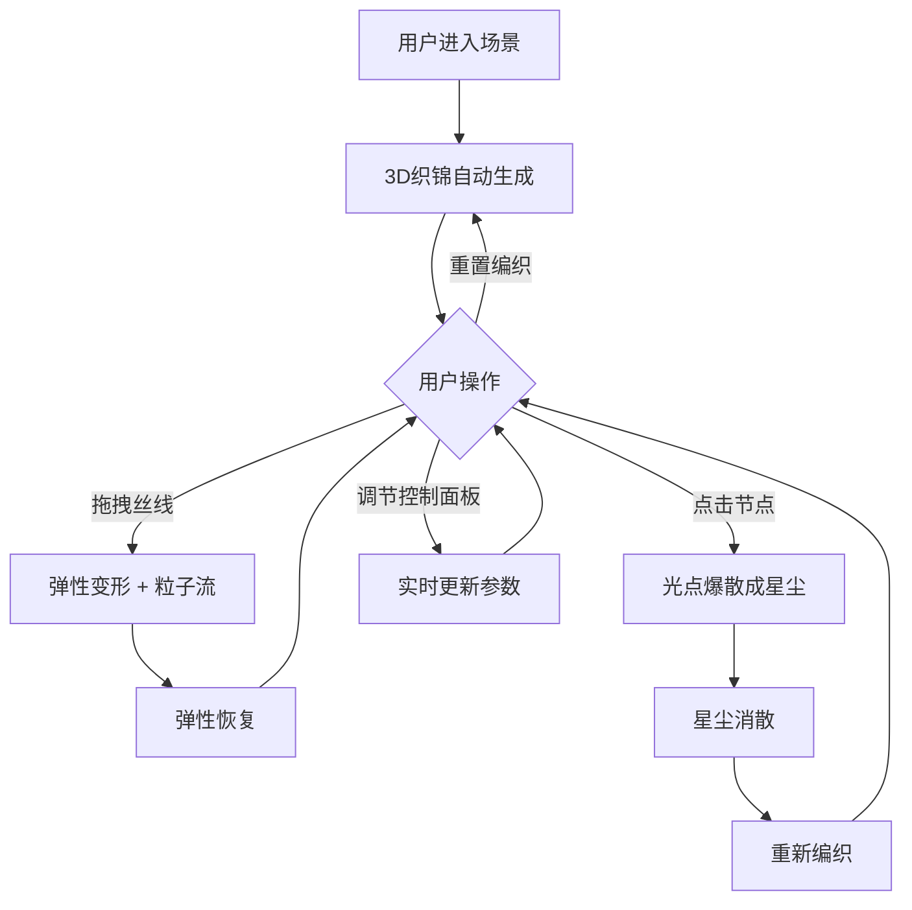

## 1. 产品概述

「光影织梦」是一款沉浸式3D交互可视化应用，模拟在深邃虚拟空间中无数发光丝线交错编织成动态光影织锦的视觉奇观。用户通过鼠标拖拽和点击直接影响织锦的纹理与色彩，体验光与线的实时交互艺术。

- 目标用户：数字艺术爱好者、交互设计师、创意编程学习者
- 核心价值：将抽象的编织美学转化为可触摸的实时3D交互体验，以极简霓虹视觉风格呈现

## 2. 核心功能

### 2.1 功能模块

1. **主场景页面**：3D光影织锦渲染、丝线系统、交互事件处理、控制面板

### 2.2 页面详情

| 页面名称 | 模块名称 | 功能描述 |
|----------|----------|----------|
| 主场景 | 3D织锦渲染 | 在纯黑到深蓝渐变背景中渲染发光丝线织锦，丝线半透明渐变（暖金→冷蓝），交织节点处有闪烁微小光点 |
| 主场景 | 鼠标拖拽交互 | 拖拽时丝线产生弹性变形，伴随粒子流动画，变形后弹性恢复 |
| 主场景 | 节点点击交互 | 点击交织节点爆散成星尘粒子，星尘消散后丝线自动重新编织 |
| 主场景 | 控制面板 | 毛玻璃风格右下角面板，包含丝线密度滑块(50-200)、色彩主题选择器(4种预设)、动画速度滑块(0.5-2.0)、重置编织按钮 |

## 3. 核心流程

用户进入场景后，3D织锦自动生成并开始动画循环。用户可自由拖拽改变丝线形态（弹性变形+粒子流），或点击节点触发光点爆散（星尘特效+重编织）。通过控制面板可实时调节丝线密度、色彩主题和动画速度，点击重置按钮可完全重建织锦。

## 4. 用户界面设计

### 4.1 设计风格

- **主色调**：纯黑(#000000)到深蓝(#0a0a2e)渐变背景
- **丝线色彩**：半透明渐变，默认暖金(#ffd700)→冷蓝(#4169e1)，支持4种主题切换
- **发光效果**：丝线自带辉光(bloom)效果，节点光点闪烁频率约2Hz
- **字体**：Orbitron（科技感显示字体）+ Noto Sans SC（中文UI字体）
- **布局**：全屏3D画布 + 右下角浮动毛玻璃控制面板
- **交互反馈**：拖拽弹性变形、点击爆散星尘、悬停光晕扩散

### 4.2 页面设计概览

| 页面名称 | 模块名称 | UI元素 |
|----------|----------|--------|
| 主场景 | 3D画布 | 全屏Three.js画布，深色渐变背景，发光丝线织锦占据中央视觉焦点 |
| 主场景 | 控制面板 | 毛玻璃卡片(backdrop-filter: blur)，圆角12px，半透明深色背景，包含4个控件 |

### 4.3 响应式设计

- 桌面端优先，全屏3D画布自适应窗口尺寸
- 控制面板在移动端缩小至最小可用尺寸，保持触控友好

### 4.4 3D场景指导

- **环境**：纯黑到深蓝径向渐变背景，无HDRI，营造深邃空间感
- **光照**：不使用传统灯光，丝线自发光通过ShaderMaterial实现
- **相机**：透视相机，FOV 60°，初始位置z=5，支持轨道控制旋转缩放
- **构图**：织锦居中，丝线沿XZ平面展开，Y轴有微小起伏产生3D深度
- **交互**：Raycaster检测鼠标悬停/点击节点，拖拽通过投影计算丝线偏移
- **后处理**：UnrealBloomPass增强发光效果
- **性能预算**：丝线密度50-200条，节点数约100-400个，粒子池上限2000，稳定60fps
