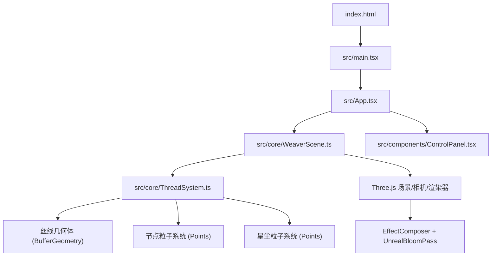

## 1. 架构设计



## 2. 技术说明

- **前端框架**：React@18 + TypeScript
- **3D引擎**：Three.js（直接使用，非R3F，以获得更精细的渲染控制）
- **构建工具**：Vite + @vitejs/plugin-react
- **样式方案**：CSS Modules + 内联样式（控制面板毛玻璃效果）
- **状态管理**：React useState/useCallback，参数通过props传递至WeaverScene
- **初始化工具**：Vite

## 3. 路由定义

| 路由 | 用途 |
|------|------|
| / | 主场景页面，全屏3D织锦 + 控制面板 |

## 4. 核心类设计

### 4.1 WeaverScene

职责：管理Three.js场景生命周期、相机、渲染器、后处理、交互事件分发

| 方法 | 说明 |
|------|------|
| constructor(container) | 初始化场景、相机、渲染器、后处理、ThreadSystem |
| updateParams(params) | 接收控制面板参数更新，转发至ThreadSystem |
| onPointerDown/Move/Up() | 处理鼠标交互：Raycaster检测节点/丝线，触发拖拽或点击 |
| animate() | requestAnimationFrame循环，更新ThreadSystem和后处理 |
| dispose() | 清理所有Three.js资源 |

### 4.2 ThreadSystem

职责：管理丝线和粒子的生成、更新、变形和特效逻辑

| 方法 | 说明 |
|------|------|
| constructor(scene, params) | 初始化丝线几何体、节点粒子、星尘粒子池 |
| rebuild(params) | 根据密度参数重建所有丝线和节点 |
| update(delta, speed) | 每帧更新：丝线波动动画、节点闪烁、弹性恢复、星尘运动 |
| deformThread(index, offset) | 对指定丝线施加弹性变形偏移 |
| burstNode(position) | 在指定位置触发光点爆散成星尘特效 |
| setTheme(theme) | 切换色彩主题，更新所有丝线和粒子颜色 |
| dispose() | 清理几何体和材质 |

### 4.3 数据结构

```typescript
interface WeaverParams {
  density: number;
  theme: 'gold-blue' | 'red-purple' | 'green-pink' | 'cold-white';
  speed: number;
}

interface ThreadData {
  positions: Float32Array;
  restPositions: Float32Array;
  velocity: Float32Array;
  colors: Float32Array;
  segmentCount: number;
}

interface NodeData {
  position: THREE.Vector3;
  threadIndices: number[];
  flickerPhase: number;
}
```

### 4.4 色彩主题映射

| 主题名称 | 起始色 | 结束色 | 节点色 |
|----------|--------|--------|--------|
| gold-blue | #ffd700 | #4169e1 | #fffacd |
| red-purple | #ff4500 | #8a2be2 | #ffb6c1 |
| green-pink | #00ff88 | #ff69b4 | #b0ffc8 |
| cold-white | #e0e0ff | #8080ff | #ffffff |

## 5. 渲染管线

1. **主渲染Pass**：丝线使用LineSegments + ShaderMaterial（顶点着色器实现波动，片元着色器实现渐变+透明度）
2. **节点粒子Pass**：Points + PointsMaterial（自定义大小衰减，shader实现闪烁）
3. **后处理**：EffectComposer → RenderPass → UnrealBloomPass（强度0.8，阈值0.3，半径0.5）
4. **帧率优化**：几何体使用BufferAttribute避免每帧创建，粒子池复用，视锥外丝线剔除

## 6. 交互实现

- **Raycaster**：每帧检测鼠标射线与节点球体的碰撞
- **拖拽变形**：鼠标按下时锁定最近丝线，移动时将鼠标投影到丝线平面计算偏移量，施加弹簧力模型
- **点击爆散**：检测到快速点击（无拖拽位移）时，在节点位置生成星尘粒子（径向速度+重力+衰减），同时移除该节点相关丝线段，1.5秒后触发重编织
- **弹性恢复**：丝线变形使用胡克定律 F=-kx，阻尼系数0.95，每帧更新位置
