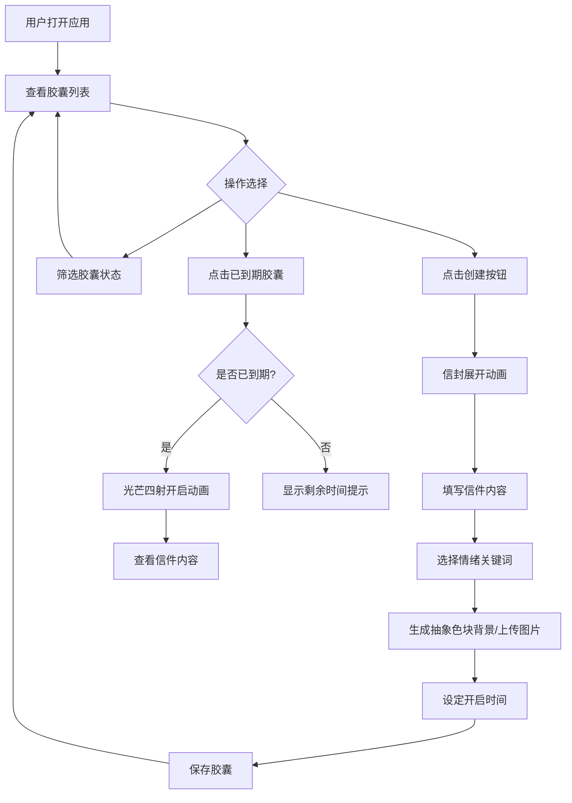

## 1. 产品概述

「时间胶囊」是一款复古未来主义风格的全栈 Web 应用，用户可以创建封存到未来某个时间点的信件或笔记，仅在设定的时间到达后才能开启查看。系统自动检测胶囊到期状态并触发开启动画，同时支持根据情绪关键词生成抽象艺术背景。

- 目标用户：希望为未来的自己或他人留下时间标记的创意人群
- 核心价值：将情感与时间绑定，通过视觉艺术和交互仪式感增强"等待—开启"的体验

## 2. 核心功能

### 2.1 用户角色

| 角色 | 注册方式 | 核心权限 |
|------|----------|----------|
| 普通用户 | 无需注册（本地模式） | 创建、查看、筛选时间胶囊 |

### 2.2 功能模块

1. **主页面**：胶囊列表展示、状态筛选、创建入口
2. **创建胶囊**：信件编辑、情绪关键词选择、背景生成、时间设定
3. **开启胶囊**：到期检测、光芒四射开启动画、内容展示

### 2.3 页面详情

| 页面名称 | 模块名称 | 功能描述 |
|----------|----------|----------|
| 主页面 | 顶部导航 | 半透明磨砂质感导航栏，包含 Logo 和创建按钮 |
| 主页面 | 筛选栏 | 按状态筛选：全部、未开启、已开启、过期，切换时卡片平滑过渡 |
| 主页面 | 胶囊列表 | 展示所有胶囊卡片，毛玻璃圆角面板带复古细边框，显示标题、开启时间、状态标签、缩略背景 |
| 主页面 | 创建表单（模态） | 信封折叠展开动画打开，包含标题、内容、情绪关键词、背景选择（生成/上传）、开启日期 |
| 主页面 | 开启动画 | 光芒四射特效，内容渐显 |

## 3. 核心流程

用户打开应用 → 查看胶囊列表 → 点击创建按钮 → 信封展开动画 → 填写信件内容 → 选择情绪关键词 → 自动生成抽象色块艺术背景（或上传图片）→ 设定开启时间 → 保存胶囊 → 返回列表 → 等待时间到达 → 胶囊状态变为"可开启" → 点击开启 → 光芒四射动画 → 查看信件内容

## 4. 用户界面设计

### 4.1 设计风格

- **主色调**：暖黄色（#D4A017）和金属铜色（#B87333）
- **背景**：深棕（#2C1810）到米白（#F5E6D3）渐变
- **卡片**：毛玻璃圆角面板（backdrop-filter: blur），复古细边框（1px solid rgba(184,115,51,0.3)）
- **导航栏**：半透明磨砂质感（rgba(44,24,16,0.7) + backdrop-filter: blur(20px)）
- **按钮**：铜色圆形胶囊按钮，带微光悬停效果（box-shadow glow）
- **字体**：展示字体使用 Playfair Display，正文使用 Noto Serif SC
- **布局**：卡片网格布局，响应式自适应
- **图标**：lucide-react 图标库
- **动画**：信封折叠展开（创建）、光芒四射（开启）、卡片平滑过渡（筛选）

### 4.2 页面设计概述

| 页面名称 | 模块名称 | UI 元素 |
|----------|----------|---------|
| 主页面 | 顶部导航 | 磨砂半透明背景，Playfair Display Logo，铜色胶囊"创建"按钮 |
| 主页面 | 筛选栏 | 铜色细边框标签按钮组，激活态带暖黄色填充 |
| 主页面 | 胶囊卡片 | 毛玻璃面板，圆角16px，情绪色块缩略图，标题+日期+状态标签，悬停微微上浮 |
| 主页面 | 创建模态 | 信封折叠展开动画，内含表单字段，铜色提交按钮 |
| 主页面 | 开启动画 | 全屏光芒放射，粒子效果，内容渐显 |

### 4.3 响应式适配

- 桌面端（≥1024px）：3列卡片网格，导航水平展开
- 平板端（768-1023px）：2列卡片网格
- 手机端（<768px）：单列卡片，导航折叠为汉堡菜单，创建表单全屏模态

### 4.4 性能要求

- 所有动画使用 CSS transforms 和 opacity，确保 GPU 加速
- 使用 will-change 提示浏览器预优化
- 列表渲染使用虚拟化（胶囊数量 > 50 时）
- 交互帧率稳定在 60fps
