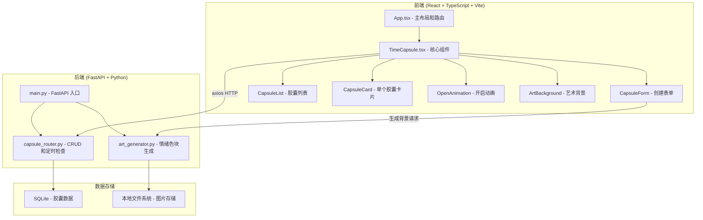
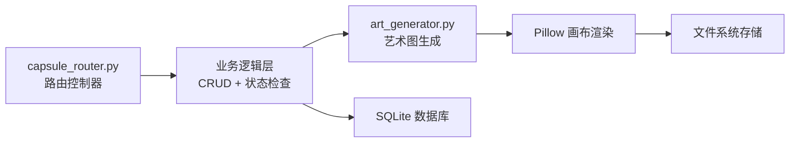
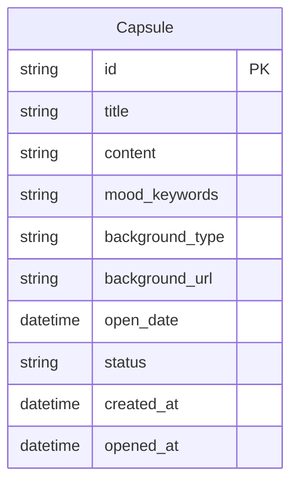

## 1. 架构设计



## 2. 技术说明

- **前端**：React 18 + TypeScript + Vite + Ant Design（按用户要求）
- **构建工具**：Vite
- **后端**：FastAPI (Python 3.10+)
- **数据库**：SQLite（轻量级，无需额外安装）
- **HTTP 客户端**：axios
- **动画**：CSS 动画 + Framer Motion（用于复杂动画编排）
- **图标**：lucide-react

## 3. 路由定义

| 路由 | 用途 |
|------|------|
| / | 主页面，展示胶囊列表、筛选、创建和开启功能 |

## 4. API 定义

### 4.1 数据类型

```typescript
interface Capsule {
  id: string;
  title: string;
  content: string;
  mood_keywords: string[];
  background_type: "generated" | "uploaded";
  background_url: string;
  open_date: string;
  status: "sealed" | "opened" | "expired";
  created_at: string;
  opened_at?: string;
}

interface CreateCapsuleRequest {
  title: string;
  content: string;
  mood_keywords: string[];
  background_type: "generated" | "uploaded";
  open_date: string;
}

interface ArtGenerateRequest {
  mood_keywords: string[];
  width: number;
  height: number;
}
```

### 4.2 API 端点

| 方法 | 路径 | 用途 | 请求体 | 响应 |
|------|------|------|--------|------|
| GET | /api/capsules | 获取所有胶囊 | - | Capsule[] |
| GET | /api/capsules?status=sealed | 按状态筛选 | - | Capsule[] |
| POST | /api/capsules | 创建胶囊 | CreateCapsuleRequest | Capsule |
| GET | /api/capsules/{id} | 获取单个胶囊 | - | Capsule |
| POST | /api/capsules/{id}/open | 开启胶囊 | - | Capsule |
| POST | /api/art/generate | 生成情绪艺术图 | ArtGenerateRequest | { image_url: string } |
| POST | /api/art/upload | 上传背景图片 | FormData | { image_url: string } |

## 5. 服务器架构图



## 6. 数据模型

### 6.1 数据模型定义



### 6.2 数据定义语言

```sql
CREATE TABLE IF NOT EXISTS capsules (
    id TEXT PRIMARY KEY,
    title TEXT NOT NULL,
    content TEXT NOT NULL,
    mood_keywords TEXT NOT NULL,
    background_type TEXT NOT NULL DEFAULT 'generated',
    background_url TEXT NOT NULL DEFAULT '',
    open_date TEXT NOT NULL,
    status TEXT NOT NULL DEFAULT 'sealed',
    created_at TEXT NOT NULL,
    opened_at TEXT
);

CREATE INDEX IF NOT EXISTS idx_capsules_status ON capsules(status);
CREATE INDEX IF NOT EXISTS idx_capsules_open_date ON capsules(open_date);
```

## 7. 项目文件结构

```
auto406/
├── server/
│   ├── main.py              # FastAPI 入口，初始化并挂载路由
│   ├── capsule_router.py    # 处理时间胶囊的 CRUD 和定时检查逻辑
│   └── art_generator.py     # 根据情绪关键词生成抽象色块图
├── client/
│   └── src/
│       ├── main.tsx         # React 入口
│       ├── App.tsx          # 主布局和路由配置
│       └── components/
│           └── TimeCapsule.tsx  # 核心组件：创建表单、胶囊列表、开启动画
├── package.json             # 依赖和脚本
├── tsconfig.json            # TypeScript 配置
├── vite.config.js           # Vite 配置
└── index.html               # 入口 HTML
```
