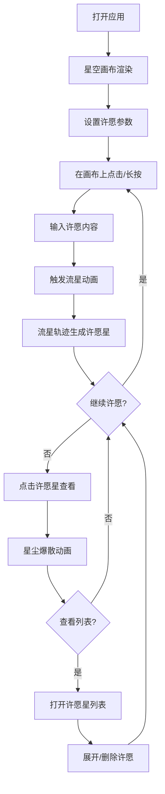

## 1. 产品概述

「星语心愿」是一款梦幻星空风格的交互式 Web 应用，让用户在虚拟夜空中许愿，并看到流星划过的浪漫过程。每次许愿触发流星动画，流星轨迹上留下半透明发光许愿星，点击许愿星可展开查看许愿内容。

- 目标用户：追求浪漫、治愈系体验的年轻用户群体
- 核心价值：提供沉浸式的星空许愿体验，通过精致的视觉效果和流畅的交互反馈带来情感治愈

## 2. 核心功能

### 2.1 功能模块

1. **星空画布页**：全屏星空画布，包含闪烁星光背景、流星动画、许愿星渲染与交互
2. **控制面板**：毛玻璃风格悬浮面板，提供许愿方式切换、流星速度调节、许愿星颜色选择和清除功能
3. **许愿星列表**：侧边/底部面板展示所有许愿星，支持展开查看和删除

### 2.2 页面详情

| 页面名称 | 模块名称 | 功能描述 |
|---------|---------|---------|
| 星空画布 | 星空背景 | 深蓝到墨黑渐变背景，布满随机分布、明暗闪烁的细小星光（200+颗），营造真实夜空氛围 |
| 星空画布 | 流星动画 | 用户许愿时触发，暖黄色到冷蓝渐变的发光拖尾，从随机方向划过天空，速度可调 |
| 星空画布 | 许愿星渲染 | 流星轨迹终点生成半透明五角星形许愿星，带柔光光晕脉冲动画 |
| 星空画布 | 许愿交互 | 点击许愿星触发明许愿内容输入弹窗（或长按直接输入），星尘爆散+光晕扩散动画反馈 |
| 控制面板 | 许愿方式 | 切换器：点击模式（单击许愿）/ 长按模式（长按0.5秒触发许愿） |
| 控制面板 | 流星速度 | 滑块控制（1-5级），影响流星划过速度和拖尾长度 |
| 控制面板 | 许愿星颜色 | 预设8种主题色选择器：暖金、冰蓝、玫瑰粉、翠绿、紫晶、橙焰、银白、天青 |
| 控制面板 | 清除按钮 | 一键清除所有许愿星，带确认提示 |
| 许愿星列表 | 列表展示 | 侧边抽屉展示所有许愿星缩略信息，含时间戳和颜色标记 |
| 许愿星列表 | 展开查看 | 点击列表项展开完整许愿内容，可删除单条 |

## 3. 核心流程

用户打开应用 → 看到梦幻星空背景（星光闪烁） → 通过控制面板设置许愿参数 → 在星空画布上点击/长按 → 弹出许愿输入框 → 输入心愿内容确认 → 流星从天空划过 → 流星轨迹终点出现发光许愿星 → 点击许愿星查看内容（星尘爆散动画） → 可随时调整参数或清除许愿星

## 4. 用户界面设计

### 4.1 设计风格

- **主色调**：深蓝 (#0a0e27) 到墨黑 (#020408) 渐变背景
- **强调色**：暖金 (#FFD700)、冰蓝 (#7EC8E3)
- **按钮风格**：圆角胶囊形，半透明毛玻璃质感，悬停时发光
- **字体**：许愿内容使用优雅衬线体（Noto Serif SC），UI 文字使用无衬线体（Noto Sans SC）
- **布局**：全屏沉浸式画布，左上角悬浮毛玻璃控制面板，右侧可滑出许愿星列表抽屉
- **图标**：极简线条风格（星星、月亮、流星等天体意象）

### 4.2 页面设计概览

| 页面名称 | 模块名称 | UI 元素 |
|---------|---------|--------|
| 星空画布 | 星空背景 | 深蓝-墨黑渐变，200+随机闪烁星光（1-3px白色光点，不同闪烁频率） |
| 星空画布 | 流星 | 暖黄到冷蓝渐变发光体，2-4px宽，100-200px拖尾，3秒内划过 |
| 星空画布 | 许愿星 | 半透明五角星（20-30px），8种预设色，脉冲光晕（2秒周期），悬停放大1.2x |
| 星空画布 | 许愿输入弹窗 | 居中毛玻璃卡片，圆角输入框，确认按钮带流星图标 |
| 控制面板 | 面板容器 | 左上角定位，backdrop-blur毛玻璃，1px半透明白色边框，圆角12px |
| 控制面板 | 许愿方式 | 双选项切换器（点击/长按），选中项带发光底色 |
| 控制面板 | 流星速度 | 5档滑块，刻度标记，拖动时实时预览 |
| 控制面板 | 颜色选择器 | 8个圆形色块（20px），选中项带发光环 |
| 许愿星列表 | 列表抽屉 | 右侧滑入，半透明深色背景，许愿星卡片列表 |
| 许愿星列表 | 列表项 | 颜色圆点+时间+内容预览，点击展开完整内容 |

### 4.3 响应式设计

- 桌面端（>768px）：全屏画布，左侧控制面板，右侧列表抽屉
- 移动端（≤768px）：全屏画布，底部折叠控制面板（点击展开），底部弹出列表
- 触摸优化：长按判定300ms，许愿星点击区域扩大到44px，滑动手势关闭抽屉

### 4.4 动效规范

- 星光闪烁：1-3秒随机周期，opacity 0.3-1.0 循环
- 流星划过：ease-in-out缓动，拖尾渐隐
- 许愿星脉冲：scale 0.95-1.05 + opacity 0.6-0.9，2秒周期
- 星尘爆散：12-16个粒子从中心向外扩散，1秒内消失
- 光晕扩散：圆环从0扩展到60px半径，opacity 1→0，0.8秒
- 所有动画使用 requestAnimationFrame，保持60fps
