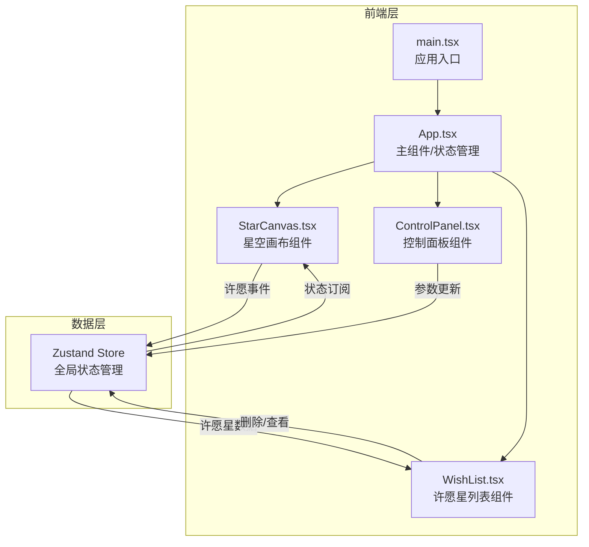
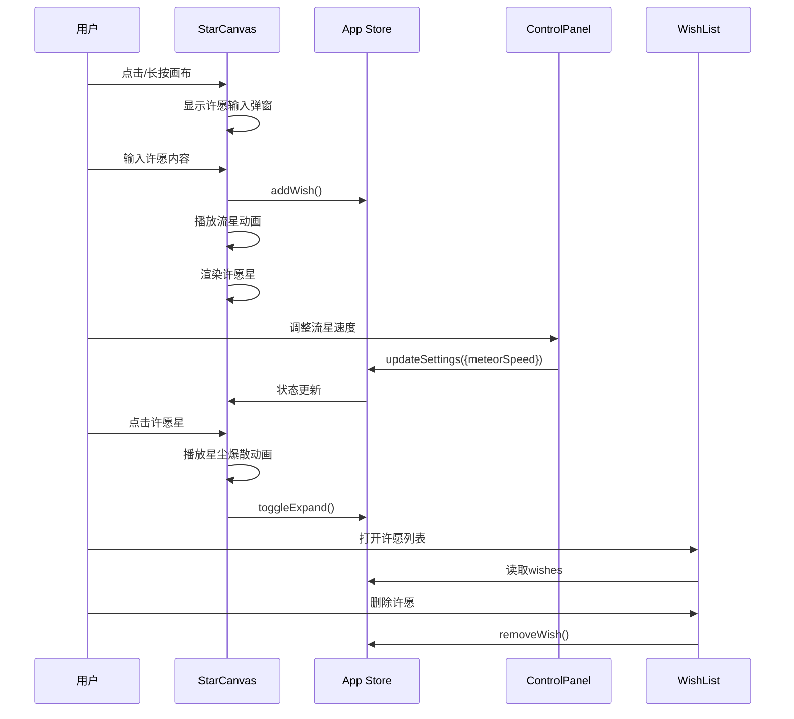

## 1. 架构设计



## 2. 技术说明

- **前端**：React 18 + TypeScript + Vite
- **样式方案**：Tailwind CSS + CSS Modules（Canvas 相关动画样式）
- **状态管理**：Zustand（管理许愿星数据、控制面板参数）
- **动画引擎**：Canvas 2D API + requestAnimationFrame（星空、流星、许愿星渲染）
- **初始化工具**：vite-init（react-ts 模板）
- **后端**：无（纯前端应用）
- **数据库**：无（数据仅存内存，可扩展 localStorage 持久化）

## 3. 路由定义

| 路由 | 用途 |
|------|------|
| / | 星空许愿主页面（单页应用，无额外路由） |

## 4. 核心数据结构

```typescript
interface Wish {
  id: string
  content: string
  x: number
  y: number
  color: string
  createdAt: number
  expanded: boolean
}

interface StarFieldStar {
  x: number
  y: number
  size: number
  opacity: number
  twinkleSpeed: number
  twinkleOffset: number
}

interface Meteor {
  id: string
  startX: number
  startY: number
  endX: number
  endY: number
  progress: number
  speed: number
  trail: { x: number; y: number; opacity: number }[]
  color: string
}

interface Particle {
  x: number
  y: number
  vx: number
  vy: number
  life: number
  maxLife: number
  size: number
  color: string
}

interface AppSettings {
  wishMode: 'click' | 'longpress'
  meteorSpeed: number
  wishColor: string
}

type ThemeColor = {
  name: string
  value: string
  glow: string
}
```

## 5. 状态管理设计（Zustand Store）

```typescript
interface WishStore {
  wishes: Wish[]
  settings: AppSettings
  addWish: (wish: Omit<Wish, 'id' | 'createdAt' | 'expanded'>) => void
  removeWish: (id: string) => void
  clearWishes: () => void
  toggleExpand: (id: string) => void
  updateSettings: (partial: Partial<AppSettings>) => void
}
```

## 6. 组件交互流程



## 7. Canvas 渲染架构

```
StarCanvas 渲染循环 (requestAnimationFrame @ 60fps):
  ┌─────────────────────────────────────┐
  │ 1. 清除画布                          │
  │ 2. 绘制渐变背景（深蓝→墨黑）          │
  │ 3. 绘制闪烁星光（200+颗，随机闪烁）   │
  │ 4. 绘制活跃流星（暖黄→冷蓝渐变拖尾）  │
  │ 5. 绘制许愿星（五角星+光晕脉冲）      │
  │ 6. 绘制星尘粒子（爆散动画）           │
  │ 7. 更新所有动画状态                   │
  └─────────────────────────────────────┘
```

## 8. 性能优化策略

- 使用单个 Canvas 实例，避免多层 Canvas 开销
- 星光数据预生成，仅更新 opacity
- 流星离屏后立即回收，避免内存泄漏
- 许愿星使用离屏 Canvas 缓存五角星图形
- 粒子系统对象池复用
- 使用 `devicePixelRatio` 适配高清屏
- 移动端降低星光数量至 100 颗
