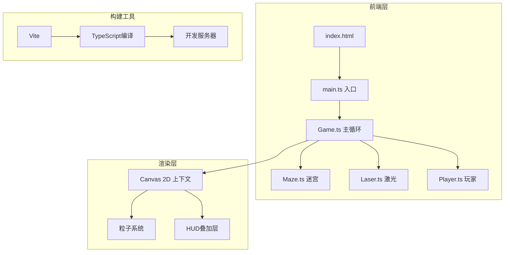

## 1. 架构设计



## 2. 技术说明

- **前端**：TypeScript + Canvas 2D API（无框架，纯原生实现）
- **构建工具**：Vite + TypeScript
- **后端**：无（纯前端单机游戏）
- **目标帧率**：60fps，使用 requestAnimationFrame

## 3. 文件结构

| 文件路径 | 用途 |
|----------|------|
| package.json | 项目依赖和脚本（typescript, vite） |
| tsconfig.json | TypeScript配置（target ES2020, module ESNext） |
| vite.config.js | Vite配置（root为当前目录） |
| index.html | 入口HTML，挂载canvas和样式 |
| src/main.ts | 入口文件，初始化Game对象和启动循环 |
| src/Game.ts | 主游戏循环，管理状态、更新和渲染 |
| src/entities/Maze.ts | 迷宫生成逻辑，镜子放置，碰撞检测 |
| src/entities/Laser.ts | 激光路径计算与反射逻辑，多段折射 |
| src/entities/Player.ts | 玩家控制，移动，收集碎片，交互 |

## 4. 核心数据结构

### 4.1 迷宫数据

```typescript
interface MazeCell {
  x: number
  y: number
  walls: { top: boolean; right: boolean; bottom: boolean; left: boolean }
  hasMirror: boolean
  mirrorAngle: number
  hasCrystal: boolean
  isExit: boolean
}
```

### 4.2 激光数据

```typescript
interface LaserSegment {
  startX: number
  startY: number
  endX: number
  endY: number
  intensity: number
}

interface LaserReflection {
  point: { x: number; y: number }
  normal: { x: number; y: number }
  segments: LaserSegment[]
}
```

### 4.3 玩家数据

```typescript
interface PlayerState {
  x: number
  y: number
  speed: number
  crystals: number
  steps: number
  trail: { x: number; y: number; alpha: number }[]
}
```

## 5. 渲染管线

每帧渲染顺序：
1. 清空画布，绘制渐变背景
2. 绘制迷宫墙壁（晶体发光质感）
3. 绘制镜子（菱形+光晕）
4. 计算并绘制激光路径（渐变光束+反射）
5. 绘制水晶碎片
6. 绘制玩家小球（发光+粒子拖尾）
7. 绘制粒子特效（光斑爆散、金色光晕等）
8. 绘制HUD（步数、水晶、小地图、操作提示）
9. 处理过渡动画（如出口解锁炫光）

## 6. 交互系统

- **WASD**：玩家上下左右移动，基于格子的平滑移动
- **鼠标拖拽**：检测点击是否在镜子附近，拖拽时计算角度差旋转镜子
- **碰撞检测**：AABB检测玩家与墙壁碰撞，射线检测激光与镜子/墙壁交点
- **水晶收集**：玩家位置与水晶位置距离检测

## 7. 性能优化策略

- 粒子池化：预分配粒子对象，避免GC
- 离屏Canvas缓存静态迷宫结构
- 激光路径仅在镜子旋转时重新计算
- requestAnimationFrame + deltaTime 确保帧率稳定
