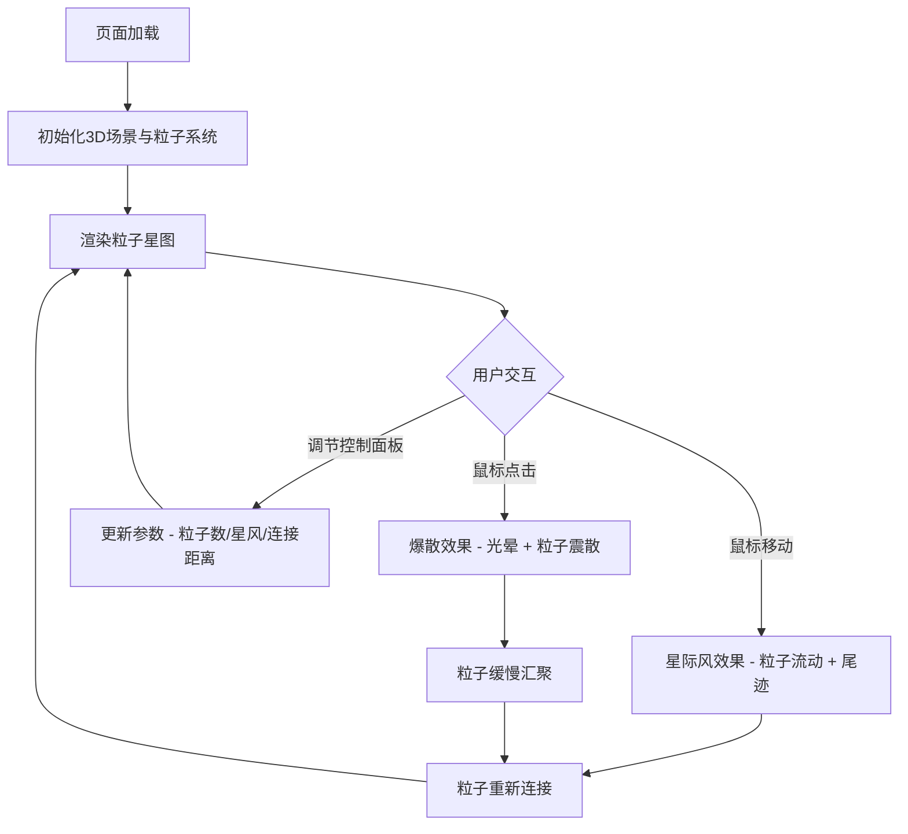

## 1. 产品概述

「星尘回声」是一个3D交互式粒子可视化项目，模拟深邃宇宙中发光粒子随用户鼠标交互而响应的沉浸式体验。鼠标移动形成星际风拖拽尾迹，点击产生爆炸光晕后粒子缓慢汇聚重连，整体呈现极光星云风格。

- 目标用户：视觉艺术爱好者、交互设计从业者、沉浸式体验探索者
- 核心价值：提供一种冥想式的宇宙粒子交互体验，兼顾视觉震撼与流畅性能

## 2. 核心功能

### 2.1 功能模块

1. **3D粒子星图场景**：成千上万发光粒子漂浮于深空，粒子颜色从中心暖白到边缘冷蓝渐变，粒子间有半透明细线动态连接形成星图
2. **鼠标交互系统**：鼠标移动产生星际风效果，粒子随鼠标流动形成尾迹；点击产生爆炸光晕，粒子震散后缓慢汇聚重连
3. **毛玻璃控制面板**：右下角控制面板可调节粒子数量、星风强度、连接距离，以及重置星图

### 2.2 页面详情

| 页面名称 | 模块名称 | 功能描述 |
|----------|----------|----------|
| 星尘回声主场景 | 3D粒子系统 | 粒子生成、颜色渐变、大小控制、流动与爆炸逻辑 |
| 星尘回声主场景 | 连接线系统 | 根据粒子间距离动态绘制半透明细线 |
| 星尘回声主场景 | 鼠标交互 | 星际风拖拽、点击爆散、微光拖尾、光晕效果 |
| 星尘回声主场景 | 控制面板 | 粒子数量滑块、星风强度滑块、连接距离滑块、重置按钮 |

## 3. 核心流程

用户打开页面后，看到深空背景中漂浮的发光粒子星图。移动鼠标时，粒子受到星际风影响流动并产生尾迹；点击时，鼠标位置产生爆炸光晕，附近粒子被震散后缓慢回归并重新建立连接。用户可通过右下角控制面板调整参数。

## 4. 用户界面设计

### 4.1 设计风格

- **主色调**：深空蓝 (#0a0e27) 到墨黑 (#000000) 渐变背景
- **粒子颜色**：中心暖白 (#fffaf0) → 边缘冷蓝 (#4a9eff) 渐变
- **连接线**：半透明白蓝色 (#4a9eff, opacity 0.15)
- **光晕效果**：爆散时白蓝渐变光晕，拖尾时微光淡蓝
- **控制面板**：毛玻璃效果 (backdrop-filter: blur)，深色半透明底
- **字体**：UI文字使用清细无衬线体，滑块标签用小号字
- **布局**：全屏3D画布，控制面板固定右下角悬浮

### 4.2 页面设计概览

| 页面名称 | 模块名称 | UI元素 |
|----------|----------|--------|
| 星尘回声主场景 | 3D画布 | 全屏WebGL画布，深空渐变背景，粒子浮动 |
| 星尘回声主场景 | 控制面板 | 毛玻璃卡片，3个滑块+1个重置按钮，右下角固定 |

### 4.3 响应式设计

- 桌面优先设计，全屏3D画布自适应窗口大小
- 控制面板在窄屏下缩小或可折叠
- 窗口resize时更新渲染器和相机参数

### 4.4 3D场景指导

- **环境氛围**：深空宇宙感，极光星云色调，深邃而神秘
- **光照**：环境光为主，粒子自发光，点击时局部增亮
- **相机设置**：透视相机，固定位置俯视粒子场，可微调视角
- **交互与动画**：鼠标移动→粒子流动+拖尾，点击→爆散+光晕+汇聚，持续动画循环
- **后期处理**：Bloom效果增强发光感，微弱色调映射
- **性能预算**：60fps稳定运行，粒子数500-3000可调，连接线按距离阈值剔除
