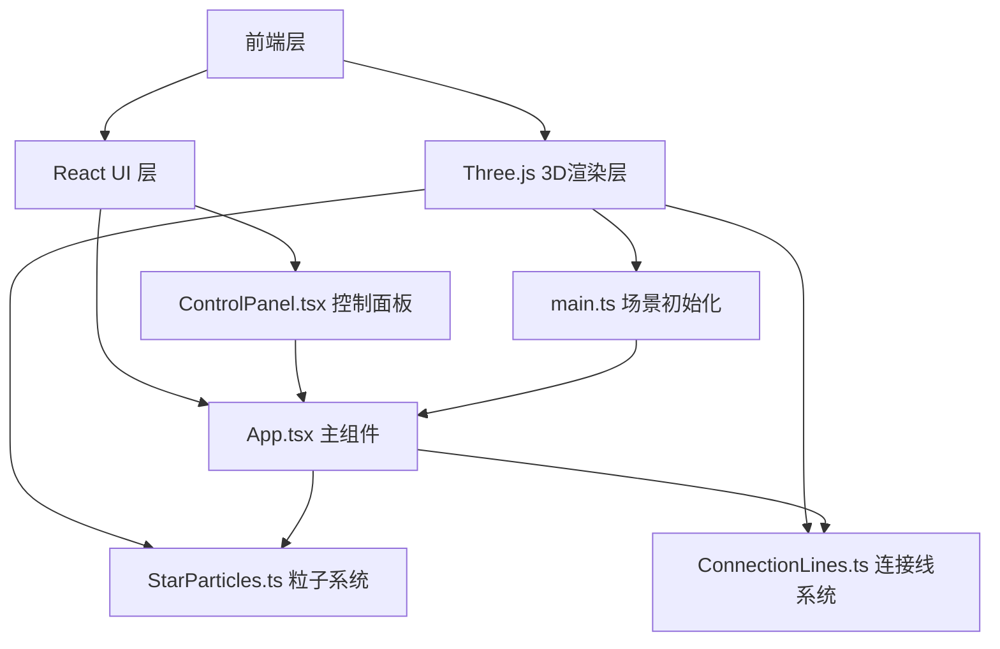

## 1. 架构设计



## 2. 技术说明

- **前端框架**：React 18 + TypeScript
- **3D渲染**：Three.js（直接使用，非 @react-three/fiber，以获得更细粒度的性能控制）
- **构建工具**：Vite
- **状态管理**：Zustand（管理粒子参数与交互状态）
- **样式**：CSS-in-JS + 内联样式（控制面板毛玻璃效果）
- **后端**：无（纯前端项目）

## 3. 路由定义

| 路由 | 用途 |
|------|------|
| / | 星尘回声主场景（单页应用） |

## 4. 文件结构

```
├── index.html                 # 入口HTML
├── package.json               # 依赖与脚本
├── vite.config.ts             # Vite配置
├── tsconfig.json              # TypeScript配置
└── src/
    ├── main.ts                # 应用入口，初始化场景和渲染器
    ├── App.tsx                # 主组件，整合场景和UI，管理状态
    ├── store.ts               # Zustand状态管理
    ├── effects/
    │   ├── StarParticles.ts   # 粒子系统
    │   └── ConnectionLines.ts # 连接线系统
    └── controls/
        └── ControlPanel.tsx   # 毛玻璃控制面板
```

## 5. 核心模块设计

### 5.1 StarParticles.ts 粒子系统

- 使用 `THREE.BufferGeometry` + `THREE.Points` 实现高性能粒子渲染
- 粒子属性存储在 `Float32Array`：位置(x,y,z)、颜色(r,g,b)、大小、速度、原始位置
- 每帧更新：应用星风力场（鼠标位置影响）、计算与鼠标的交互力、更新位置
- 点击爆炸：在鼠标位置施加径向排斥力，粒子被推散后施加回归力缓慢回原位
- 拖尾效果：使用 `THREE.AdditiveBlending` + 自定义着色器实现发光和拖尾
- 颜色渐变：中心粒子暖白，边缘粒子冷蓝，基于到场景中心的距离插值

### 5.2 ConnectionLines.ts 连接线系统

- 使用 `THREE.BufferGeometry` + `THREE.LineSegments` 实现动态连接线
- 每帧计算粒子间距离，距离小于阈值的粒子对绘制连接线
- 连接线透明度随距离增大而降低
- 优化策略：空间分区（网格法）减少距离计算量，仅检查相邻网格内的粒子
- 点击爆散时，受影响粒子的连接线断开，汇聚后重新连接

### 5.3 ControlPanel.tsx 控制面板

- 毛玻璃效果：`backdrop-filter: blur(20px)` + 半透明深色背景
- 三个滑块：粒子数量(500-3000)、星风强度(0.1-2.0)、连接距离(50-200)
- 重置按钮：恢复默认参数，重置粒子位置
- 使用 Zustand store 管理参数状态，变更实时反馈到3D场景

### 5.4 main.ts 应用入口

- 初始化 Three.js 场景、相机（透视相机）、WebGL渲染器
- 创建 StarParticles 和 ConnectionLines 实例
- 绑定鼠标事件（mousemove、click）
- 启动渲染循环（requestAnimationFrame）
- 窗口resize自适应

### 5.5 App.tsx 主组件

- React根组件，挂载Three.js canvas到DOM
- 包含ControlPanel子组件
- 通过useEffect管理Three.js生命周期
- 连接Zustand store与Three.js场景参数

## 6. 性能优化策略

- 粒子系统使用 BufferGeometry + Points，避免逐粒子创建Mesh
- 连接线使用空间分区减少O(n²)距离计算
- 粒子数量可调，默认1500，最大3000
- 使用 AdditiveBlending 实现发光效果，无需后期处理
- 渲染循环使用 requestAnimationFrame，确保帧率稳定60fps
- 窗口resize时防抖更新
