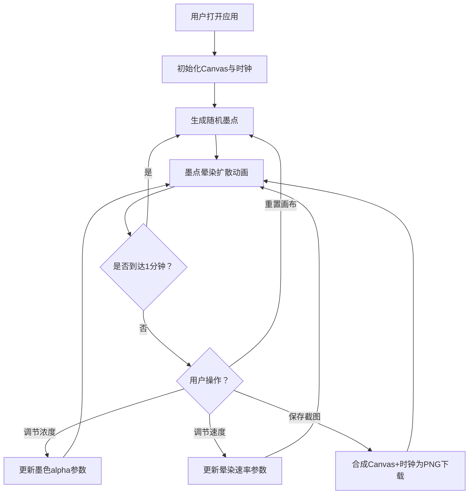

## 1. 产品概述

「墨韵时钟」是一款新中式水墨风格的交互式数字时钟Web应用，每分钟自动生成一幅随机水墨画作为动态背景，时间数字以半透明毛笔字体呈现，配合金色微光动画，营造墨色在宣纸上晕染扩散的诗意视觉体验。

- 核心目标：将传统水墨美学与数字时钟结合，打造兼具实用性与艺术性的桌面/手机应用
- 目标用户：喜爱中国传统文化、追求桌面美学的用户

## 2. 核心功能

### 2.1 用户角色

无用户角色区分，所有功能开放使用。

### 2.2 功能模块

1. **主界面**：全屏水墨canvas背景 + 时钟数字叠加显示 + 控制面板
2. **时钟显示**：实时时分秒渲染，毛笔风格字体，金色光晕动画
3. **水墨画布**：Canvas随机生成墨点，自动晕染扩散，每分钟切换
4. **控制面板**：毛玻璃面板，浓度/速度滑块，重置/截图按钮

### 2.3 页面详情

| 页面名称 | 模块名称 | 功能描述 |
|----------|----------|----------|
| 主界面 | 时钟显示区 | 显示当前时间（HH:MM:SS），半透明毛笔字体，金色发光动画，毛玻璃背景模糊 |
| 主界面 | 水墨画布区 | 全屏Canvas，每分钟生成随机墨点并晕染扩散，墨色从纯黑到灰渐变，墨迹自然融合 |
| 主界面 | 控制面板 | 右下角毛玻璃面板，墨色浓度滑块、晕染速度滑块、重置画布按钮、保存截图按钮 |

## 3. 核心流程

用户打开应用后看到全屏水墨画背景与实时时钟。每分钟自动生成新水墨画。用户可通过控制面板调节墨色浓度和晕染速度，或手动重置画布生成新画，也可截图保存当前画面。

## 4. 界面设计

### 4.1 设计风格

- 主色调：黑（#1a1a1a）、灰（#4a4a4a）、米白（#f5f0e8）
- 点缀色：金色（#c9a96e）
- 按钮样式：毛玻璃磨砂效果 + 细金边，悬停微光放大
- 字体：Ma Shan Zheng（毛笔风格Google Font）用于时钟数字，系统字体用于控制面板
- 布局：全屏沉浸式，时钟居中，控制面板右下角浮动
- 图标：极简线性图标（墨滴、刷新、相机）

### 4.2 页面设计概览

| 页面名称 | 模块名称 | UI元素 |
|----------|----------|--------|
| 主界面 | 时钟显示区 | Ma Shan Zheng字体，字号120px（桌面）/60px（手机），半透明白色，text-shadow金色光晕，backdrop-filter毛玻璃 |
| 主界面 | 水墨画布区 | 全屏Canvas，深灰到米白径向渐变底色，随机墨点+alpha晕染，帧动画60fps |
| 主界面 | 控制面板 | 固定右下角（桌面）/底部折叠（手机），backdrop-filter毛玻璃，1px金色边框，圆角12px，滑块+按钮 |

### 4.3 响应式适配

- 桌面优先设计，手机端自适应
- 时钟数字：桌面120px → 手机60px
- 控制面板：桌面固定右下角 → 手机折叠为图标按钮，展开覆盖半屏
- Canvas始终全屏，墨点数量根据屏幕尺寸缩放
- 触摸优化：滑块和按钮触摸区域≥44px

### 4.4 3D场景指导

不适用。
