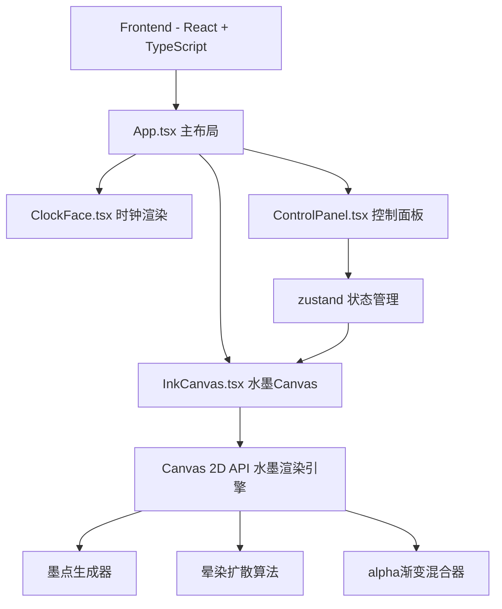

## 1. 架构设计



## 2. 技术说明

- 前端：React 18 + TypeScript + Vite
- 初始化工具：vite-init（react-ts模板）
- 状态管理：zustand（墨色浓度、晕染速度参数）
- 后端：无
- 数据库：无
- 字体：Google Fonts - Ma Shan Zheng
- 图标：lucide-react

## 3. 路由定义

无路由，单页应用。

| 路由 | 用途 |
|------|------|
| / | 主界面，包含时钟、水墨画布、控制面板 |

## 4. API定义

无后端API。

## 5. 服务端架构图

不适用。

## 6. 数据模型

### 6.1 核心状态定义

```typescript
interface InkState {
  inkDensity: number;
  spreadSpeed: number;
  resetTrigger: number;
  setInkDensity: (v: number) => void;
  setSpreadSpeed: (v: number) => void;
  triggerReset: () => void;
}

interface InkParticle {
  x: number;
  y: number;
  radius: number;
  maxRadius: number;
  opacity: number;
  spreadRate: number;
  color: string;
}
```

### 6.2 水墨渲染算法

1. **墨点生成**：每分钟在Canvas上随机生成8-15个墨点，位置(x,y)随机，初始半径2-8px，最大半径30-120px
2. **晕染扩散**：每帧通过requestAnimationFrame更新每个墨点的radius（向maxRadius靠近），同时降低opacity
3. **alpha混合**：使用Canvas的globalAlpha和径向渐变(radialGradient)模拟墨色浓淡
4. **融合效果**：墨点重叠区域通过alpha叠加自然融合，深色区域更浓
5. **帧率控制**：60fps动画循环，使用Canvas离屏缓冲避免重绘闪烁

## 7. 文件结构

```
src/
  main.tsx          - 入口文件
  App.tsx           - 主布局组件
  components/
    ClockFace.tsx   - 时钟数字渲染
    InkCanvas.tsx   - 水墨Canvas核心
    ControlPanel.tsx - 控制面板
  store/
    useInkStore.ts  - zustand状态管理
index.html          - HTML入口
vite.config.ts      - Vite配置
tsconfig.json       - TypeScript配置
package.json        - 项目依赖
```
