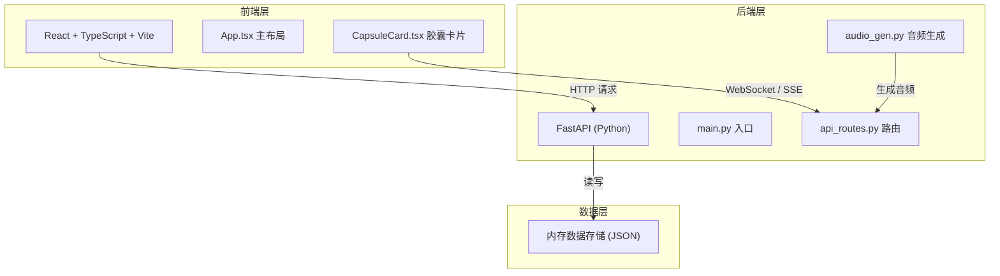
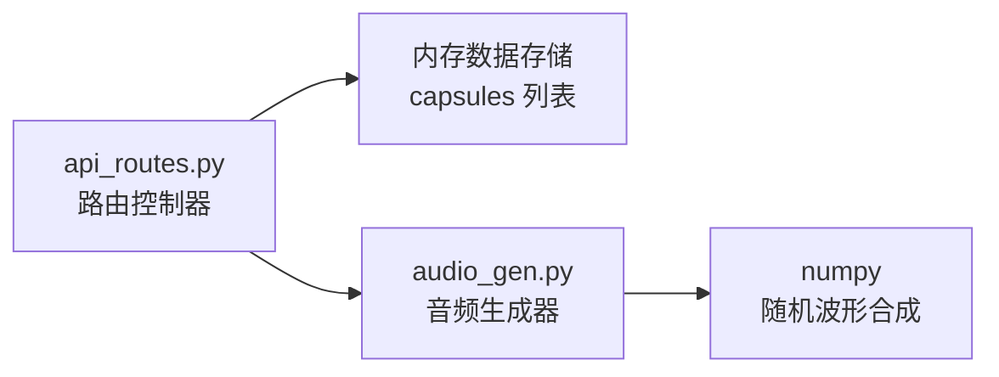
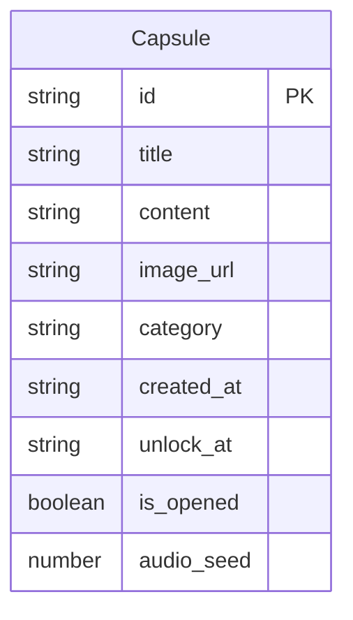

## 1. 架构设计



## 2. 技术说明

- **前端**: React@18 + TypeScript + Vite + Tailwind CSS
- **初始化工具**: vite-init (react-ts 模板)
- **后端**: FastAPI + Uvicorn (Python)
- **数据库**: 内存数据存储（使用 Python 列表/字典模拟，简化部署）
- **音频生成**: Python 标准库 + numpy 随机波形生成 WAV
- **状态管理**: Zustand
- **图标**: lucide-react

## 3. 路由定义

| 路由 | 用途 |
|------|------|
| `/` | 胶囊大厅页，展示所有胶囊列表与筛选 |
| `/capsule/:id` | 胶囊详情页，倒计时、环境音、开启交互 |

## 4. API 定义

### 4.1 数据模型

```typescript
interface Capsule {
  id: string;
  title: string;
  content: string;
  image_url: string | null;
  category: "回忆" | "许愿" | "计划";
  created_at: string;
  unlock_at: string;
  is_opened: boolean;
  audio_seed: number;
}
```

### 4.2 API 端点

| 方法 | 路径 | 请求体 | 响应 | 说明 |
|------|------|--------|------|------|
| GET | `/api/capsules` | - | `Capsule[]` | 获取所有胶囊，支持 `?category=&status=` 查询参数 |
| GET | `/api/capsules/{id}` | - | `Capsule` | 获取单个胶囊详情 |
| POST | `/api/capsules` | `CreateCapsuleRequest` | `Capsule` | 创建新胶囊 |
| PUT | `/api/capsules/{id}/open` | - | `Capsule` | 开启胶囊 |
| GET | `/api/capsules/{id}/audio` | - | `audio/wav` | 获取胶囊环境音 |

```typescript
interface CreateCapsuleRequest {
  title: string;
  content: string;
  image_base64: string | null;
  category: "回忆" | "许愿" | "计划";
  unlock_at: string;
}
```

## 5. 服务端架构图



## 6. 数据模型

### 6.1 数据模型定义



### 6.2 数据存储

使用 Python 内存列表存储胶囊数据，应用重启后数据清空（原型阶段）。初始预置 3 条示例胶囊数据以便演示。

## 7. 项目结构

```
auto412/
├── package.json              # 前端依赖与启动脚本
├── client/
│   ├── vite.config.ts        # Vite 配置（API 代理到 8000 端口）
│   ├── tsconfig.json         # TypeScript 配置
│   ├── index.html            # HTML 入口
│   └── src/
│       ├── main.tsx          # React 入口
│       ├── App.tsx           # 主布局与路由
│       └── components/
│           └── CapsuleCard.tsx  # 胶囊卡片组件
└── server/
    ├── main.py               # FastAPI 入口
    ├── api_routes.py         # API 路由
    ├── audio_gen.py          # 环境音生成
    └── requirements.txt      # Python 依赖
```

## 8. 运行方式

1. `npm install` 安装前端依赖
2. `pip install -r server/requirements.txt` 安装 Python 依赖
3. 终端 1: `uvicorn server.main:app --reload` 启动后端 (端口 8000)
4. 终端 2: `npm run dev` 启动前端 (端口 5173)
5. 浏览器访问 `http://localhost:5173`
