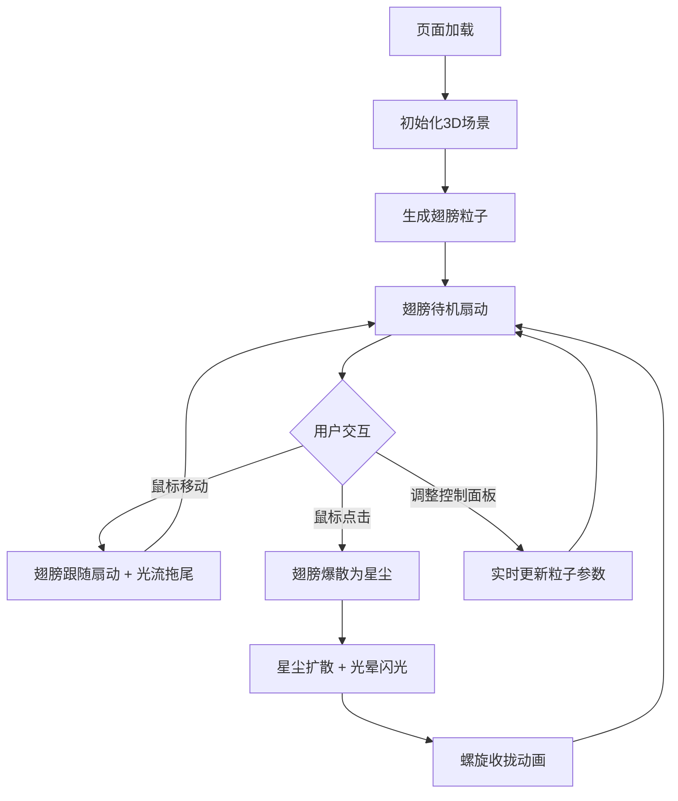

## 1. 产品概述

「光翼织梦」是一个3D交互可视化项目，在深色空间中模拟由用户鼠标驱动的动态光翼粒子系统。成千上万发光粒子组成翅膀形状，随鼠标移动扇动并拖出光流尾迹，点击时爆散为星尘再重新聚合，呈现天使极光风格的沉浸式视觉体验。

- 目标：打造一个视觉震撼、交互流畅的3D粒子艺术交互作品
- 目标用户：数字艺术爱好者、创意开发者、交互设计探索者

## 2. 核心功能

### 2.1 功能模块

1. **主场景页面**：3D粒子翅膀系统、鼠标交互、光效动画

### 2.2 页面详情

| 页面名称 | 模块名称 | 功能描述 |
|----------|----------|----------|
| 主场景 | 翅膀粒子系统 | 数千粒子组成翅膀形状，随鼠标移动扇动，暖金到冷蓝渐变 |
| 主场景 | 光流拖尾效果 | 翅膀扇动时产生半透明光晕和拖尾粒子流 |
| 主场景 | 爆散与聚合 | 点击时翅膀爆散为星尘（扩散+闪光），然后螺旋收拢重新聚合 |
| 主场景 | 毛玻璃控制面板 | 粒子数量/翅膀扇动速度/光流强度滑块 + 重置翅膀按钮 |

## 3. 核心流程

用户打开页面后看到深色空间中的一对光翼，翅膀由发光粒子组成并微微扇动。鼠标移动时翅膀跟随扇动，拖出光流尾迹。点击时翅膀爆散为星尘，带有扩散和光晕闪光效果，随后粒子螺旋收拢重新聚合为翅膀形状。用户可通过右下角毛玻璃面板调节参数。

## 4. 用户界面设计

### 4.1 设计风格

- **主色调**：深紫 (#0a0015) 到墨黑 (#000000) 渐变背景
- **粒子色彩**：主翼暖金 (#FFD700) → 边缘冷蓝 (#4FC3F7) 渐变
- **特效**：半透明光晕、拖尾粒子流、星尘扩散、光晕闪光
- **控制面板**：毛玻璃效果（backdrop-filter: blur），圆角，半透明深色底
- **字体**：系统无衬线字体，细体
- **布局**：全屏3D画布，右下角悬浮控制面板

### 4.2 页面设计概览

| 页面名称 | 模块名称 | UI 元素 |
|----------|----------|---------|
| 主场景 | 3D画布 | 全屏WebGL画布，深紫黑渐变背景 |
| 主场景 | 控制面板 | 毛玻璃卡片，3个滑块（粒子数量/扇动速度/光流强度）+ 重置按钮，悬停/点击有平滑反馈 |

### 4.3 响应式

- 桌面优先，全屏画布自适应窗口大小
- 控制面板在小屏幕下缩至右下角紧凑模式

### 4.4 3D场景指导

- **环境**：深紫到墨黑渐变，无环境光，纯粒子自发光
- **光照**：无传统光照，粒子使用自发光材质（PointsMaterial with vertexColors）
- **相机**：透视相机，固定位置，注视翅膀中心
- **构图**：翅膀居中，控制面板右下角不遮挡主体
- **交互**：鼠标移动驱动翅膀扇动角度，点击触发爆散/聚合
- **后处理**：可选Bloom效果增强发光感
- **性能预算**：5000粒子@60fps，使用BufferGeometry + Points
