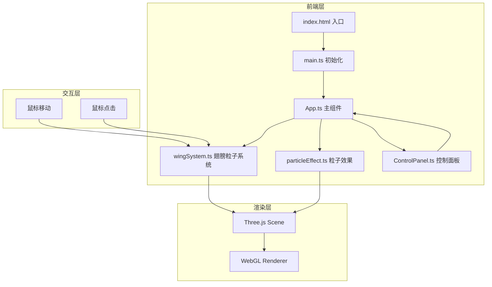

## 1. 架构设计



## 2. 技术说明

- **前端框架**：纯 TypeScript + Three.js（无React/Vue，项目为纯3D可视化）
- **构建工具**：Vite
- **3D引擎**：Three.js + @types/three
- **状态管理**：App.ts 内部管理，通过回调传递给子系统
- **包管理器**：npm

## 3. 文件结构

| 文件路径 | 职责 |
|----------|------|
| `index.html` | 入口HTML，引入main.ts |
| `src/main.ts` | 初始化场景、相机、渲染器，启动渲染循环 |
| `src/App.ts` | 主组件，协调各子系统，管理状态，处理鼠标事件 |
| `src/core/wingSystem.ts` | 翅膀粒子系统，粒子位置计算、扇动动画、爆散/聚合逻辑 |
| `src/core/particleEffect.ts` | 粒子效果，光晕、拖尾、星尘动画 |
| `src/components/ControlPanel.ts` | 毛玻璃控制面板UI，滑块和按钮 |

## 4. 核心模块设计

### 4.1 wingSystem.ts - 翅膀粒子系统

- 使用 `THREE.BufferGeometry` + `THREE.Points` 渲染粒子
- 翅膀形状通过数学参数化生成（椭圆+扇形分布，左右对称）
- 粒子颜色通过 `vertexColors` 属性实现暖金到冷蓝渐变
- 扇动动画：基于鼠标位置计算扇动角度，使用正弦函数驱动粒子Y轴偏移
- 爆散：点击时每个粒子获得随机径向速度向外扩散
- 聚合：爆散后粒子以螺旋路径回到原位，使用缓动函数

### 4.2 particleEffect.ts - 粒子效果

- 光晕：使用额外的半透明大粒子叠加在翅膀粒子位置
- 拖尾：维护一个拖尾粒子池，翅膀扇动时释放粒子，逐渐缩小并淡出
- 星尘：爆散时生成额外的星尘粒子，随机方向扩散后淡出
- 所有效果使用独立的 Points 对象管理

### 4.3 ControlPanel.ts - 控制面板

- 纯DOM操作创建毛玻璃面板
- CSS: `backdrop-filter: blur(12px)`, 半透明背景, 圆角
- 滑块：粒子数量(500-5000)、翅膀扇动速度(0.5-2.0)、光流强度(0.1-1.0)
- 重置按钮：触发翅膀重新聚合动画
- 所有控件有平滑悬停和点击CSS动画

### 4.4 main.ts - 入口

- 创建 `THREE.Scene`、`THREE.PerspectiveCamera`、`THREE.WebGLRenderer`
- 初始化 App 实例
- 绑定 window resize 事件
- 启动 `requestAnimationFrame` 渲染循环

## 5. 数据模型

无后端数据库，所有状态在内存中管理：

```typescript
interface AppState {
  particleCount: number;      // 500-5000
  flapSpeed: number;          // 0.5-2.0
  trailIntensity: number;     // 0.1-1.0
  isExploded: boolean;        // 是否处于爆散状态
  mouseX: number;             // 归一化鼠标X [-1, 1]
  mouseY: number;             // 归一化鼠标Y [-1, 1]
}
```

## 6. 性能策略

- 使用 `BufferGeometry` 直接操作 TypedArray，避免每帧创建对象
- 粒子系统合并为少量 draw call
- 拖尾粒子池预分配，循环复用
- 窗口resize时更新相机和渲染器
- 目标：5000粒子@60fps
