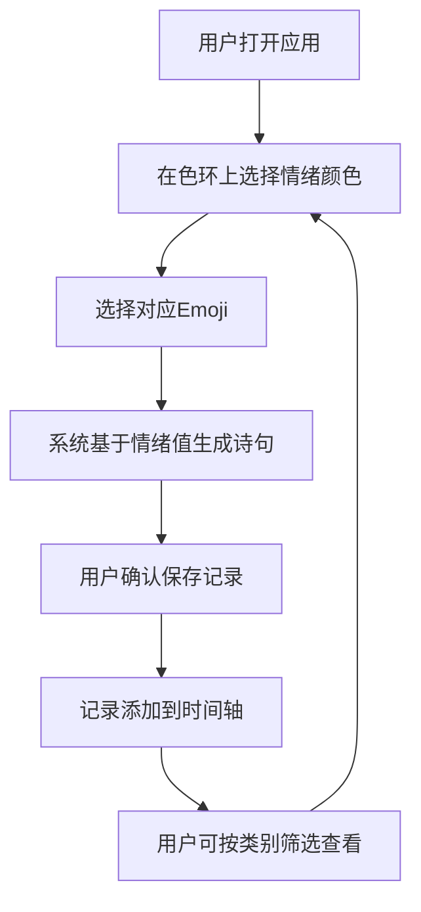

## 1. 产品概述

「情绪回声」是一款帮助用户记录每日情绪的全栈Web应用，用户通过选择颜色与emoji标记情绪，系统基于情绪值生成诗意文案，并以时间轴形式呈现情绪历史轨迹，支持按类别筛选，让用户在温柔的视觉体验中觉察内心的回声。

- 目标用户：注重心理健康、希望通过可视化方式觉察情绪变化的年轻群体
- 核心价值：将抽象情绪具象化为颜色与文字，构建个人情绪档案，培养情绪觉知力

## 2. 核心功能

### 2.1 用户角色

| 角色 | 注册方式 | 核心权限 |
|------|----------|----------|
| 普通用户 | 无需注册，本地使用 | 记录情绪、查看历史、筛选分类 |

### 2.2 功能模块

1. **主页面**：情绪输入面板 + 情绪时间轴 + 筛选器
2. **情绪记录弹窗**：色环选择器 + Emoji选择 + 生成诗句展示

### 2.3 页面详情

| 页面名称 | 模块名称 | 功能描述 |
|----------|----------|----------|
| 主页面 | 情绪输入区 | 展示情绪色环选择器，用户选择情绪类别与强度，点击emoji确认情绪 |
| 主页面 | 诗句生成区 | 选择情绪后，系统自动生成一段简短诗句或文案，展示在毛玻璃卡片中 |
| 主页面 | 时间轴区域 | 按日期纵向排列历史情绪记录，每条记录显示日期、emoji、颜色、诗句摘要 |
| 主页面 | 筛选器 | 按情绪类别（开心、平静、忧伤、焦虑、愤怒、疲惫）筛选时间轴记录 |

## 3. 核心流程

用户打开页面 → 在色环上选择情绪颜色 → 选择对应emoji → 系统生成诗句文案 → 点击保存 → 记录出现在时间轴 → 可通过筛选器按类别过滤

## 4. 用户界面设计

### 4.1 设计风格

- **主色调**：莫兰迪色系 — 薰衣草紫(#9B8EC4)、鼠尾草绿(#8FA89A)、雾霾蓝(#8B9DAF)、暖沙色(#C4A882)、柔粉(#C9A0A0)
- **背景**：浅灰(#F0EDE8)到米白(#FAF8F5)线性渐变
- **按钮风格**：圆形胶囊按钮，哑光莫兰迪色，悬停时轻微上浮4px并带微光(box-shadow光晕)
- **字体**：正文使用 Noto Serif SC 衬线体营造诗意，辅助使用系统无衬线体
- **布局风格**：单页面垂直布局，顶部情绪输入，下方时间轴
- **卡片**：圆角(16px)毛玻璃面板(backdrop-filter: blur)，微阴影(0 4px 20px rgba(0,0,0,0.06))
- **图标/Emoji**：使用原生Emoji，无额外图标库

### 4.2 页面设计概览

| 页面名称 | 模块名称 | UI元素 |
|----------|----------|--------|
| 主页面 | 情绪输入区 | 渐变色彩环(居中展示)，点击时色环对应区域光晕扩散动画，6个emoji环绕色环排列，胶囊按钮"记录此刻" |
| 主页面 | 诗句生成区 | 毛玻璃卡片，诗句文字居中，Noto Serif SC字体，淡入动画 |
| 主页面 | 时间轴区域 | 左侧竖线+圆点时间轴，右侧毛玻璃卡片展示记录，滑动平滑过渡 |
| 主页面 | 筛选器 | 顶部胶囊标签组（全部/开心/平静/忧伤/焦虑/愤怒/疲惫），选中态为莫兰迪色填充，切换时卡片弹性重排 |

### 4.3 响应式适配

- **桌面端(≥1024px)**：情绪输入区和时间轴并排布局，色环较大(280px)
- **平板端(768-1023px)**：单列布局，色环中等(240px)
- **移动端(<768px)**：单列紧凑布局，色环较小(200px)，筛选器横向滚动，触控友好

### 4.4 动效规范

- **色环光晕**：点击时从选中点向外扩散半透明光圈，持续600ms，ease-out
- **卡片出现**：从下方滑入+淡入，持续400ms，spring弹性曲线
- **筛选切换**：卡片以 staggered 动画重新排列，间隔50ms，总时长500ms
- **按钮悬停**：上浮4px + 光晕，持续200ms，ease-out
- **时间轴滑动**：CSS scroll-behavior: smooth，配合 IntersectionObserver 淡入
- **帧率目标**：所有动画稳定60fps，使用 transform/opacity 驱动，避免布局抖动
