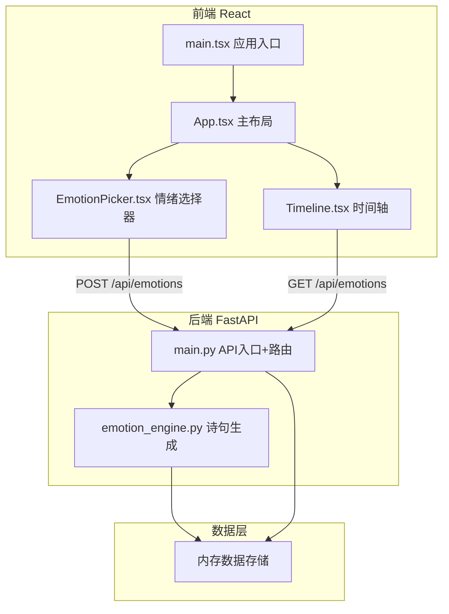
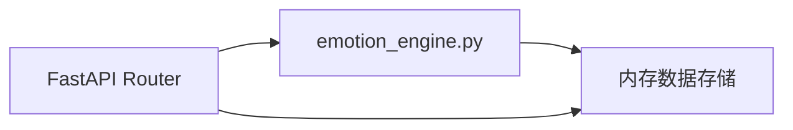
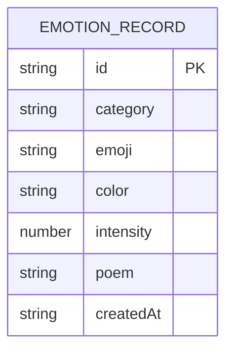

## 1. 架构设计



## 2. 技术说明

- **前端**：React@18 + TypeScript + Vite
- **构建工具**：Vite + @vitejs/plugin-react
- **HTTP客户端**：axios
- **后端**：Python FastAPI + uvicorn
- **数据库**：内存存储（Python列表），无需外部数据库
- **动画**：CSS transitions + CSS animations + requestAnimationFrame（色环光晕）
- **字体**：Google Fonts - Noto Serif SC

## 3. 路由定义

| 路由 | 用途 |
|------|------|
| / | 主页面 - 情绪输入与时间轴展示 |

## 4. API 定义

### 4.1 情绪类别枚举

```typescript
type EmotionCategory = 'happy' | 'calm' | 'sad' | 'anxious' | 'angry' | 'tired';
```

### 4.2 数据模型

```typescript
interface EmotionRecord {
  id: string;
  category: EmotionCategory;
  emoji: string;
  color: string;
  intensity: number;
  poem: string;
  createdAt: string;
}
```

### 4.3 API 端点

| 方法 | 路径 | 请求体 | 响应 | 用途 |
|------|------|--------|------|------|
| POST | /api/emotions | `{ category, emoji, color, intensity }` | `EmotionRecord` | 创建情绪记录 |
| GET | /api/emotions | `?category=happy` (可选筛选) | `EmotionRecord[]` | 获取情绪列表 |

### 4.4 请求/响应 Schema

**POST /api/emotions**
```typescript
interface CreateEmotionRequest {
  category: EmotionCategory;
  emoji: string;
  color: string;
  intensity: number;
}
interface CreateEmotionResponse extends EmotionRecord {}
```

**GET /api/emotions**
```typescript
interface GetEmotionsQuery {
  category?: EmotionCategory;
}
interface GetEmotionsResponse extends Array<EmotionRecord> {}
```

## 5. 服务器架构图



## 6. 数据模型

### 6.1 数据模型定义



### 6.2 情绪类别配置

| 类别 | emoji | 颜色(莫兰迪) | 色环角度 |
|------|-------|-------------|---------|
| happy 开心 | 😊 | #C9A882 暖沙金 | 0° |
| calm 平静 | 🍃 | #8FA89A 鼠尾草绿 | 60° |
| sad 忧伤 | 🌧️ | #8B9DAF 雾霾蓝 | 120° |
| anxious 焦虑 | 🌀 | #9B8EC4 薰衣草紫 | 180° |
| angry 愤怒 | 🔥 | #C49A9A 柔玫瑰 | 240° |
| tired 疲惫 | 🌙 | #A89B8E 暖灰棕 | 300° |
