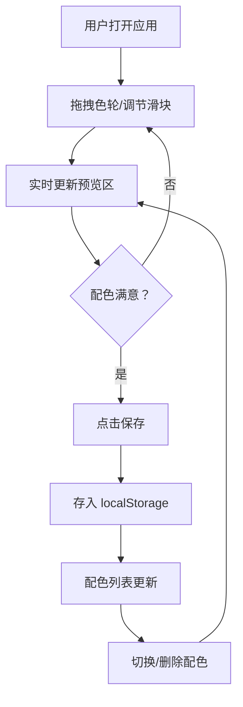

## 1. 产品概述

「幻彩调色盘」是一款交互式渐变配色生成器，面向设计师和前端开发者，通过直觉化的色轮拖拽、滑块调节来实时生成配色方案，并预览在真实UI组件上的视觉效果，支持本地持久化保存。

## 2. 核心功能

### 2.1 功能模块

1. **色轮控制台**：Canvas 绘制的色相环，支持拖拽旋转和点击选取颜色，中心实时显示选中色值
2. **滑块控制区**：色相偏移、饱和度、亮度三个控制滑块，拖动时颜色实时平滑过渡
3. **预览面板**：四种预设UI组件（毛玻璃卡片、圆角按钮、线性渐变背景、文字示例）的实时配色预览
4. **配色收藏**：已保存配色列表，支持 localStorage 持久化、切换预览、删除和清空

### 2.2 页面详情

| 页面名称 | 模块名称 | 功能描述 |
|----------|----------|----------|
| 主页面 | 色轮控制台 | Canvas 色相环拖拽旋转、点击选色，中心显示当前色值，底部显示 HSL 数值 |
| 主页面 | 滑块控制区 | 色相偏移（0-360°）、饱和度（0-100%）、亮度（0-100%）三滑块，拖动实时更新 |
| 主页面 | 预览面板 | 毛玻璃卡片、圆角按钮（悬停发光）、45°线性渐变背景、明暗背景文字示例 |
| 主页面 | 配色收藏列表 | 微缩色块预览、点击切换预览、删除单条、清空全部、localStorage 持久化 |

## 3. 核心流程

用户打开应用 → 拖拽色轮或调节滑块选择颜色 → 实时预览配色在四种UI组件上的效果 → 满意时保存配色方案 → 可随时切换已保存配色预览或删除

## 4. 用户界面设计

### 4.1 设计风格

- **整体风格**：极简柔光，纯白到浅灰渐变背景
- **主色调**：由色轮实时生成的渐变配色作为强调色，界面本身保持中性白灰
- **色轮**：半透明发光圆环，带色泽渐变，拖拽时有光晕扩散和颜色流动动画
- **滑块**：自定义圆角滑块，轨道带渐变色指示
- **按钮**：圆角渐变按钮，悬停时发光扩散
- **字体**：正文使用系统无衬线字体，标题使用 Noto Sans SC
- **布局**：桌面端三栏（左-色轮+滑块 / 中-预览 / 右-收藏），手机端底部抽屉式折叠

### 4.2 页面设计概览

| 页面名称 | 模块名称 | UI 元素 |
|----------|----------|---------|
| 主页面 | 色轮控制台 | Canvas 色轮（半透明发光环）、中心色值显示、HSL 数值 |
| 主页面 | 滑块控制区 | 三个渐变轨道滑块，拖动时平滑过渡动画 |
| 主页面 | 预览面板 | 毛玻璃卡片、发光圆角按钮、渐变背景块、文字对比示例 |
| 主页面 | 配色收藏 | 竖向列表、微缩色块、删除/清空按钮、淡入淡出切换 |

### 4.3 响应式设计

- **桌面端（≥1024px）**：三栏并排布局，左280px + 中自适应 + 右260px
- **平板端（768-1023px）**：左右面板折叠为侧边抽屉
- **手机端（<768px）**：控制面板折叠为底部抽屉，预览区全宽，收藏列表为全屏弹层

### 4.4 动效规范

- 色轮拖拽：光晕扩散 + 颜色流动（requestAnimationFrame 驱动，60fps）
- 滑块拖动：CSS transition 200ms ease-out 平滑过渡
- 配色卡片切换：淡入淡出 300ms
- 按钮悬停：box-shadow 发光扩展 200ms
- 配色保存/删除：列表项 slide-in/fade-out 250ms
