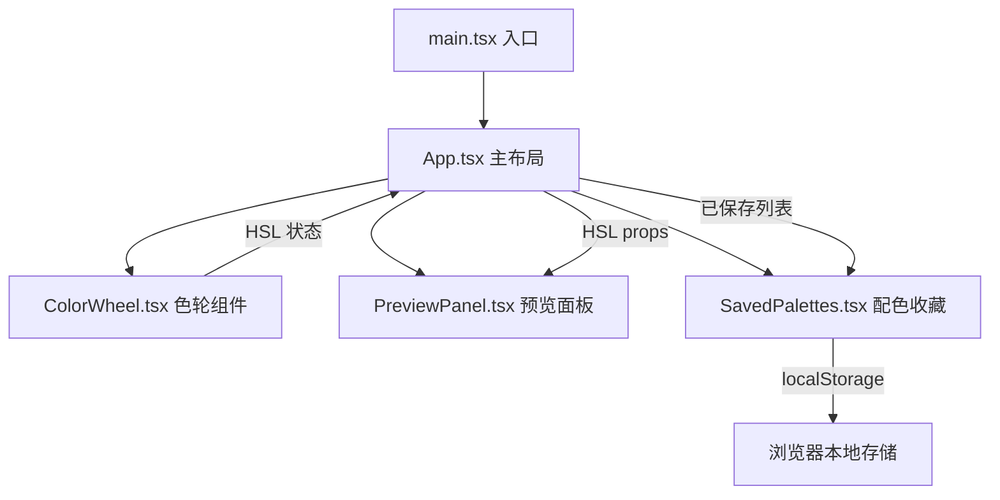

## 1. 架构设计



## 2. 技术说明

- **前端框架**：React 18 + TypeScript
- **构建工具**：Vite + @vitejs/plugin-react
- **样式方案**：CSS Modules + CSS 自定义属性（CSS Variables）
- **动画**：Canvas requestAnimationFrame（色轮）+ CSS transition/animation（UI 组件）
- **数据持久化**：localStorage
- **无后端服务**

## 3. 路由定义

本项目为单页应用，无路由，仅一个主页面。

| 路由 | 用途 |
|------|------|
| / | 主页面，包含色轮、预览、配色收藏三区域 |

## 4. 状态管理

采用 React useState + useCallback 进行状态管理，无需引入外部状态库。

### 核心状态（App.tsx）

```typescript
interface HSLColor {
  h: number; // 0-360
  s: number; // 0-100
  l: number; // 0-100
}

interface SavedPalette {
  id: string;
  name: string;
  colors: HSLColor[];
  createdAt: number;
}
```

- `currentHSL: HSLColor` — 当前选中颜色
- `savedPalettes: SavedPalette[]` — 已保存配色列表
- `isMobileDrawerOpen: boolean` — 移动端抽屉开关

## 5. 组件设计

### 5.1 ColorWheel.tsx

- Canvas 绘制 HSL 色相环（360°渐变圆环）
- 监听 mousedown/mousemove/mouseup 和 touch 事件实现拖拽
- 根据鼠标/触摸位置计算角度和对应色相值
- 中心绘制选中色圆形预览
- 使用 requestAnimationFrame 驱动光晕扩散动画
- Props: `hsl: HSLColor`, `onHSLChange: (hsl: HSLColor) => void`

### 5.2 PreviewPanel.tsx

- 接收当前 HSL 颜色，渲染四种 UI 组件预览
- 毛玻璃卡片：backdrop-filter blur + 半透明背景
- 圆角按钮：渐变背景 + hover 发光
- 线性渐变背景：45° 渐变
- 文字示例：明/暗背景上文字可读性对比
- CSS transition 驱动颜色过渡

### 5.3 SavedPalettes.tsx

- 读取/写入 localStorage
- 列表项包含微缩色块 + 名称 + 删除按钮
- 点击列表项切换当前预览
- 清空全部功能
- Props: `savedPalettes: SavedPalette[]`, `onSelect: (palette: SavedPalette) => void`, `onDelete: (id: string) => void`, `onClearAll: () => void`

## 6. 文件结构

```
├── index.html
├── package.json
├── tsconfig.json
├── vite.config.js
└── src/
    ├── main.tsx
    ├── App.tsx
    ├── App.module.css
    └── components/
        ├── ColorWheel.tsx
        ├── ColorWheel.module.css
        ├── PreviewPanel.tsx
        ├── PreviewPanel.module.css
        ├── SavedPalettes.tsx
        └── SavedPalettes.module.css
```

## 7. 性能目标

- 色轮拖拽帧率 ≥ 60fps（Canvas + requestAnimationFrame）
- 滑块拖动响应延迟 < 16ms
- CSS transition 动画使用 GPU 加速（transform、opacity）
- 避免不必要的重渲染：使用 useCallback 稳定回调引用
