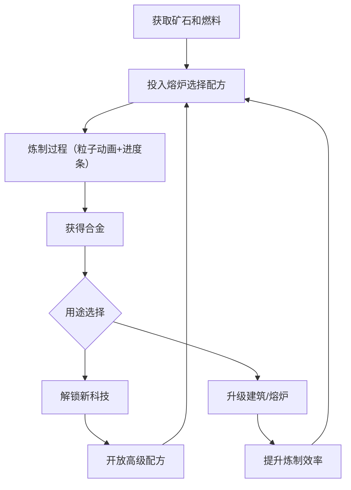

## 1. 产品概述

「熔炉纪元」是一款2D资源管理模拟游戏，玩家在蒸汽朋克风格的世界中建造和升级熔炉，用不同矿石和燃料炼制合金，解锁新科技与建筑。
- 目标用户：喜欢模拟经营、资源管理和蒸汽朋克美学的休闲玩家
- 核心价值：通过炼制系统的深度策略和视觉反馈，创造沉浸式的熔炉经营体验

## 2. 核心功能

### 2.1 功能模块

1. **主游戏区域**：Canvas绘制的熔炉场景，包含熔炉动画、矿石/燃料晶体、粒子特效（火焰、火花、蒸汽）
2. **资源面板**：左上角显示金币、矿石、燃料等资源数量，提供建造和升级操作按钮
3. **科技与配方面板**：右上角科技树展示可解锁科技，炼制配方列表展示可用配方及其所需材料
4. **建造面板**：底部毛玻璃面板，可拖动熔炉到场景中建造，建造时有齿轮旋转和蒸汽喷发动画

### 2.2 页面详情

| 页面名称 | 模块名称 | 功能描述 |
|----------|----------|----------|
| 主游戏页 | 熔炉场景（Canvas） | 绘制熔炉金属质感、发光火焰纹理、矿石半透明彩色晶体、燃料闪烁发光煤块、火焰翻滚和火花飞溅粒子、合金光泽流动动画 |
| 主游戏页 | 资源面板 | 显示金币/矿石/燃料数量，建造和升级熔炉按钮，资源获取按钮 |
| 主游戏页 | 科技与配方面板 | 科技树层级展示，配方列表含所需材料和产出，点击解锁/炼制 |
| 主游戏页 | 建造面板 | 底部毛玻璃面板，拖动熔炉到场景建造，齿轮旋转+蒸汽喷发建造动画 |
| 主游戏页 | 炼制进度 | 进度条带粒子流动效果，完成时金色光晕+碎片爆散动画 |

## 3. 核心流程

玩家通过采集或购买获取矿石和燃料 → 在熔炉中投入材料选择配方炼制 → 炼制过程有进度条和粒子动画反馈 → 炼制完成获得合金 → 合金可用于解锁新科技或升级建筑 → 解锁新科技开放更高级配方和熔炉类型 → 循环推进游戏进程

## 4. 用户界面设计

### 4.1 设计风格

- 主色调：深棕（#2C1810）到暗红（#8B1A1A）渐变背景
- 熔炉：金属质感（#4A3728）带发光火焰纹理（#FF6B35 → #FFD700）
- 矿石：半透明彩色晶体（铜#B87333、铁#71797E、水晶#9B59B6等）
- 燃料：闪烁发光煤块（#FF4500 → #FF8C00脉冲）
- 界面元素：圆角毛玻璃面板（backdrop-filter: blur），铜色细边框（#B87333）
- 字体：标题用粗犷金属感字体，正文用清晰易读字体
- 布局：全屏Canvas场景，UI面板叠加在Canvas上方

### 4.2 页面设计概述

| 页面名称 | 模块名称 | UI元素 |
|----------|----------|--------|
| 主游戏页 | 熔炉场景 | Canvas全屏，深棕暗红渐变背景，熔炉金属质感+火焰动画，矿石彩色晶体，火花粒子 |
| 主游戏页 | 资源面板 | 左上角毛玻璃圆角面板，铜色边框，资源图标+数字，建造/升级按钮 |
| 主游戏页 | 科技配方面板 | 右上角毛玻璃面板，科技树层级图，配方卡片列表 |
| 主游戏页 | 建造面板 | 底部毛玻璃面板，可拖动熔炉图标，齿轮+蒸汽建造动画 |
| 主游戏页 | 炼制进度 | 进度条叠加在熔炉上方，粒子流动效果，完成时金色光晕爆散 |

### 4.3 响应式

- 桌面优先设计，全屏Canvas自适应窗口大小
- UI面板使用绝对定位+百分比布局适配不同分辨率
- Canvas绘制逻辑基于实际尺寸动态计算坐标

### 4.4 动画与交互

- 熔炉火焰：持续翻滚动画，亮度随炼制状态变化
- 矿石/燃料：hover时微浮动，拖拽时有轨迹粒子
- 炼制进度：进度条粒子流动，完成后金色光晕扩散+碎片爆散
- 建造：齿轮旋转+蒸汽喷发动画
- 所有动画基于requestAnimationFrame，目标60fps
