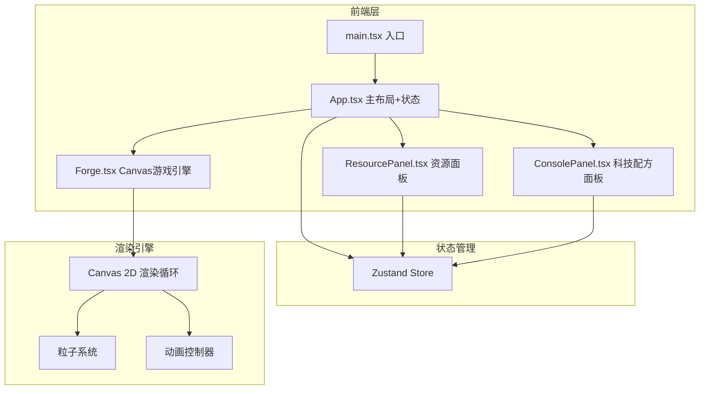

## 1. 架构设计



## 2. 技术说明

- 前端框架：React 18 + TypeScript
- 构建工具：Vite
- 状态管理：Zustand
- 渲染引擎：Canvas 2D API（Forge.tsx中实现）
- 样式方案：CSS Modules + CSS变量（蒸汽朋克主题）
- 初始化工具：Vite + react-ts模板

## 3. 路由定义

本项目为单页游戏应用，无路由切换，所有内容在一个页面中通过面板叠加呈现。

| 路由 | 用途 |
|------|------|
| / | 主游戏页（唯一页面） |

## 4. 数据模型

### 4.1 游戏状态数据模型

```typescript
interface GameState {
  resources: {
    coins: number;
    ores: Record<OreType, number>;
    fuels: Record<FuelType, number>;
    alloys: Record<AlloyType, number>;
  };
  forges: Forge[];
  technologies: Record<string, boolean>;
  activeRecipe: Recipe | null;
  smeltingProgress: number;
}

type OreType = 'copper' | 'iron' | 'crystal' | 'mithril';
type FuelType = 'coal' | 'lavaCoal' | 'spiritFlame';
type AlloyType = 'bronze' | 'steel' | 'crystalAlloy' | 'arcaneMetal';

interface Forge {
  id: string;
  level: number;
  position: { x: number; y: number };
  status: 'idle' | 'smelting' | 'upgrading';
}

interface Recipe {
  name: string;
  requiredOres: Partial<Record<OreType, number>>;
  requiredFuel: Partial<Record<FuelType, number>>;
  output: { type: AlloyType; amount: number };
  duration: number;
  requiredTech?: string;
}
```

### 4.2 粒子系统数据模型

```typescript
interface Particle {
  x: number;
  y: number;
  vx: number;
  vy: number;
  life: number;
  maxLife: number;
  size: number;
  color: string;
  alpha: number;
  type: 'spark' | 'flame' | 'steam' | 'glow' | 'fragment';
}
```

## 5. 文件结构

```
src/
  main.tsx          — 入口，挂载App
  App.tsx           — 主布局，游戏状态管理和面板切换
  components/
    Forge.tsx       — 核心游戏区域，Canvas绘制熔炉动画和粒子
    ResourcePanel.tsx — 资源显示和控制按钮
    ConsolePanel.tsx  — 科技树和配方列表
```

## 6. 性能约束

- Canvas渲染循环使用requestAnimationFrame，目标60fps
- 粒子数量上限500，超限后复用最早死亡的粒子
- 状态更新使用Zustand的浅比较优化，避免不必要的重渲染
- Canvas尺寸跟随窗口resize事件动态调整
