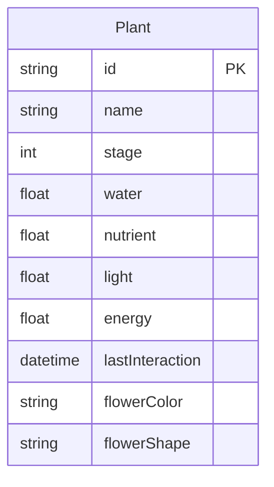

## 1. 架构设计

```mermaid
flowchart TD
    "前端 React+Vite" --> "API请求层 src/api"
    "API请求层 src/api" --> "FastAPI后端 api/main.py"
    "FastAPI后端 api/main.py" --> "业务逻辑: 属性计算/进化判定/花朵生成"
    "前端 React+Vite" --> "localStorage持久化"
    "前端 React+Vite" --> "Canvas渲染引擎 PlantCanvas"
    "Canvas渲染引擎 PlantCanvas" --> "动画系统 requestAnimationFrame"
```

## 2. 技术说明

- **前端**：React@18 + TypeScript + Vite + Zustand（状态管理）+ TailwindCSS
- **后端**：Python FastAPI
- **构建工具**：Vite
- **数据持久化**：前端localStorage + 后端内存状态
- **动画渲染**：HTML5 Canvas + requestAnimationFrame
- **初始化工具**：vite-init (react-ts模板)

## 3. 路由定义

| 路由 | 用途 |
|------|------|
| / | 主页面，包含植物展示、操作面板和状态面板 |

单页应用，无需多路由。

## 4. API定义

### 4.1 TypeScript类型定义

```typescript
interface PlantState {
  id: string;
  name: string;
  stage: GrowthStage;
  water: number;
  nutrient: number;
  light: number;
  energy: number;
  lastInteraction: number;
  flowerColor: string | null;
  flowerShape: FlowerShape | null;
  growthPath: GrowthAction[];
}

enum GrowthStage {
  Seed = 0,      // 种子
  Sprout = 1,    // 嫩芽
  Seedling = 2,  // 小苗
  Mature = 3,    // 成熟
  Flowering = 4  // 开花
}

enum FlowerShape {
  Symmetric = "symmetric",  // 对称
  Spiral = "spiral"         // 螺旋
}

type GrowthAction = "water" | "nutrient" | "light";

interface ActionRequest {
  plantId: string;
  action: GrowthAction;
}

interface ActionResponse {
  plant: PlantState;
  evolved: boolean;
  newStage?: GrowthStage;
}

interface DecayResponse {
  plant: PlantState;
  isWithering: boolean;
}
```

### 4.2 API端点

| 方法 | 路径 | 请求体 | 响应 | 描述 |
|------|------|--------|------|------|
| GET | /api/plants | - | PlantState[] | 获取所有植物状态 |
| POST | /api/plants | { name: string } | PlantState | 创建新植物 |
| POST | /api/plants/{id}/action | ActionRequest | ActionResponse | 执行操作（浇水/施肥/光照） |
| POST | /api/plants/{id}/decay | - | DecayResponse | 触发衰减检查 |
| DELETE | /api/plants/{id} | - | { success: boolean } | 删除植物 |

### 4.3 属性算法

**操作效果**：
- 浇水：water +15, energy -5
- 施肥：nutrient +15, energy -5
- 光照：light +15, energy -5

**进化阈值**（总属性值 = water + nutrient + light）：
- 种子→嫩芽：总属性 ≥ 30
- 嫩芽→小苗：总属性 ≥ 80
- 小苗→成熟：总属性 ≥ 150
- 成熟→开花：总属性 ≥ 250

**花朵颜色生成（HSL）**：
- H（色相）= (water比例 × 200 + nutrient比例 × 80 + light比例 × 45) % 360
- S（饱和度）= 60 + max(属性比例差) × 30（范围60-90）
- L（亮度）= 55 + energy/200 × 15（范围55-70）

**花朵形状**：
- 若成长路径中water操作占比最高 → 螺旋形（水流曲线）
- 若nutrient或light占比最高 → 对称形（稳定结构）

**衰减机制**：
- 每60秒无操作，三项属性各衰减当前值的5%
- energy不会衰减，但属性低于20时显示枯萎视觉

## 5. 服务器架构

```mermaid
flowchart LR
    "FastAPI路由层" --> "业务逻辑层"
    "业务逻辑层" --> "状态存储层"
    "状态存储层" --> "内存字典 + 前端localStorage同步"
```

后端使用FastAPI，无需数据库，状态存储在内存中。前端同时维护localStorage作为持久化备份，页面刷新时优先从localStorage恢复状态。

## 6. 数据模型

### 6.1 数据模型定义



### 6.2 数据初始化

- 首次访问时自动创建默认植物「小绿」，属性值均为0，阶段为Seed
- 植物数量上限5株
- 属性值上限100，下限0
- energy上限100，初始值100

## 7. 文件结构

```
├── api/
│   └── main.py              # FastAPI后端
├── src/
│   ├── App.tsx              # 主布局
│   ├── api/
│   │   └── index.ts         # API请求封装
│   ├── components/
│   │   ├── PlantCanvas.tsx   # Canvas植物渲染
│   │   └── ControlPanel.tsx  # 操作控制面板
│   └── types.ts             # 类型定义
├── package.json
├── tsconfig.json
├── vite.config.js
└── index.html
```

## 8. 性能要求

- Canvas渲染保持60fps，使用requestAnimationFrame驱动
- 植物绘制优化：非动画状态时降低重绘频率
- React组件使用React.memo和useMemo/useCallback避免不必要重渲染
- Zustand状态按植物ID分片订阅，避免全局重渲染
- 动画粒子池复用，避免频繁GC
