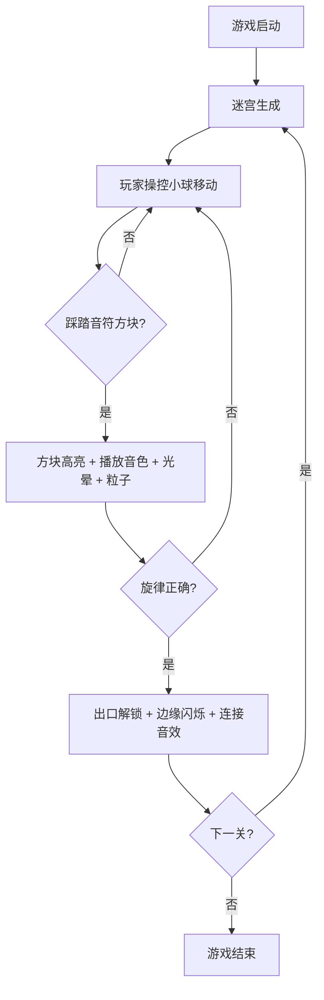

## 1. 产品概述

「幻音领域」是一款 2D 音乐谜题游戏，玩家操控发光小球在音符方块组成的动态迷宫中移动，通过踩踏方块改变音符高低奏出正确旋律以解锁出口。目标用户为休闲游戏玩家和音乐爱好者，核心价值在于将音乐创作与迷宫探索结合，提供沉浸式视听体验。

## 2. 核心功能

### 2.1 用户角色
| 角色 | 说明 |
|------|------|
| 玩家 | 通过键盘/触屏控制小球，探索迷宫，奏出旋律 |

### 2.2 功能模块
1. **游戏主场景**: 迷宫地图、音符方块、玩家小球、粒子特效
2. **旋律进度面板**: 显示当前旋律进度、已奏亮/未奏亮音符
3. **迷你地图**: 毛玻璃效果显示整体迷宫布局
4. **操作提示**: 显示 WASD 移动、空格跳跃控制说明

### 2.3 页面详情
| 页面/场景 | 模块名称 | 功能描述 |
|-----------|----------|----------|
| 游戏主场景 | 迷宫地图 | 随机生成音符方块迷宫，方块颜色对应音阶 |
| 游戏主场景 | 玩家小球 | WASD移动、空格跳跃、暖白发光体+彩色粒子拖尾 |
| 游戏主场景 | 踩踏检测 | 小球踩踏音符方块时触发高亮+音色+光晕+粒子升腾 |
| 游戏主场景 | 旋律判定 | 奏出正确旋律后解锁出口、屏幕边缘闪烁+连接音效 |
| UI覆盖层 | 旋律进度面板 | 左上角显示音符图标序列，已奏亮发光，未奏暗淡 |
| UI覆盖层 | 迷你地图 | 右上角毛玻璃小地图，显示迷宫整体和音符位置 |
| UI覆盖层 | 操作提示 | 底部显示WASD移动、空格跳跃提示 |

## 3. 核心流程

玩家进入游戏 → 迷宫生成（含音符方块和出口）→ 玩家操控小球移动探索 → 踩踏音符方块触发音效和视觉反馈 → 旋律进度面板记录已奏音符 → 奏出正确旋律序列 → 出口解锁 + 屏幕边缘闪烁 + 连接音效 → 进入下一关

## 4. 用户界面设计

### 4.1 设计风格
- **主色调**: 深紫到纯黑渐变背景，赛博霓虹风格
- **音符方块色**: Do红橙、Re金、Mi黄绿、Fa青、Sol蓝、La紫、Si玫红，半透明发光晶体
- **玩家小球**: 暖白色发光体，彩色粒子拖尾
- **字体**: 科技感字体，标题用粗体，正文用细体
- **布局**: 全屏游戏画布，UI覆盖层浮于上方
- **按钮风格**: 无传统按钮，通过踩踏方块交互
- **图标风格**: 霓虹发光音符图标

### 4.2 页面设计概览
| 页面/场景 | 模块名称 | UI 元素 |
|-----------|----------|---------|
| 游戏主场景 | 迷宫背景 | 深紫→纯黑渐变，半透明发光晶体方块 |
| 游戏主场景 | 玩家小球 | 暖白发光圆，彩色粒子拖尾 |
| 游戏主场景 | 踩踏特效 | 方块高亮脉冲、光晕扩散、粒子升腾 |
| 游戏主场景 | 旋律完成特效 | 屏幕边缘闪烁 |
| UI覆盖层 | 旋律进度 | 左上角音符图标行，发光/暗淡双态 |
| UI覆盖层 | 迷你地图 | 右上角毛玻璃小地图 |
| UI覆盖层 | 操作提示 | 底部半透明文字提示 |

### 4.3 响应式适配
- 桌面优先设计，使用 Canvas 渲染游戏场景
- 移动端适配：虚拟摇杆控制移动，触屏按钮跳跃
- 游戏画布自适应窗口大小
- 帧率保持 60fps

### 4.4 2D 场景设计指导
- **环境氛围**: 深紫到纯黑渐变背景，赛博霓虹感
- **光照效果**: 方块自身发光，小球发光产生环境光照
- **相机**: 俯视角 2D 视图，跟随玩家平滑滚动
- **动画**: 粒子拖尾、光晕脉冲、方块高亮、边缘闪烁
- **性能**: 目标 60fps，粒子数量受控
