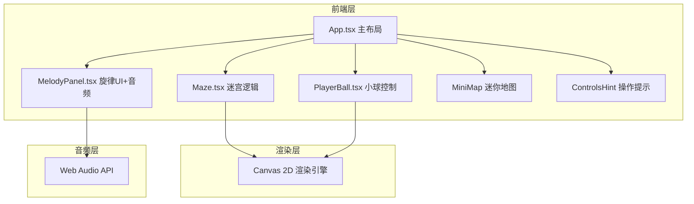

## 1. 架构设计



## 2. 技术说明
- **前端框架**: React 18 + TypeScript
- **构建工具**: Vite
- **样式方案**: CSS-in-JS (inline styles) + CSS Variables，赛博霓虹主题
- **音频**: Web Audio API (OscillatorNode 生成音符音色)
- **渲染**: HTML5 Canvas 2D，requestAnimationFrame 驱动游戏循环
- **状态管理**: React useState/useRef + 自定义 Hook
- **后端**: 无
- **数据库**: 无

## 3. 路由定义
| 路由 | 用途 |
|------|------|
| / | 游戏主页面（单页应用，无路由切换） |

## 4. API 定义
无后端 API，所有逻辑在前端完成。

## 5. 数据模型

### 5.1 核心类型定义

```typescript
type NoteName = 'Do' | 'Re' | 'Mi' | 'Fa' | 'Sol' | 'La' | 'Si';

interface NoteBlock {
  x: number;
  y: number;
  note: NoteName;
  color: string;
  activated: boolean;
  isTarget: boolean;
}

interface PlayerState {
  x: number;
  y: number;
  vx: number;
  vy: number;
  isJumping: boolean;
  trail: Particle[];
}

interface Particle {
  x: number;
  y: number;
  vx: number;
  vy: number;
  life: number;
  maxLife: number;
  color: string;
  size: number;
}

interface MelodyTarget {
  notes: NoteName[];
  currentIndex: number;
  completed: boolean;
}
```

### 5.2 迷宫生成算法
- 使用预设迷宫模板 + 音符方块放置策略
- 迷宫由墙壁和通道组成，音符方块放置在通道中
- 出口在迷宫边缘，正确旋律奏出后打开

## 6. 文件结构

```
src/
  main.tsx          - 入口文件，挂载根组件
  App.tsx            - 主布局，整合游戏场景和UI覆盖层
  components/
    Maze.tsx         - 迷宫地图生成、方块放置、踩踏检测、Canvas渲染
    PlayerBall.tsx   - 小球移动/跳跃物理、粒子拖尾渲染
    MelodyPanel.tsx  - 旋律进度显示、Web Audio API音符播放
public/
  index.html         - 入口HTML
package.json         - 依赖配置
tsconfig.json        - TypeScript配置
vite.config.ts       - Vite配置
```
