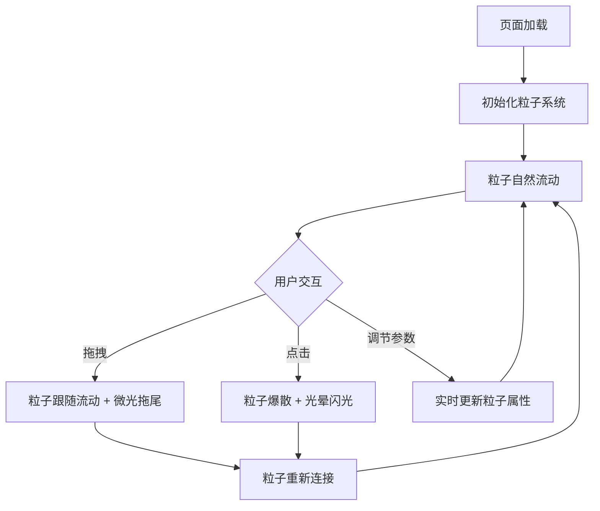

## 1. 产品概述

「星尘织梦」是一个基于 Three.js 的 3D 交互粒子可视化项目，在深邃宇宙空间中模拟动态星云。用户通过鼠标拖拽控制粒子流动方向与速度，点击触发粒子爆散后重新汇聚，形成不断变化的星云形态。

- 目标用户：对交互式可视化、生成式艺术和宇宙主题感兴趣的用户
- 核心价值：提供沉浸式的宇宙粒子交互体验，将物理模拟与艺术表达融合

## 2. 核心功能

### 2.1 功能模块

1. **3D 粒子场景**：深空蓝到墨黑渐变背景，数千发光粒子形成动态星云
2. **鼠标交互系统**：拖拽控制粒子流动、点击触发爆散与重新汇聚
3. **粒子连接网络**：近距离粒子间半透明细线连接，形成动态星图
4. **毛玻璃控制面板**：粒子数量、星风强度、连接距离滑块及重置按钮

### 2.2 页面详情

| 页面名称 | 模块名称 | 功能描述 |
|---------|---------|---------|
| 主场景 | 3D粒子画布 | 全屏Three.js画布，渲染深空背景与粒子系统 |
| 主场景 | 粒子系统 | 粒子创建、流动、爆散、汇聚的核心逻辑 |
| 主场景 | 连接线系统 | 近距离粒子间半透明细线连接 |
| 主场景 | 鼠标交互 | 拖拽流动、点击爆散、轨迹拖尾与光晕 |
| 主场景 | 控制面板 | 毛玻璃面板，包含参数滑块和重置按钮 |

## 3. 核心流程

用户打开页面 → 粒子在深空背景中缓慢流动形成星云 → 用户拖拽鼠标 → 粒子跟随鼠标方向流动并带有微光拖尾 → 用户点击 → 粒子从点击位置爆散、产生光晕闪光 → 粒子缓慢重新连接汇聚 → 形成新星云形态 → 循环

## 4. 用户界面设计

### 4.1 设计风格

- **主色调**：深空蓝 (#0a0e27) → 墨黑 (#000000) 渐变背景
- **粒子颜色**：中心暖白 (#fff5e6) → 边缘冷蓝 (#4a9eff) 渐变
- **连接线**：半透明冷蓝色 (rgba(74, 158, 255, 0.15))
- **控制面板**：毛玻璃效果，背景 rgba(10, 14, 39, 0.6)，边框 rgba(74, 158, 255, 0.2)
- **字体**：显示字体 Orbitron（科幻风格），UI字体系统默认
- **布局**：全屏3D画布 + 右下角浮动控制面板
- **交互反馈**：粒子流动拖尾、点击光晕闪光、控件悬停发光

### 4.2 页面设计详情

| 页面名称 | 模块名称 | UI元素 |
|---------|---------|--------|
| 主场景 | 3D画布 | 全屏画布，深空渐变背景，粒子渲染 |
| 主场景 | 粒子 | 细小发光点，暖白到冷蓝径向渐变，拖尾光晕 |
| 主场景 | 连接线 | 半透明冷蓝细线，距离越远越透明 |
| 主场景 | 控制面板 | 毛玻璃卡片，圆角12px，Orbitron标题，自定义滑块，重置按钮 |

### 4.3 响应式设计

- 桌面优先，全屏3D画布自适应窗口大小
- 控制面板在小屏幕上自动缩小
- 鼠标和触摸事件双支持

### 4.4 3D场景指引

- **环境**：深空蓝到墨黑渐变，无HDRI，纯色+渐变背景
- **光照**：无传统光源，粒子自发光（自定义着色器实现）
- **相机**：透视相机，固定位置，鼠标轻微影响视角偏移（视差效果）
- **构图**：粒子居中分布，星云形态自然变化
- **交互**：鼠标拖拽控制粒子流向、点击爆散、参数实时调节
- **后处理**：粒子发光效果通过着色器实现，避免额外后处理Pass
- **性能**：目标60fps，粒子数量上限5000，使用BufferGeometry和自定义着色器优化渲染
