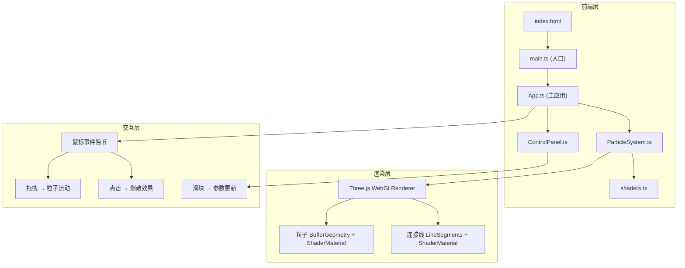

## 1. 架构设计



## 2. 技术说明

- **前端**：TypeScript + Three.js + Vite
- **构建工具**：Vite
- **3D渲染**：Three.js 自定义 ShaderMaterial + BufferGeometry
- **UI**：原生 DOM + CSS 毛玻璃效果
- **后端**：无（纯前端项目）
- **数据库**：无

## 3. 文件结构

| 文件路径 | 职责 |
|---------|------|
| `src/main.ts` | 入口，初始化场景和渲染循环 |
| `src/App.ts` | 主应用类，管理状态和交互 |
| `src/components/ParticleSystem.ts` | 粒子系统核心，控制创建、流动和爆散 |
| `src/components/ControlPanel.ts` | 生成毛玻璃控制面板并绑定事件 |
| `src/utils/shaders.ts` | 粒子和连接线的自定义着色器 |
| `package.json` | 项目依赖和脚本 |
| `tsconfig.json` | TypeScript配置 |
| `vite.config.ts` | Vite构建配置 |
| `index.html` | 入口HTML |

## 4. 核心数据结构

### 4.1 粒子状态

```typescript
interface ParticleState {
  positions: Float32Array;
  velocities: Float32Array;
  colors: Float32Array;
  sizes: Float32Array;
  count: number;
}
```

### 4.2 应用参数

```typescript
interface AppConfig {
  particleCount: number;
  starWindStrength: number;
  connectionDistance: number;
}
```

### 4.3 鼠标状态

```typescript
interface MouseState {
  x: number;
  y: number;
  isDragging: boolean;
  velocityX: number;
  velocityY: number;
}
```

## 5. 着色器设计

### 5.1 粒子着色器

- **顶点着色器**：根据粒子位置计算尺寸衰减，传递颜色和透明度
- **片元着色器**：圆形发光点，中心暖白到边缘冷蓝径向渐变，边缘柔和透明

### 5.2 连接线着色器

- **顶点着色器**：传递线段两端位置和距离
- **片元着色器**：半透明冷蓝色，距离越远越透明

## 6. 性能策略

- 使用 `BufferGeometry` 避免每帧创建几何体
- 使用 `ShaderMaterial` 实现GPU端颜色/尺寸计算
- 连接线使用空间分区减少两两距离计算
- 粒子爆散使用力场模型而非逐粒子碰撞
- `requestAnimationFrame` 驱动渲染循环
- 窗口resize事件做节流处理
