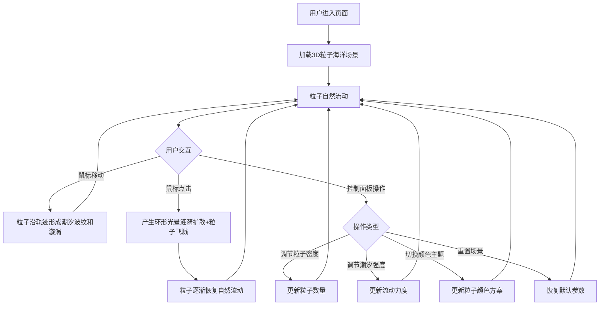

## 1. 产品概述
「星潮引力」是一个3D交互可视化项目，模拟动态发光粒子海洋，用户通过鼠标移动和点击与粒子交互，产生潮汐流动、漩涡和涟漪扩散效果。目标用户为视觉艺术爱好者、交互设计师及创意开发者，产品价值在于提供沉浸式的深海极光风格3D视觉体验。

## 2. 核心功能

### 2.2 功能模块
1. **3D粒子海洋页面**：粒子系统、潮汐流动、鼠标交互涟漪、动态光网、控制面板

### 2.3 页面详情
| 页面名称 | 模块名称 | 功能描述 |
|----------|----------|----------|
| 3D粒子海洋 | 粒子海洋 | 创建500-3000个发光粒子，颜色从浅蓝到紫红渐变，粒子随时间自然漂浮流动 |
| 3D粒子海洋 | 潮汐流动 | 鼠标移动时粒子沿鼠标轨迹形成波状光带和漩涡，可调节潮汐强度 |
| 3D粒子海洋 | 涟漪扩散 | 鼠标点击时产生环形光晕扩散并激起粒子飞溅，之后粒子慢慢恢复流动 |
| 3D粒子海洋 | 动态光网 | 粒子之间有半透明细线连接，动态计算近距离粒子并绘制连线 |
| 3D粒子海洋 | 控制面板 | 毛玻璃面板，包含粒子密度滑块、潮汐强度滑块、颜色主题选择器、重置按钮 |

## 3. 核心流程
用户进入页面后看到深蓝到墨黑渐变背景上的发光粒子海洋，粒子自然流动。鼠标移动时粒子沿轨迹形成潮汐波纹和漩涡，鼠标点击时产生引力波涟漪扩散和粒子飞溅，随后粒子逐渐恢复自然流动。用户可通过左下角控制面板调节粒子密度、潮汐强度、切换颜色主题或重置场景。

## 4. 用户界面设计

### 4.1 设计风格
- 主色调：深蓝（#0a0e27）到墨黑（#000000）渐变背景
- 强调色：浅蓝（#00d4ff）到紫红（#ff0066）粒子渐变
- 按钮/控件风格：圆角、半透明、毛玻璃效果
- 字体：Orbitron（科技感展示字体）+ Rajdhani（UI字体）
- 布局风格：全屏3D画布 + 左下角浮动控制面板
- 图标风格：线性发光风格

### 4.2 页面设计概述
| 页面名称 | 模块名称 | UI元素 |
|----------|----------|--------|
| 3D粒子海洋 | 全屏3D画布 | 深蓝到墨黑渐变背景，发光粒子，动态光网连线 |
| 3D粒子海洋 | 毛玻璃控制面板 | 半透明背景模糊，圆角，粒子密度滑块，潮汐强度滑块，颜色主题选择器，重置按钮，悬停/点击动画反馈 |

### 4.3 响应式设计
- 桌面优先设计，全屏3D画布自适应窗口大小
- 控制面板在移动端可折叠

### 4.4 3D场景指引
- 环境：深海极光氛围，无HDRI，程序化渐变背景
- 灯光：无传统灯光，使用自发光材质（PointsMaterial + LineBasicMaterial）
- 相机：透视相机，固定位置俯瞰粒子海洋，近截面0.1远截面1000
- 构图：粒子分布在XZ平面上，Y轴有轻微高度变化模拟海浪
- 交互：鼠标移动影响粒子流动方向和速度，点击产生涟漪
- 后期处理：Bloom发光效果增强粒子光感
- 性能预算：60fps，粒子数最高3000，连线仅计算近距离粒子

### 4.5 颜色主题预设
| 主题名称 | 粒子色1 | 粒子色2 | 连线色 | 涟漪色 |
|----------|---------|---------|--------|--------|
| 极光 | #00d4ff 浅蓝 | #ff0066 紫红 | #1a3a5c 深蓝半透 | #00ffaa 青绿 |
| 星夜 | #4466ff 靛蓝 | #ff44aa 粉紫 | #2a1a5c 暗紫半透 | #8844ff 紫蓝 |
| 珊瑚 | #ff6b6b 珊瑚红 | #ffa07a 浅鲑鱼 | #5c2a2a 暗红半透 | #ffdd44 金黄 |
| 霓虹 | #00ff88 霓虹绿 | #ff00ff 洋红 | #1a5c3a 暗绿半透 | #ffff00 亮黄 |
